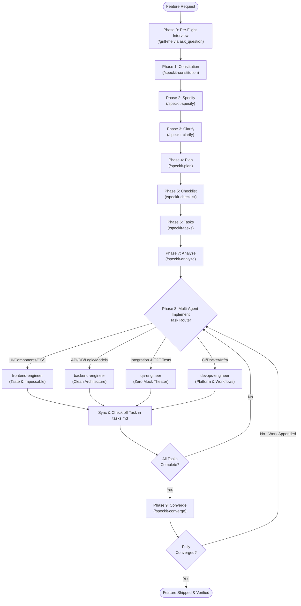

# Project Agent Guidelines: Spec-Driven Development (Spec Kit)

All agents operating in this workspace MUST follow **Spec-Driven Development (SDD)** powered by [GitHub Spec Kit](https://github.com/github/spec-kit). Avoid ad-hoc "vibe coding" without documented specifications, architecture blueprints, and granular task lists.

---

## 1. Core Workflow & Autonomous Spec Kit Pipeline

When a user requests a new feature or non-trivial modification, guide the process through the sequential pipeline:

1. **Phase 0: Pre-Flight Interview (`/grill-me`)**:
   - Before generating specs or code, interview the user using `ask_question` to resolve all key dependencies (tech stack, data models, auth/security schemes, UI tone).
2. **Phase 1: Constitution (`/speckit-constitution`)**:
   - Establishes governing engineering principles, architectural patterns, and project constraints in `.specify/memory/constitution.md`.
3. **Phase 2: Specify (`/speckit-specify <feature description>`)**:
   - Produces a formal feature specification (`specs/<feature-id>/spec.md`) defining prioritized user stories (P1, P2...), functional requirements, and edge cases.
4. **Phase 3: Clarify (`/speckit-clarify`)**:
   - Proactively scans the specification for ambiguities or gaps, asking targeted questions before planning.
5. **Phase 4: Plan (`/speckit-plan`)**:
   - Generates the technical architecture blueprint (`plan.md`), data models (`data-model.md`), contracts (`contracts/`), and validation guides (`quickstart.md`).
6. **Phase 5: Checklist (`/speckit-checklist <category>`)**:
   - Generates domain requirements quality checklists (`specs/<feature-id>/checklists/<category>.md`) for security, UX, performance, etc.
7. **Phase 6: Tasks (`/speckit-tasks`)**:
   - Decomposes the plan into sequenced, atomic tasks with clear completion criteria in `tasks.md`.
8. **Phase 7: Analyze (`/speckit-analyze`)**:
   - Validates that spec, plan, and tasks align with each other and comply with the project constitution.
9. **Phase 8: Multi-Agent Implementation (`/speckit-implement`)**:
   - Executes implementation task-by-task. Tasks are routed to specialized subagents according to domain:
     - `frontend-engineer`: UI components, responsive styling, client interactions (*Taste Skill* & *Impeccable*).
     - `backend-engineer`: Server routes, business logic, database migrations, authentication.
     - `qa-engineer`: Integration tests, end-to-end user journeys, regression verification.
     - `devops-engineer`: GitHub Actions workflows, Dockerfiles, environment configurations.
10. **Phase 9: Converge (`/speckit-converge`)**:
    - Assesses the codebase against the original spec, verifying all requirements are met and appending any remaining work until complete.

---

## 2. Multi-Agent Task Routing Matrix

When implementing tasks from `tasks.md`, the orchestrator delegates to specialized subagents based on domain and monorepo package boundaries:

| Task Type & Package Scope | Target Subagent | Enforced Standard |
| :--- | :--- | :--- |
| **`apps/web`** (UI, Pages, Layouts, Components, CSS) | `frontend-engineer` | Anti-slop craft (*Taste Skill* dials + *Impeccable* craft floor), Next.js 16 App Router, React 19 standards (zero `set-state-in-effect`), strict theme token enforcement (ALWAYS reference from `apps/web/src/lib/theme.ts`; NEVER declare ad-hoc styles/colors; zero capsule pill badges; NEVER modify `DESIGN.md`). |
| **`apps/worker`**, **`packages/contracts`**, **`packages/database`** | `backend-engineer` | Clean architecture, strict Zod schema validation, multi-tenant compound isolation (`user_id`), edge V8 isolate purity (zero Node TCP sockets in worker). |
| **E2E & Integration Tests**, Contracts, Scenarios | `qa-engineer` | Real journey testing, zero mock theater, multi-tenant leak prevention tests, edge worker cron validation. |
| **Turborepo**, **CI/CD**, **Cloudflare Wrangler**, Docker | `devops-engineer` | Turborepo pipeline caching, GitHub Actions workflows, Wrangler environments, atomic PR hygiene. |

---

## 3. Available Skills & Personas

### Skills (`.agents/skills/`)
- `speckit-constitution`: Sets up or amends project constitution.
- `speckit-specify`: Generates structured feature requirements.
- `speckit-clarify`: Identifies uncertainties and refines specifications.
- `speckit-plan`: Produces architectural and technical plans.
- `speckit-checklist`: Generates verification checklists.
- `speckit-tasks`: Creates implementation task checklists.
- `speckit-analyze`: Audits consistency across artifacts.
- `speckit-implement`: Implements features based on spec artifacts.
- `speckit-converge`: Evaluates completion and logs remaining work.
- `speckit-taskstoissues`: Exports tasks to GitHub issues.
- `impeccable`: Design director and anti-slop craft skill.
- `taste-skill`: Anti-slop frontend design framework.
- `ux-writing`: User-centered, professional interface copy and microcopy, free of developer jargon.

### Autonomous Subagents (`.agents/agents/`)
- `spec-driver`: Lead orchestrator driving the entire SDD lifecycle with `/grill-me` pre-flight alignment.
- `speckit-specify`, `speckit-clarify`, `speckit-plan`, `speckit-checklist`, `speckit-tasks`, `speckit-analyze`, `speckit-implement`, `speckit-converge`, `speckit-taskstoissues`, `speckit-constitution`.
- `frontend-engineer`, `backend-engineer`, `qa-engineer`, `devops-engineer`.

---

## 4. Storage & Artifacts

- All specifications, plans, and active tasks are versioned under `specs/` (e.g., `specs/<feature-id>/spec.md`).
- Project constitution is maintained in `.specify/memory/constitution.md`.
- Shared scripts and templates are located in `.specify/scripts/` and `.specify/templates/`.
- Product vision and architecture reference is in `docs/foundational-knowledge.md`.

---

## 5. Project-Specific Stack & Guidelines

### FBUploadPro Monorepo Substrate
- **Web App**: Next.js 16 (App Router) + React 19 (`apps/web`). Event-driven state transitions only.
- **Edge Worker**: Cloudflare Workers edge runtime (`apps/worker`). V8 isolate execution; import database via `@fbuploadpro/database/edge`.
- **Contracts**: Shared schemas and validations in `@fbuploadpro/contracts` with strict Zod types.
- **Database**: PostgreSQL substrate in `@fbuploadpro/database` with compound tenant constraints (`user_id`).
- **Publishing & APIs**: Facebook Graph API v26.0, Cloudflare R2 media storage.

### Quality & Governance
- Follow coding standards in `.agents/rules/coding-standards.md`.
- Follow Git guidelines in `.agents/rules/git-workflow.md` (Atomic PRs <150–200 LoC).
- Quality Gate: `pnpm turbo run build lint typecheck test` must pass with 100% success and 0 errors before PR creation.
- **Deployment Failure Transparency & Diagnosis**: Whenever a deployment, release pipeline, or CI/CD workflow fails, the agent MUST immediately inspect the execution logs (e.g., via `gh run view --log-failed` or deployment service logs), clearly explain to the user the exact root cause of why it failed (e.g., missing secret, schema migration error, API quota, timeout, or build failure), and outline concrete remediation steps or autonomously apply the fix.
- **Continuous Constitution & Documentation Synchronization**:
  - **On User Directives & Project Insights**: Whenever the user shares new details, business logic, constraints, architectural choices, or domain rules about the project, the agent MUST immediately update `.specify/memory/constitution.md` (for principles & governance) and corresponding documentation under `docs/` (e.g., `docs/foundational-knowledge.md`). Never leave project knowledge isolated in chat history.
  - **On Merge / Push to `main`**: Whenever modifications, new features, or milestone tasks are pushed or merged into `main`, the agent MUST proactively update documentation in `docs/` (updating the milestone roadmap, API contracts, database schemas, or deployment guides) to ensure documentation never drifts from production reality.
- **Mandatory Human Approval Gate Before Merging**:
  - The agent MUST NEVER merge any Pull Request into `main` without explicitly asking the user and receiving their direct, unambiguous approval first.
  - This rule is non-negotiable and applies to ALL PRs without exception—whether frontend, backend, database migrations, devops, or documentation.
- **Strict Theme & Design System Authority (`apps/web/src/lib/theme.ts`)**:
  - The single source of truth for all frontend styling, colors, hairlines, spacing, radii, and shadows is [`apps/web/src/lib/theme.ts`](file:///home/agent/.gemini/antigravity/worktrees/fbuploadpro/verify_speckit_access/apps/web/src/lib/theme.ts) and [`DESIGN.md`](file:///home/agent/.gemini/antigravity/worktrees/fbuploadpro/verify_speckit_access/DESIGN.md).
  - All components MUST import and reference styling properties from `@web/lib/theme` or CSS variables (`globals.css`).
  - NEVER declare, invent, or hardcode ad-hoc hex codes, custom borders, arbitrary shadows, or capsule pill badges anywhere in frontend components.
  - Status indicators must strictly use unboxed 6px luminous dots with micro-halos (`STATUS_SIGNALS` or `COMPONENT_STYLES.statusDot`).
  - Enforced by `.agents/rules/theme-standards.md`.
- **Absolute Immutability of `DESIGN.md` (Never Modify `DESIGN.md`)**:
  - AI agents and automated tools MUST NEVER make any changes, edits, reformatting, overwrites, or truncations to [`DESIGN.md`](file:///home/agent/.gemini/antigravity/worktrees/fbuploadpro/verify_speckit_access/DESIGN.md).
  - `DESIGN.md` is permanently frozen and locked as the repository's immutable design system specification.
  - All frontend code and theme configurations in `apps/web/src/lib/theme.ts` and `apps/web/src/app/globals.css` must strictly conform to `DESIGN.md` without modifying the root design specification document itself.
  - Only the human project lead may directly alter or update `DESIGN.md`.
- **Pre-Merge UI Showroom & Review Protocol**:
  - To prevent context fragmentation and workflow derailment, component previews are batched at the very end when all tasks are complete and the Pull Request is ready for merge.
  - All mock data and component preview harnesses are strictly isolated in `apps/showroom` (with zero mock code in `apps/web`).
  - When a PR containing UI components is ready, the agent launches the showroom on port 3001, opens an ephemeral Cloudflare tunnel, and provides the live HTTPS link for the user to interactively inspect all component states before requesting merge approval.
- **Prohibition on Running Migrations via Supabase MCP (`apply_migration` / `execute_sql`)**:
  - AI agents and automated tools MUST NEVER use the Supabase MCP server or direct ad-hoc SQL execution tools (`apply_migration`, `execute_sql`, etc.) to run, apply, or execute database schema migrations on the remote database.
  - All database schema modifications MUST be written as versioned forward migration files strictly located in `supabase/migrations/YYYYMMDDHHmmss_<name>.sql` and delivered through GitHub Pull Requests.
  - Migrations are automatically executed by the Supabase GitHub Integration whenever code is pushed or merged into `main`.
  - The Supabase MCP server is strictly limited to read-only inspection and diagnostics (`list_tables`, `list_migrations`, `get_project_url`, `get_publishable_keys`, read-only queries), never for manual schema mutation.
- **Universal Professional UX Writing & Interface Tone Standards**:
  - **Public Product Voice**: FBUploadPro is a commercial SaaS application; every piece of user-visible copy across the entire platform (pages, layouts, headers, modals, forms, helper text, error alerts, empty states, and buttons) MUST be written professionally, clearly, and from the user's perspective.
  - **Zero Technical Plumbing Leaks**: AI agents and engineers MUST NEVER expose backend architecture, internal database mechanics, schema constraints, validation logic, regex sanitization, or infrastructure/DevOps terminology anywhere in the user interface. Copy must focus purely on customer intent, workflows, and outcomes.
  - **Prohibition on Decorative / Simulated Status Indicators**: AI agents and engineers MUST NEVER place cosmetic, fake, or simulated "operational / system health" signals (such as "Online", "Ready", "Operational", or static status dots) on pages, cards, headers, forms, or general UI containers. Status indicators (`StatusDot`, `STATUS_SIGNALS`) are strictly and exclusively reserved for authentic, dynamic entity runtime states (such as live third-party OAuth token validity or queued publishing task execution status).
  - Enforced platform-wide by `.agents/rules/ux-writing-standards.md` and `.agents/skills/ux-writing/SKILL.md`.
