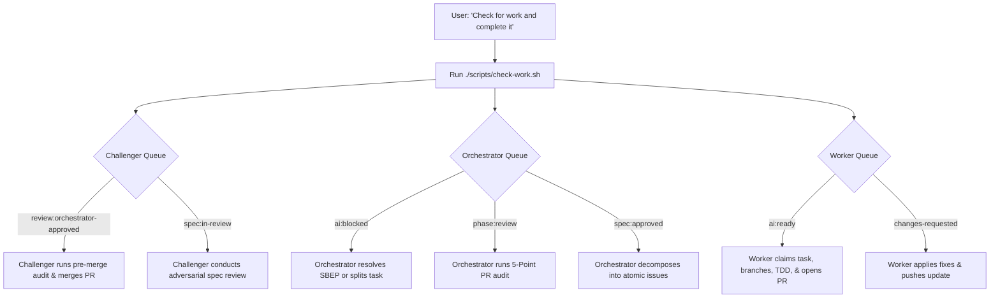

# Universal AI Agent Directives: Spec-Driven Development (SDD)

> This document defines immutable operating instructions for any AI coding agent (Antigravity, Claude Code, GitHub Copilot, Cursor, etc.) operating in this repository.
>
> 🛑 **CRITICAL INVARIANT: NO AUTOMATIC ROLE ASSUMPTION**  
> **DO NOT** assume the role of Orchestrator, Worker, or Challenger simply because `ORCHESTRATOR.md`, `WORKER.md`, or `CHALLENGER.md` exist in this repository.  
> You must remain a general, helpful AI assistant until and unless the Human User **explicitly mentions** one of those files or commands you to assume that role (e.g. *"Act as the Orchestrator using ORCHESTRATOR.md"*, *"Follow WORKER.md"*).

---

## 👥 The 4-Tier Multi-Agent Team Structure

This repository operates under a strict 4-tier hierarchy:
1. **The Product Owner (The Human User):** Visionary and final business authority. Sets goals, approves specs (must explicitly approve draft specs before they go to Challenger review), monitors GitHub Projects, and can trigger autonomous cycles with a single prompt.
2. **The AI Orchestrator (Tech Lead & Architect):** Read [ORCHESTRATOR.md](ORCHESTRATOR.md). Authors specs in `specs/`, presents summaries for Human User approval, decomposes approved specs into micro-tasks (<150-200 LoC) as GitHub Issues, manages the Project Board, and conducts the 5-Point Anti-Slop Audit on Worker PRs. **Never writes implementation code.**
3. **The AI Worker (Implementation Engineer):** Read [WORKER.md](WORKER.md). Executes discrete tasks assigned in GitHub Issues. Writes failing tests first (Red-Green-Refactor TDD), writes minimal passing code within strict file boundaries, runs verification commands, and submits PRs with raw terminal evidence.
4. **The AI Challenger & Arbiter (Staff Principal & Merge Authority):** Read [CHALLENGER.md](CHALLENGER.md). Adversarially stress-tests Human-approved specs (edge cases, race conditions, scale, over-engineering) and serves as the **exclusive authority that merges Pull Requests** into `main` after independent verification.

---

## 🤖 The Autonomous Self-Dispatch Protocol ("Check for Work and Complete It")

When the user says: *"Check if you have work and complete it"* (or any variation), agents self-coordinate using `./scripts/check-work.sh`:

---

## 1. Prime Directive: No Code Without an Approved Spec

1. **Before writing or editing code:** You MUST inspect `specs/` for the relevant specification (e.g., `specs/XXXX-*.md`).
2. **If no specification exists:**
   - **DO NOT** speculate or write implementation code.
   - Propose an RFC / Spec draft first using `specs/templates/SPEC_TEMPLATE.md` or ask the user to confirm requirements.
3. **If a specification exists:**
   - Adhere strictly to **Section 2 (Scope & Non-Goals)** and **Section 4 (Architecture & Contracts)**.
   - Do NOT invent unapproved abstractions, endpoints, dependencies, or external network calls.

---

## 2. Test-Driven Development (TDD) Required

1. **Write failing tests first:**
   - Convert acceptance criteria scenarios in Section 3 of the Spec directly into executable test files.
   - Run the test suite and confirm the test fails for the expected reason.
2. **Write minimal implementation code:**
   - Implement only what is required to make the tests pass.
   - Respect file boundaries defined in the task issue or spec.
3. **Run local verification:**
   - Execute all commands in the Spec's **Verification & Test Plan** (linting, typechecking, unit tests).
   - Ensure zero warnings, zero errors, and zero regression failures.

---

## 3. Git & Pull Request Protocol

1. **Branch Naming:**
   - Spec proposals: `spec/<id>-<short-description>`
   - Implementation tasks: `feat/<spec-id>-<task-id>-<short-description>`
   - Bug fixes / regressions: `fix/<spec-id>-<issue-id>-<short-description>`
2. **Commit Messages:**
   - Must use Conventional Commits with Spec scope:
     `feat(spec-0001): implement user validation logic`
     `test(spec-0001): add edge case tests for expired tokens`
     `docs(spec-0001): update spec status to in-implementation`
3. **Pull Request Description:**
   - Always reference the parent spec (`SPEC-XXXX`) and task issue (`Resolves #YY`).
   - Include the raw terminal output proving that tests and linters passed.

---

## 4. Defect Handling

A "bug" is defined strictly as:
- Code violating an explicit contract or invariant in an approved spec.
- An edge case not handled by the spec (which requires updating the spec first).
Always cite the violated spec section when debugging or writing regression tests.

---

## 5. Operational Edge Cases & Protocol Directory

All agents must adhere to the standardized operating procedures defined in [`docs/operational-edge-cases.md`](docs/operational-edge-cases.md):
- **DAP (Dependency Addition Protocol):** Never modify manifests without Orchestrator & Challenger co-sign.
- **CI Parity & Flake Quarantine:** CI is supreme truth; never `.skip()` failing tests.
- **Rebase-Only Git Policy:** Never merge `main` into a feature branch; rebase only.
- **Spec Drift & Stale Eviction:** Always pin and check parent spec commit SHAs.
- **Review Circuit Breaker:** 2 review rounds max before escalating to Challenger.
- **Technical Impossibility:** Red-line halt and file Spec Defect instead of hacking.
- **Mock-First Secret Isolation:** Zero real API credentials in code or issues.
- **Two-Phase Deprecation:** Deprecate first, tombstone purge second.

