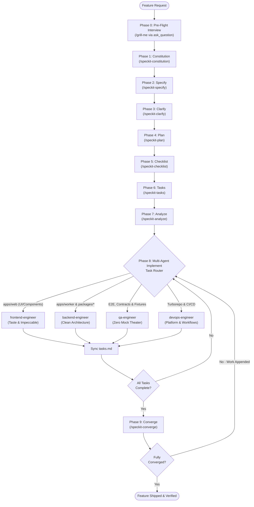

# FBUploadPro 🚀

Modern, cloud-native social media automation and video/image publishing SaaS. FBUploadPro empowers content creators, digital marketers, and media operators to manage multiple Facebook profiles, organize rich digital media, and automate high-volume publishing to Facebook Pages through intelligent, slot-based queues with zero token leakage, real-time analytics, and transparent pay-as-you-go token billing.

---

## 🏗️ Monorepo Architecture

FBUploadPro is organized as a high-performance `pnpm` monorepo orchestrated with Turborepo:

```
fbuploadpro/
├── apps/
│   ├── web/               # Next.js 16 (App Router) + React 19 web application
│   └── worker/            # Cloudflare Worker edge publisher & queue scheduler
├── packages/
│   ├── contracts/         # Zod schemas & shared data contracts
│   └── database/          # PostgreSQL database substrate (Node & Edge clients)
├── specs/                 # Spec-Driven Development (SDD) feature specifications
├── .specify/              # Spec Kit memory, scripts, and templates
└── .agents/               # Autonomous Multi-Agent Suite & Skills
```

---

## 🔄 The Spec-Driven Development (SDD) Lifecycle

All feature development and modifications follow the autonomous Spec Kit lifecycle:



### Core Slash Commands

| Phase | Slash Command | Subagent / Engine | Description |
| :--- | :--- | :--- | :--- |
| **0. Interview** | `/grill-me` | `spec-driver` | Conduct interactive pre-flight alignment interview via `ask_question`. |
| **1. Constitution** | `/speckit-constitution` | `speckit-constitution` | Ratify project-wide architectural principles in `.specify/memory/constitution.md`. |
| **2. Specify** | `/speckit-specify <description>` | `speckit-specify` | Generate requirements, user stories, and acceptance scenarios in `specs/<feature>/spec.md`. |
| **3. Clarify** | `/speckit-clarify` | `speckit-clarify` | Proactively scan spec for ambiguities and resolve gaps. |
| **4. Plan** | `/speckit-plan` | `speckit-plan` | Architect technical blueprints, data models, and contracts. |
| **5. Checklist** | `/speckit-checklist [category]` | `speckit-checklist` | Generate domain quality checklists (security, UX, perf). |
| **6. Tasks** | `/speckit-tasks` | `speckit-tasks` | Decompose plan into atomic, dependency-ordered tasks (<150–200 LoC). |
| **7. Analyze** | `/speckit-analyze` | `speckit-analyze` | Audit consistency across `spec.md`, `plan.md`, and `tasks.md`. |
| **8. Implement** | `/speckit-implement` | `speckit-implement` + Specialized Team | Multi-agent execution (`frontend-engineer`, `backend-engineer`, `qa-engineer`, `devops-engineer`). |
| **9. Converge** | `/speckit-converge` | `speckit-converge` | Validate codebase convergence against spec and resolve remaining gaps. |
| **Tracker** | `/speckit-taskstoissues` | `speckit-taskstoissues` | Convert tasks into GitHub Issues for tracking. |

---

## 🛠️ Multi-Agent Implementation Router

| Monorepo Scope | Dispatched Agent | Enforced Standard |
| :--- | :--- | :--- |
| **`apps/web`** (UI, Components, CSS) | `frontend-engineer` | Anti-slop craft (`taste-skill` + `pbakaus/impeccable`), Next.js 16 App Router, React 19 standards. |
| **`apps/worker`**, **`packages/*`** | `backend-engineer` | Clean architecture, Zod runtime validation, multi-tenant isolation (`user_id`), edge V8 isolate purity. |
| **E2E & Integration Tests** | `qa-engineer` | Real journey testing, zero mock theater, multi-tenant boundary verification. |
| **Turborepo & CI/CD** | `devops-engineer` | Turborepo pipeline caching, GitHub Actions workflows, Wrangler environments. |

---

## 🚀 Quickstart

1. **Install Dependencies**:
   ```bash
   pnpm install
   ```

2. **Run Agent Setup**:
   ```bash
   ./setup.sh
   ```

3. **Run Quality Gates**:
   ```bash
   pnpm turbo run build lint typecheck test
   ```
