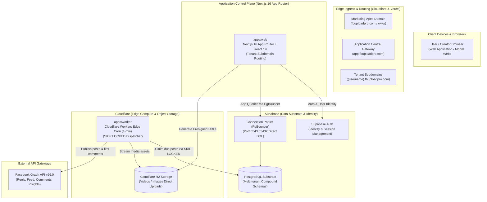

# FBUploadPro: System Architecture, Product Knowledge & Execution Blueprint

---

## 1. Product Vision & Core Mission

**FBUploadPro** is a modern, cloud-native social media automation and video/image publishing SaaS. It empowers content creators, digital marketers, and media operators to manage multiple Facebook profiles, organize rich digital media, and automate high-volume publishing to Facebook Pages through intelligent, slot-based queues with robust multi-tenant data isolation, real-time analytics, and unrestricted publishing entitlement for active users.

---

## 2. System Architecture Diagram & Component Topology

| Component | Host / Runtime | Entrypoints | Core Responsibilities |
|---|---|---|---|
| **Marketing Site** | **Independent Host** | Landing Page, Terms, Privacy | High-converting marketing landing pages, Terms of Service (`/terms`), Privacy Policy (`/privacy`), SEO content, deployed independently. |
| **Web App Gateway** | **Vercel** | `app.fbuploadpro.com` (`apps/web`) | Central authentication gateway, serving `/login`, `/signup`, and cross-subdomain auth handoffs. |
| **Tenant Workspaces** | **Vercel** | `{username}.fbuploadpro.com` (`apps/web`) | User workspace root and dedicated tenant tools. |
| **Database & Identity** | **Supabase** | Managed PostgreSQL & Supabase Auth | User identity/sessions, multi-tenant tables (`user_id`), transaction pooling, and automated schema migrations via `/supabase/migrations` and GitHub integration. |
| **Edge Compute** | **Cloudflare** | Cloudflare Workers (`apps/worker`) | Per-minute edge cron triggers, atomic queue locks (`SKIP LOCKED`), direct media streaming to Meta APIs. |
| **Object Storage** | **Cloudflare** | Cloudflare R2 (`media.fbuploadpro.com`) | S3-compatible media asset storage, presigned direct PC-to-bucket uploads, thumbnail cache. |
| **Social Publishing** | **Meta** | Facebook Graph API v26.0 | Reels and photo publishing, automatic first comment submission, page insights sync. |

### C. Automated Database Schema Migrations (Supabase GitHub Integration)
- **Canonical Migrations Directory**: `/supabase/migrations/`
- **Naming Standard**: Strict `YYYYMMDDHHmmss_<name>.sql` timestamp pattern (e.g. `20261008120001_initial_schema.sql`).
- **Automated Deployment**: Powered by the **Supabase GitHub Integration** configured in the Supabase Project Dashboard. When code merges to `main`, Supabase automatically executes unapplied migrations in chronological order.
- **Single Primary Instance (Zero Branching)**: Supabase preview branching is disabled (paid tier feature). The system operates strictly against the single production database instance tied directly to the `main` branch.
- **Local Package Reference**: `packages/database/migrations/` maintains symbolic links pointing to `/supabase/migrations` for package-level reference and local test execution.

---

## 3. Multi-Tenant User Architecture & Domain Routing

The platform adopts a decoupled multi-domain topology:

### A. Domain Routing Strategy
1. **Apex Marketing Domain (`fbuploadpro.com` & `www.fbuploadpro.com`)**:
   - Hosted and deployed independently from the webapp (e.g., custom marketing repo, Framer, Webflow).
   - Serves high-craft landing pages, feature announcements, `/terms`, and `/privacy`.
   - Links "Log In" to `https://app.fbuploadpro.com/login` and "Sign Up" / "Get Started" to `https://app.fbuploadpro.com/signup`.
2. **Central Application Gateway (`app.fbuploadpro.com`)**:
   - The primary entry door to the SaaS application.
   - Hosts public authentication: `/login` and `/signup`.
   - Upon successful authentication, automatically redirects the user to their personal workspace (`https://{username}.fbuploadpro.com`).
3. **Dedicated User Workspaces (`https://{username}.fbuploadpro.com`)**:
   - Every registered user operates within their dedicated tenant subdomain.
   - Authentication cookies are set on the apex wildcard cookie domain (`.fbuploadpro.com`), ensuring uninterrupted session continuity between `app.fbuploadpro.com` and `{username}.fbuploadpro.com`.
   - Facebook accounts, imported Facebook Pages, media assets, and publishing queues are strictly scoped to the active tenant user.
   - Zero cross-user data leakage enforced via database compound constraints (`user_id`) and edge routing guards.

### B. Active Construction & Staging Demo Domain (`vinsmokemedia.online`)
During initial feature assembly, integration testing, and staging, the platform is configured with `vinsmokemedia.online`:
- **Central Application Gateway**: `https://app.vinsmokemedia.online` (`/login`, `/signup`).
- **Dedicated Tenant Workspaces**: `https://{username}.vinsmokemedia.online`.
- **Wildcard Session Cookie**: `.vinsmokemedia.online` (enables cross-subdomain authentication continuity).
- **Supabase Auth Allowlist**: `https://app.vinsmokemedia.online/**` and `https://*.vinsmokemedia.online/**`.
- **Vercel Domains**: `app.vinsmokemedia.online` and `*.vinsmokemedia.online` with CNAME `cname.vercel-dns.com`.

---

## 4. Platform Roles & Governance

The platform operates on a clear three-tier role taxonomy:

| Role | Primary Purpose | Key Capabilities |
|---|---|---|
| **User** | Content Creator / Operator | Connects multiple Facebook profiles, manages personal Media Library, creates custom folders, configures Page queue slots, schedules and publishes unlimited posts without credit checks, and monitors Page insights. |
| **Seller** | Affiliate / Referral Partner | Onboards users via unique referral links/codes. Tracks referred users' activity and workspace usage. |
| **Admin** | Platform & System Controller | Manages platform health, system operations, and user statuses. User onboarding and management is completely automated. |

---

## 5. Dedicated User Media Library

Each user has an isolated, feature-rich Media Library:

- **Multi-Media Support**: Full support for both **short-form videos** (Reels / feed videos) and **images**.
- **Direct PC Ingestion**: Users upload assets directly from their local computer.
  - Browser-to-storage direct uploads via Cloudflare R2 presigned URLs (preventing web application server bottlenecks).
  - Fast upload handling with automated thumbnail preview generation.
- **Organization & Metadata**:
  - **Custom Folders**: Nested or categorized collections for organizing campaigns, themes, or series.
  - **Tags**: Multi-tag filtering and search for quick asset retrieval.
- **Storage Infrastructure & Quotas**:
  - High-availability object storage powered by **Cloudflare R2** with zero egress fees.
  - Per-user storage limits (default 10 GB), with real-time quota tracking.

---

## 6. High-Frequency Facebook Publishing Engine

Publishing is driven by an automated, queue-based slot architecture:

1. **Recurring Queue Slots**:
   - For each connected Facebook Page, users define recurring publishing time slots (e.g., Daily at `09:00`, `13:00`, and `18:00`).
2. **Selective Asset Queueing**:
   - Users select videos or images from their Media Library, assign captions, and add them to target Page queues.
3. **Automated First Comment**:
   - Users can optionally attach a First Comment (calls to action, affiliate links, hashtags) that is automatically posted immediately after the post goes live.
4. **Cloudflare Worker Edge Scheduler**:
   - A high-performance Cloudflare Worker edge cron runs every minute.
   - Atomically claims due queue items using PostgreSQL row-level locks (`FOR UPDATE SKIP LOCKED`).
   - Streams media directly to **Facebook Graph API v26.0**.
   - Submits the automated first comment if configured.
5. **Unrestricted Publishing Entitlement**:
   - Publishing entitlement is unrestricted for all active users (`status = 'active'`) with connected Facebook Pages.
   - Any active user can queue and publish unlimited posts with zero credit checks, balance deduction gates, or token ledgers.
   - Zero reliance on external scraping daemons or VPS downloaders; 100% focused on user-owned creative content.

---

## 7. Dedicated Facebook Page Insights & Analytics

Insights are accessible via dedicated analytics endpoints:

- **Overview & Growth**:
  - Current Fan Count (Likes) & Total Followers Count.
  - Time-series follower growth, daily new follows, and unfollow trends.
- **Content & Video Performance**:
  - Total video views and unique video views.
  - 30-second complete video views and total view time (watch minutes).
  - Media impressions and page views over 7-day, 14-day, and 28-day intervals.
- **Audience Engagement & Reactions**:
  - Total post engagements and action counts.
  - Detailed reaction breakdowns: Likes, Love, Wow, Haha, Sorry, Anger.
- **Demographics**:
  - Audience distribution by top countries and top cities.

---

## 8. Zero-Token Architecture & Unrestricted Publishing Policy

- **Token Economy Purged**: The prepaid token system, token ledger, and credit balance model have been formally abolished. Database columns (`tokens_balance`, `tokens_deducted`) and tables (`token_transactions`) are removed via clean DDL rewrite.
- **Unrestricted Publishing**: Any user with `status = 'active'` and connected Facebook pages can queue and publish unlimited posts without credit checks or balance deductions.
- **On-Demand Extension**: All billing, subscription monetization, or specialized workflows will be specified and implemented strictly upon explicit user direction.

---

## 9. Current Specifications & Platform Status

```mermaid
flowchart LR
  subgraph Done [Completed & Merged]
    M1[Spec 001: Monorepo Foundation & DB]
    M2[Spec 002: Auth & Subdomain Routing]
    M3[Spec 003: FB Graph API v26.0 & Accounts]
    M4[Spec 004: Dedicated Media Library & R2]
    M5[Spec 005: Automated Queue Slots Engine]
    M6[Spec 006: Dedicated Page Insights]
    M7[Spec 007: Purge Token System]
    M8[Spec 008: Essential Reusable UI Components]
    M9[Spec 009: Supabase Login & Signup Flow]
    M10[Spec 010: Auth UI/UX Redesign & Default Login]
    M11[Spec 011: Password Reset & Recovery Flow]
    M12[Spec 012: Auth Security Leak Prevention & Fault-Tolerant Resilience]
    M13[Spec 013: Auth OTP Confirmation & Subdomain Hardening]
    M14[Spec 014: Shared Shadcn-Compatible Sidebar Component]
    M15[Spec 015: Gmail Canonicalization, Phone E.164 & OTP Hardening]
    M16[Spec 016: Auth UX Refinement & Inline Validation]
    M17[Spec 017: Auth Flow Audit Remediation]
    M18[Spec 018: Unified 6-Digit OTP Password Reset Flow]
    M19[Spec 019: Pure Sidebar-Only Workspace App Shell]
    M20[Spec 020: Canonical Post-Auth Home Landing Route]
    M21[Spec 021: Auth Lifecycle, Session & Shell Hardening]
    M22[Spec 022: Left-Aligned Authentication Split Layout]
    M23[Spec 023: Supabase Auth Native SMTP OTP Delivery Migration]
    M24[Spec 024: Native Supabase Auth Lifecycle & Cooldown Resilience]
  end

  subgraph CurrentFocus [Active Priority]
    UIRecreate[Feature Views Assembly: Spec 002-006 Pages]
  end

  M1 --> M2 --> M3 --> M4 --> M5 --> M6 --> M7 --> M8 --> M9 --> M10 --> M11 --> M12 --> M13 --> M14 --> M15 --> M16 --> M17 --> M18 --> M19 --> M20 --> M21 --> M22 --> M23 --> M24 --> UIRecreate
```

- **Spec 001 (Completed & Merged)**: Turborepo monorepo, dual Node/Edge database clients, baseline schema, health probes.
- **Spec 002 (Completed & Merged; UI Slated for Assembly)**: Native Web Crypto HMAC-SHA256 session auth, subdomain routing middleware, RBAC shell.
- **Spec 003 (Completed & Merged; UI Slated for Assembly)**: Facebook Graph API v26.0 OAuth, AES-256-GCM encrypted token storage, selective page discovery, multi-account management UI.
- **Spec 004 (Completed & Merged; UI Slated for Assembly)**: Dedicated Media Library & Cloudflare R2 Uploads (direct presigned upload/confirm, folder hierarchy, 10 GB storage quota meters).
- **Spec 005 (Completed & Merged; UI Slated for Assembly)**: Automated Queue Slots Publishing Engine & Edge Dispatcher (recurring slot definitions, Cloudflare Worker edge dispatcher with `FOR UPDATE SKIP LOCKED`, Facebook Graph API v26.0 video/photo publisher, automated first comment).
- **Spec 006 (Completed & Merged; UI Slated for Assembly)**: Dedicated Facebook Page Insights (Server-side proxy, 15m cache, time-series followers, video views, watch time, reactions, demographics, worker daily snapshot cron sync).
- **Spec 007 (Completed & Merged)**: **Purge Token System & Enforce Unrestricted Publishing** (Abolished prepaid token credits, token transactions, atomic token decrements, queue balance gates, clean DDL purge of `tokens_balance` / `tokens_deducted` / `token_transactions`, and granted unrestricted publishing for active users).
- **Spec 008 (Completed & Merged into main)**: **Essential Reusable UI Components** (15 production-ready, accessible React 19 primitives in `apps/web/src/components/ui/`: Button, Input, Textarea, Checkbox, Switch, Select, Card, Dialog/Modal, Tabs, Table, StatusDot, Tag, Skeleton, Alert, Tooltip with 325 passing unit tests).
- **Spec 009 (Completed & Merged into main)**: **Supabase Authentication, Login & Registration Flow** (Full registration with Name, Phone, Email, Password; real-time automatic subdomain derivation stripping dots and plus tags; Supabase Auth integration; root-domain cookie scoping `.fbuploadpro.com`; automatic redirect to `{subdomain}.fbuploadpro.com`; dual-theme UI using Spec 008 primitives).
- **Spec 010 (Completed & Merged into main)**: **Professional Auth UI/UX Redesign & Default Login Page** (Eliminated placeholder landing card; configured root `/` to redirect directly to `/login`; crafted professional split-screen layout with brand showcase and feature pillars; added accessible show/hide password toggle; removed subdomain preview box from `/signup` for clean UX).
- **Spec 011 (Completed & Merged into main)**: **Password Reset & Recovery Flow** (Added "Forgot password?" link on sign-in form; created `/forgot-password` recovery email portal with confirmation state; created `/reset-password` credential update form with password confirmation and minimum length validation; added backend recovery endpoints via Supabase Auth).
- **Spec 012 (Completed & Merged into main)**: **Auth Security Leak Prevention & Fault-Tolerant Resilience** (Centralized `formatAuthErrorResponse` and `sanitizeAuthErrorMessage`; completely masked internal technical plumbing exceptions like `ECONNREFUSED` and database socket errors behind customer-safe copy; prioritized Supabase HTTPS PostgREST queries over raw TCP sockets on serverless; added comprehensive resilience integration test suites).
- **Spec 013 (Completed & Merged into main)**: **Auth OTP Confirmation & Subdomain Hardening** (6-digit email confirmation OTP using Resend with rate-limited resend cooldown; eliminated tenant subdomain 404s by 307 redirecting `/login`, `/signup`, `/forgot-password`, `/reset-password` to central gateway `app.fbuploadpro.com`; real-time PasswordStrengthMeter; Caps Lock warning indicator; deep-link `returnUrl` preservation; Terms & Privacy legal consent on signup).
- **Spec 014 (Completed & Merged into main)**: **Shared Shadcn-Compatible Sidebar Component** (Production-grade, accessible Sidebar suite in `apps/web/src/components/ui/sidebar.tsx` conforming strictly to `apps/web/src/lib/theme.ts`: `SidebarProvider`, `Sidebar`, `SidebarHeader`, `SidebarContent`, `SidebarFooter`, `SidebarInset`, `SidebarGroup`, `SidebarGroupLabel`, `SidebarGroupAction`, `SidebarGroupContent`, `SidebarMenu`, `SidebarMenuItem`, `SidebarMenuButton`, `SidebarMenuAction`, `SidebarMenuBadge`, `SidebarMenuSub`, `SidebarRail`, `SidebarTrigger`; desktop icon rail collapse `48px`, mobile slide-over drawer with backdrop, cookie persistence `sidebar_state`, `Cmd+B`/`Ctrl+B` keyboard shortcut, and pure unpopulated primitives free of mocks for user-defined content).
- **Spec 015 (Completed & Merged into main)**: **Gmail Canonicalization, Phone E.164 & Hardened OTP Security** (Strict Gmail-only domain enforcement `@gmail.com` / `@googlemail.com`; anti-aliasing canonicalization stripping dots and plus tags both on frontend and server-side; database `normalized_email` column with unique index and domain check constraint; international phone validation via `libphonenumber-js` with database E.164 check constraint; cryptographically secure OTP with constant-time comparison `timingSafeEqual`; sliding-window dual IP & identifier rate limiting; 15-minute progressive backoff lockout after 5 failed verification attempts; zero-knowledge safe Resend error handling).
- **Spec 016 (Completed & Verified)**: **Auth UX Refinement, Inline Error Highlighting & Edge-Case Hygiene** (Eliminated disruptive, bulky alert/dialogue boxes for field validation; implemented standard SaaS field-level inline error states with red border highlighting and contextual helper messages; integrated `validateClientPhoneNumber` via `libphonenumber-js` client-side handling edge cases like `asdf` and `+32433`; unpacked backend 400 validation `details` directly onto respective form fields; permanently removed `PasswordStrengthMeter` visual clutter in favor of clean static minimum criteria; implemented compact `<FormErrorCallout>` positioned directly above action buttons for non-field errors; added hybrid live error clearing on user keystroke).
- **Spec 017 (Completed & Verified)**: **Authentication Flow Audit Remediation & Hardening** (Full remediation of all 15 audit findings across `/login`, `/signup`, `/forgot-password`, and `/reset-password`: strict post-auth open redirect prevention via `sanitizeAuthRedirectUrl`, password recovery token parsing with single-use invalidation and arbitrary password override removal, in-memory credential zero-retention via immediate PBKDF2 pre-hashing in OTP staging, synchronized 30-day session lifetimes with post-password-reset session invalidation, and WCAG 2.2 AA accessibility hardening across form labels, autocomplete, visible focus indicators, and touch target minimums).
- **Spec 018 (Completed & Verified)**: **Unified 6-Digit OTP Password Reset Flow** (Eliminated all legacy email magic recovery links in favor of a secure 6-digit numeric OTP recovery flow delivered via Resend; two-step layout on `/forgot-password`: Step 1 collects and canonicalizes Gmail, Step 2 verifies 6-digit code with timing-safe constant-time comparison `timingSafeEqual`, 10-minute expiration, 60-second cooldown on resends, 5-attempt progressive lockout, and immediate post-reset session invalidation; `/reset-password` cleanly guides and redirects visitors to `/forgot-password`).
- **Spec 019 (Completed & Merged into main)**: **Pure Sidebar-Only Workspace App Shell** (Implemented Linear/Stripe-style headerless desktop canvas giving 100% full-viewport bleed to publisher workflows; unified navigation in shadcn `Sidebar` suite with top Workspace brand monogram header, "Home" top menu item, 1px hairline `SidebarSeparator`, "Facebook" section heading with "Accounts" nested sub-item, and integrated `SidebarRail` edge collapse; anchored footer card with operator name/email, avatar initials, and chevron-up (`^`) trigger popover for theme switching and instant sign-out; discreet floating top-left corner trigger for mobile screens `<768px`).
- **Spec 020 (Completed & Merged into main)**: **Canonical Post-Authentication Workspace Home Landing Route** (Standardized all post-authentication entry points—login and signup OTP verification—to route directly to the tenant's workspace root `https://${subdomain}.${rootDomain}/` rewriting to the workspace Home page `/tenant/[subdomain]`, eradicating deprecated `/dashboard` routes; updated post-password-reset flow to redirect to `/login?reset=success` with an accessible green confirmation alert banner, taking operators to their workspace Home upon signing in; updated central app gateway middleware to automatically forward authenticated sessions to their workspace root).
- **Spec 021 (Completed & Merged into main)**: **Comprehensive Auth Lifecycle, Resilient Session Termination & Workspace Shell Usability Hardening** (Full remediation of all 22 real-world edge cases across authentication, pending registration re-login routing to OTP verification, OTP onboarding error recovery with accessible "Wrong email? Edit" details restoration, persistence of pending verification state across reloads, 1-click "Send fresh code" on expired OTPs, contextual 1-click "Sign in instead" on 409 duplicate registration, bulletproof offline sign-out via client-side cookie wiping and middleware `?logout=success` bypass, cross-tab session termination synchronization via `BroadcastChannel` and storage events, canonical gateway navigation on logout, bfcache leakage prevention via `Cache-Control: no-store` and `pageshow` reload guard, theme persistence in `localStorage` and cookie `fbup_theme` to prevent FOUC, automatic mobile drawer sheet dismissal on navigation, layout gutter reserving mobile clearance for floating trigger, user popover viewport collision boundaries, subtle Caps Lock indication, and uniform rate-limiting copy preventing account enumeration).
- **Spec 022 (Completed & Verified)**: **Left-Aligned Authentication Split Layout Architecture** (Repositioned the primary interactive authentication forms to the left side of desktop viewports ($\ge 1024\text{px}$) across `/login`, `/signup`, `/forgot-password`, and `/reset-password` in `AuthSplitLayout` to align with F-pattern reading ergonomics and screen-reader accessibility; added `auth-showcase-right` with `border-left` and outer radial glow at `82% 22%`; preserved 100% full-width single-column responsive behavior on mobile/tablet viewports `< 1024\text{px}`).
- **Spec 023 (Completed & Verified)**: **Supabase Auth Native SMTP OTP Delivery Architecture** (Completely decommissioned Resend SDK and custom email service; migrated all 6-digit numeric OTP delivery for registration and password recovery to native Supabase Auth over operator-configured custom SMTP in Supabase Dashboard; added staged account lifecycle with `pending_verification` user status, automated PostgREST profile activation upon successful OTP verification, resilient fallback for offline/CI test environments, and zero third-party email SDK footprint).
- **Spec 024 (Completed & Verified)**: **Native Supabase Auth Lifecycle & Cooldown Resilience** (Eliminated redundant `pending_verification` state from `public.users` database schema to rely strictly on Supabase Auth `email_confirmed_at` as the single source of truth; established that proving email ownership via Forgot Password recovery OTP verifies the email and grants access to the workspace; added comprehensive GoTrue security rate-limit / cooldown extraction (`/after (\d+) seconds/i`) returning HTTP 429 and disabling the Create Account button with live countdown `Please wait (Xs)`; ensured unverified user logins return HTTP 403 `requiresOtp: true` and redirect automatically to OTP confirmation `/signup?step=otp`).
- **Feature Views Assembly (Active Priority)**: Assembling the recreated frontend views across Specs 002–006 utilizing the completed Spec 008, Spec 014, Spec 015, Spec 016, Spec 017, Spec 018, Spec 019, and Spec 020 component primitives.
- **Future Specifications**: All subsequent features and specifications will be created strictly on demand as directed by the user.

---

## 10. Autonomous Spec-Driven Development (SDD) & Multi-Agent Protocol

All development follows autonomous multi-agent orchestration codified in [`.agents/AGENTS.md`](../.agents/AGENTS.md):

1. **Focused Execution & Mandatory Human Merge Gate ("Ask Once, Verify & Approve Before Merge")**:
   - The agent confirms **which spec or feature to work on**.
   - The agent autonomously conducts specification, planning, task decomposition, and implementation across subagents without constant micro-interruptions.
   - **Post-PR Vercel Preview Testing**: UI components and layouts are reviewed and validated using live Vercel Preview Deployments generated automatically for each Pull Request. If and only if the PR modifies UI components or pages, the agent retrieves the preview URL and provides it for interactive user inspection across all states (empty, loading, active, error, mobile/desktop). Non-UI PRs do not surface a preview link.
   - **Mandatory Human Approval Gate**: The agent MUST NEVER merge any PR into `main` without explicitly asking the user and receiving direct approval. This applies to all PRs (frontend, backend, database migrations, devops, or docs).
2. **Deterministic 7-Stage Sequence**:
   - `RFC Discussion` ➔ `/speckit-specify` ➔ `/speckit-plan` ➔ `/speckit-tasks` ➔ `/speckit-implement` ➔ `/speckit-converge` ➔ `PR Vercel Preview & Human Approval` ➔ `Merge & Deploy`.
3. **Clean Chat & Sub-Agent Delegation**:
   - Orchestrator keeps main chat executive-ready, isolating verbose commands into dedicated subagents (`frontend-engineer`, `backend-engineer`, `qa-engineer`, `devops-engineer`).
4. **Constitutional Guardrails**:
   - Strict TDD (failing tests committed before implementation).
   - Atomic PR diffs strictly under 150–200 LoC per PR.
   - 100% Turborepo quality gates green (`build`, `lint`, `typecheck`, `test`).
   - Zero direct pushes to `main`.
5. **Unrestricted Publishing Governance (Constitution v2.1.0)**:
   - In accordance with Constitution v2.1.0, the platform enforces unrestricted queue publishing for all active users (`status = 'active'`).
   - Zero token balance checks, deductions, or credit ledgers are permitted in the scheduling or publishing pipeline.
6. **Design System & Theme Token Governance (`DESIGN.md` & `apps/web/src/lib/theme.ts`)**:
   - The official palette is codified in `DESIGN.md`: Gold (`#fad734`), Peru (`#b29527`), Bronze (`#766018`), Rose (`#f6465d`), Emerald (`#2ebd85`), Pitch Black (`#000000`), Pure White (`#ffffff`), and Pitch Slate (`#1f242d`).
   - `DESIGN.md` is permanently frozen and locked as an immutable specification; agents must NEVER modify it.
   - `apps/web/src/lib/theme.ts` is the single centralized authority for all frontend styling. All components must import and reference tokens from `@web/lib/theme` or CSS variables (`globals.css`); declaring ad-hoc hex values, arbitrary borders, or capsule pill badges is permanently prohibited. Status signaling must strictly use unboxed 6px luminous dots with micro-halos.
