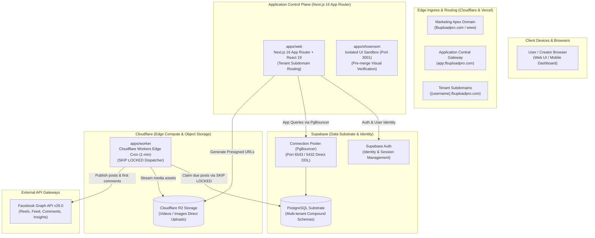

# FBUploadPro: System Architecture, Product Knowledge & Execution Blueprint

---

## 1. Product Vision & Core Mission

**FBUploadPro** is a modern, cloud-native social media automation and video/image publishing SaaS. It empowers content creators, digital marketers, and media operators to manage multiple Facebook profiles, organize rich digital media, and automate high-volume publishing to Facebook Pages through intelligent, slot-based queues with robust multi-tenant data isolation, real-time analytics, and unrestricted publishing entitlement for active users.

---

## 2. System Architecture Diagram & Component Topology

| Component | Host / Runtime | Entrypoints | Core Responsibilities |
|---|---|---|---|
| **Marketing Site** | **Independent Host** | Landing Page, Terms, Privacy | High-converting marketing landing pages, Terms of Service (`/terms`), Privacy Policy (`/privacy`), SEO content, deployed independently. |
| **Web App Gateway** | **Vercel** | `app.fbuploadpro.com` (`apps/web`) | Central authentication gateway, serving `/login`, `/signup`, and cross-subdomain auth handoffs. |
| **Tenant Workspaces** | **Vercel** | `{username}.fbuploadpro.com` (`apps/web`) | User workspace dashboard, dedicated Media Library, queue slot configuration, Page analytics. |
| **Database & Identity** | **Supabase** | Managed PostgreSQL & Supabase Auth | User identity/sessions, multi-tenant tables (`user_id`), transaction pooling, and forward SQL migrations. |
| **Edge Compute** | **Cloudflare** | Cloudflare Workers (`apps/worker`) | Per-minute edge cron triggers, atomic queue locks (`SKIP LOCKED`), direct media streaming to Meta APIs. |
| **Object Storage** | **Cloudflare** | Cloudflare R2 (`media.fbuploadpro.com`) | S3-compatible media asset storage, presigned direct PC-to-bucket uploads, thumbnail cache. |
| **Social Publishing** | **Meta** | Facebook Graph API v26.0 | Reels and photo publishing, automatic first comment submission, page insights sync. |

---

## 3. Multi-Tenant User Architecture & Domain Routing

The platform adopts a decoupled multi-domain topology:

### A. Domain Routing Strategy
1. **Apex Marketing Domain (`fbuploadpro.com` & `www.fbuploadpro.com`)**:
   - Hosted and deployed independently from the webapp (e.g., custom marketing repo, Framer, Webflow).
   - Serves high-craft landing pages, feature announcements, `/terms`, and `/privacy`.
   - Links "Log In" to `https://app.fbuploadpro.com/login` and "Sign Up" / "Get Started" to `https://app.fbuploadpro.com/signup`.
2. **Central Application Gateway (`app.fbuploadpro.com`)**:
   - The primary entry door to the SaaS application.
   - Hosts public authentication: `/login` and `/signup`.
   - Upon successful authentication, automatically redirects the user to their personal workspace (`https://{username}.fbuploadpro.com/dashboard`).
3. **Dedicated User Workspaces (`https://{username}.fbuploadpro.com`)**:
   - Every registered user operates within their dedicated tenant subdomain.
   - Authentication cookies are set on the apex wildcard cookie domain (`.fbuploadpro.com`), ensuring uninterrupted session continuity between `app.fbuploadpro.com` and `{username}.fbuploadpro.com`.
   - Facebook accounts, imported Facebook Pages, media assets, and publishing queues are strictly scoped to the active tenant user.
   - Zero cross-user data leakage enforced via database compound constraints (`user_id`) and edge routing guards.

---

## 4. Platform Roles & Governance

The platform operates on a clear three-tier role taxonomy:

| Role | Primary Purpose | Key Capabilities |
|---|---|---|
| **User** | Content Creator / Operator | Connects multiple Facebook profiles, manages personal Media Library, creates custom folders and reusable captions, configures Page queue slots, schedules and publishes unlimited posts without credit checks, and monitors Page insights. |
| **Seller** | Affiliate / Referral Partner | Onboards users via unique referral links/codes. Tracks referred users' activity and workspace usage. |
| **Admin** | Platform & System Controller | Manages platform health, system operations, and user statuses. User onboarding and management is completely automated. |

---

## 5. Dedicated User Media Library

Each user has an isolated, feature-rich Media Library:

- **Multi-Media Support**: Full support for both **short-form videos** (Reels / feed videos) and **images**.
- **Direct PC Ingestion**: Users upload assets directly from their local computer.
  - Browser-to-storage direct uploads via Cloudflare R2 presigned URLs (preventing web application server bottlenecks).
  - Fast upload handling with automated thumbnail preview generation.
- **Organization & Metadata**:
  - **Custom Folders**: Nested or categorized collections for organizing campaigns, themes, or series.
  - **Tags**: Multi-tag filtering and search for quick asset retrieval.
  - **Reusable Captions**: A library of saved caption templates and snippets that can be attached to posts with one click.
- **Storage Infrastructure & Quotas**:
  - High-availability object storage powered by **Cloudflare R2** with zero egress fees.
  - Per-user storage limits (default 5 GB / 50 assets), with real-time quota tracking.

---

## 6. High-Frequency Facebook Publishing Engine

Publishing is driven by an automated, queue-based slot architecture:

1. **Recurring Queue Slots**:
   - For each connected Facebook Page, users define recurring publishing time slots (e.g., Daily at `09:00`, `13:00`, and `18:00`).
2. **Selective Asset Queueing**:
   - Users select videos or images from their Media Library, assign captions (or reusable caption templates), and add them to target Page queues.
3. **Automated First Comment**:
   - Users can optionally attach a First Comment (calls to action, affiliate links, hashtags) that is automatically posted immediately after the post goes live.
4. **Cloudflare Worker Edge Scheduler**:
   - A high-performance Cloudflare Worker edge cron runs every minute.
   - Atomically claims due queue items using PostgreSQL row-level locks (`FOR UPDATE SKIP LOCKED`).
   - Streams media directly to **Facebook Graph API v26.0**.
   - Submits the automated first comment if configured.
5. **Unrestricted Publishing Entitlement**:
   - Publishing entitlement is unrestricted for all active users (`status = 'active'`) with connected Facebook Pages.
   - Any active user can queue and publish unlimited posts with zero credit checks, balance deduction gates, or token ledgers.
   - Zero reliance on external scraping daemons or VPS downloaders; 100% focused on user-owned creative content.

---

## 7. Dedicated Facebook Page Insights & Analytics

Insights are accessible in a dedicated, per-page view (rather than cluttering the workspace dashboard):

- **Overview & Growth**:
  - Current Fan Count (Likes) & Total Followers Count.
  - Time-series follower growth, daily new follows, and unfollow trends.
- **Content & Video Performance**:
  - Total video views and unique video views.
  - 30-second complete video views and total view time (watch minutes).
  - Media impressions and page views over 7-day, 14-day, and 28-day intervals.
- **Audience Engagement & Reactions**:
  - Total post engagements and action counts.
  - Detailed reaction breakdowns: Likes, Love, Wow, Haha, Sorry, Anger.
- **Demographics**:
  - Audience distribution by top countries and top cities.

---

## 8. Zero-Token Architecture & Unrestricted Publishing Policy

- **Token Economy Purged**: The prepaid token system, token ledger, and credit balance model have been formally abolished. Database columns (`tokens_balance`, `tokens_deducted`) and tables (`token_transactions`) are removed via clean DDL rewrite.
- **Unrestricted Publishing**: Any user with `status = 'active'` and connected Facebook pages can queue and publish unlimited posts without credit checks or balance deductions.
- **On-Demand Extension**: All billing, subscription monetization, or specialized workflows will be specified and implemented strictly upon explicit user direction.

---

## 9. Current Specifications & Platform Status

```mermaid
flowchart LR
  subgraph Done [Completed & Merged]
    M1[Spec 001: Monorepo Foundation & DB]
    M2[Spec 002: Auth & Subdomain Routing]
    M3[Spec 003: FB Graph API v26.0 & Accounts]
    M4[Spec 004: Dedicated Media Library & R2]
    M5[Spec 005: Automated Queue Slots Engine]
    M6[Spec 006: Dedicated Page Insights]
    M7[Spec 007: Purge Token System]
    M8[Spec 008: Essential Reusable UI Components]
  end

  subgraph CurrentFocus [Active Priority]
    UIRecreate[Feature Views Assembly: Spec 002-006 Pages]
  end

  M1 --> M2 --> M3 --> M4 --> M5 --> M6 --> M7 --> M8 --> UIRecreate
```

- **Spec 001 (Completed & Merged)**: Turborepo monorepo, dual Node/Edge database clients, baseline schema, health probes.
- **Spec 002 (Completed & Merged; UI Slated for Assembly)**: Native Web Crypto HMAC-SHA256 session auth, subdomain routing middleware, RBAC shell.
- **Spec 003 (Completed & Merged; UI Slated for Assembly)**: Facebook Graph API v26.0 OAuth, AES-256-GCM encrypted token storage, selective page discovery, multi-account management UI.
- **Spec 004 (Completed & Merged; UI Slated for Assembly)**: Dedicated Media Library & Cloudflare R2 Uploads (direct presigned upload/confirm, folder hierarchy, reusable caption templates, 5GB/50-asset storage quota meters).
- **Spec 005 (Completed & Merged; UI Slated for Assembly)**: Automated Queue Slots Publishing Engine & Edge Dispatcher (recurring slot definitions, Cloudflare Worker edge dispatcher with `FOR UPDATE SKIP LOCKED`, Facebook Graph API v26.0 video/photo publisher, automated first comment).
- **Spec 006 (Completed & Merged; UI Slated for Assembly)**: Dedicated Facebook Page Insights (Server-side proxy, 15m cache, time-series followers, video views, watch time, reactions, demographics, worker daily snapshot cron sync).
- **Spec 007 (Completed & Merged)**: **Purge Token System & Enforce Unrestricted Publishing** (Abolished prepaid token credits, token transactions, atomic token decrements, queue balance gates, clean DDL purge of `tokens_balance` / `tokens_deducted` / `token_transactions`, and granted unrestricted publishing for active users).
- **Spec 008 (Completed & Implemented)**: **Essential Reusable UI Components** (15 production-ready, accessible React 19 primitives in `apps/web/src/components/ui/` with interactive dual-theme testing benches in `apps/showroom` on port 3001: Button, Input, Textarea, Checkbox, Switch, Select, Card, Dialog/Modal, Tabs, Table, StatusDot, Tag, Skeleton, Alert, Tooltip).
- **Feature Views Assembly (Active Priority)**: Assembling the recreated frontend views across Specs 002–006 utilizing the completed Spec 008 component primitives.
- **Future Specifications**: All subsequent features and specifications will be created strictly on demand as directed by the user.

---

## 10. Autonomous Spec-Driven Development (SDD) & Multi-Agent Protocol

All development follows autonomous multi-agent orchestration codified in [`AGENTS.md`](../AGENTS.md):

1. **Focused Execution & Mandatory Human Merge Gate ("Ask Once, Verify & Approve Before Merge")**:
   - The agent confirms **which spec or feature to work on**.
   - The agent autonomously conducts specification, planning, task decomposition, and implementation across subagents without constant micro-interruptions.
   - **Pre-Merge UI Showroom**: To keep agent focus sharp and eliminate mock data contamination from `apps/web`, component testing is batched at the very end when all milestone tasks are complete. The agent launches `apps/showroom` and provides an ephemeral public tunnel link for interactive inspection across all states (empty, loading, active, error, mobile/desktop).
   - **Mandatory Human Approval Gate**: The agent MUST NEVER merge any PR into `main` without explicitly asking the user and receiving direct approval. This applies to all PRs (frontend, backend, database migrations, devops, or docs).
2. **Deterministic 7-Stage Sequence**:
   - `RFC Discussion` ➔ `/speckit-specify` ➔ `/speckit-plan` ➔ `/speckit-tasks` ➔ `/speckit-implement` ➔ `/speckit-converge` ➔ `Pre-Merge Showroom & Human Approval` ➔ `Merge & Deploy`.
3. **Clean Chat & Sub-Agent Delegation**:
   - Orchestrator keeps main chat executive-ready, isolating verbose commands into dedicated subagents (`frontend-engineer`, `backend-engineer`, `qa-engineer`, `devops-engineer`).
4. **Constitutional Guardrails**:
   - Strict TDD (failing tests committed before implementation).
   - Atomic PR diffs strictly under 150–200 LoC per PR.
   - 100% Turborepo quality gates green (`build`, `lint`, `typecheck`, `test`).
   - Zero direct pushes to `main`.
5. **Unrestricted Publishing Governance (Constitution v2.1.0)**:
   - In accordance with Constitution v2.1.0, the platform enforces unrestricted queue publishing for all active users (`status = 'active'`).
   - Zero token balance checks, deductions, or credit ledgers are permitted in the scheduling or publishing pipeline.
6. **Design System & Theme Token Governance (`DESIGN.md` & `apps/web/src/lib/theme.ts`)**:
   - The official palette is codified in `DESIGN.md`: Gold (`#fad734`), Peru (`#b29527`), Bronze (`#766018`), Rose (`#f6465d`), Emerald (`#2ebd85`), Pitch Black (`#000000`), Pure White (`#ffffff`), and Pitch Slate (`#1f242d`).
   - `DESIGN.md` is permanently frozen and locked as an immutable specification; agents must NEVER modify it.
   - `apps/web/src/lib/theme.ts` is the single centralized authority for all frontend styling. All components must import and reference tokens from `@web/lib/theme` or CSS variables (`globals.css`); declaring ad-hoc hex values, arbitrary borders, or capsule pill badges is permanently prohibited. Status signaling must strictly use unboxed 6px luminous dots with micro-halos.
