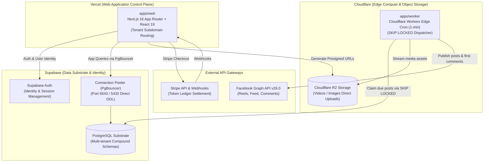
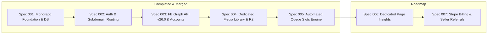

# FBUploadPro: Foundational Product Knowledge & Architecture

This document serves as the canonical source of truth for the product vision, architecture, user personas, roles, and functional workflows of **FBUploadPro**.

---

## 1. Product Vision & Core Mission

**FBUploadPro** is a modern, cloud-native social media automation and video/image publishing SaaS. It empowers content creators, digital marketers, and media operators to manage multiple Facebook profiles, organize rich digital media, and automate high-volume publishing to Facebook Pages through intelligent, slot-based queues with zero token leakage, real-time analytics, and transparent pay-as-you-go token billing.

---

## 2. Production Infrastructure Topology & Cloud Providers

The platform architecture is cleanly separated across four specialized, best-in-class cloud providers:

| **Marketing Site** | **Independent Host** | Landing Page, Terms, Privacy | High-converting marketing landing pages, Terms of Service (`/terms`), Privacy Policy (`/privacy`), SEO content, deployed independently. |
| **Web App Gateway** | **Vercel** | `app.fbuploadpro.com` (`apps/web`) | Central authentication gateway, serving `/login`, `/signup`, and cross-subdomain auth handoffs. |
| **Tenant Workspaces** | **Vercel** | `{username}.fbuploadpro.com` (`apps/web`) | User workspace dashboard, dedicated Media Library, queue slot configuration, Page analytics. |
| **Database & Identity** | **Supabase** | Managed PostgreSQL & Supabase Auth | User identity/sessions, multi-tenant tables (`user_id`), transaction pooling, and forward SQL migrations. |
| **Edge Compute** | **Cloudflare** | Cloudflare Workers (`apps/worker`) | Per-minute edge cron triggers, atomic queue locks (`SKIP LOCKED`), direct media streaming to Meta APIs. |
| **Object Storage** | **Cloudflare** | Cloudflare R2 (`media.fbuploadpro.com`) | S3-compatible media asset storage, presigned direct PC-to-bucket uploads, thumbnail cache. |
| **Social Publishing** | **Meta** | Facebook Graph API v26.0 | Reels and photo publishing, automatic first comment submission, page insights sync. |
| **Billing & Payments** | **Stripe** | Stripe Billing & Webhooks | Pay-as-you-go token packs, seller referral commission attribution. |

---

## 3. Multi-Tenant User Architecture & Domain Routing

The platform adopts a decoupled multi-domain topology:

### A. Domain Routing Strategy
1. **Apex Marketing Domain (`fbuploadpro.com` & `www.fbuploadpro.com`)**:
   - Hosted and deployed independently from the webapp (e.g., custom marketing repo, Framer, Webflow).
   - Serves high-craft landing pages, feature announcements, `/terms`, and `/privacy`.
   - Links "Log In" to `https://app.fbuploadpro.com/login` and "Sign Up" / "Get Started" to `https://app.fbuploadpro.com/signup`.
2. **Central Application Gateway (`app.fbuploadpro.com`)**:
   - The primary entry door to the SaaS application.
   - Hosts public authentication: `/login` and `/signup`.
   - Upon successful authentication, automatically redirects the user to their personal workspace (`https://{username}.fbuploadpro.com/dashboard`).
3. **Dedicated User Workspaces (`https://{username}.fbuploadpro.com`)**:
   - Strictly reserved for the active authenticated user.
   - Unauthenticated visitors hitting `{username}.fbuploadpro.com` are bounced to `https://app.fbuploadpro.com/login?returnUrl=...`.
   - Mismatched users (e.g. user `alex` trying to view `https://sarah.fbuploadpro.com`) are redirected to their own valid workspace.
4. **Shared Session Cookie Scope**:
   - Authentication cookies are set on the apex wildcard cookie domain (`.fbuploadpro.com`), ensuring uninterrupted session continuity between `app.fbuploadpro.com` and `{username}.fbuploadpro.com`.
  - Facebook accounts, imported Facebook Pages, media assets, publishing queues, and token ledgers are strictly scoped to the active tenant user.
  - Zero cross-user data leakage enforced via database compound constraints (`user_id`) and edge routing guards.

---

## 4. Platform Roles & Governance

The platform operates on a clear three-tier role taxonomy:

| Role | Primary Purpose | Key Capabilities |
|---|---|---|
| **User** | Content Creator / Operator | Connects multiple Facebook profiles, manages personal Media Library, creates custom folders and reusable captions, configures Page queue slots, schedules posts, monitors Page insights, and purchases operational tokens via Stripe. |
| **Seller** | Affiliate / Referral Partner | Onboards users via unique referral links/codes. Tracks referred users' activity and earns commission credits / revenue share on referred users' Stripe token purchases. |
| **Admin** | Financial & Commission Controller | Configures platform token pricing tiers, sets seller commission percentages, reviews referral performance, and approves/processes commission payouts. User onboarding and management is completely automated. |

---

## 5. Dedicated User Media Library

Each user has an isolated, feature-rich Media Library:

- **Multi-Media Support**: Full support for both **short-form videos** (Reels / feed videos) and **images**.
- **Direct PC Ingestion**: Users upload assets directly from their local computer.
  - Browser-to-storage direct uploads via Cloudflare R2 presigned URLs (preventing web application server bottlenecks).
  - Fast upload handling with automated thumbnail preview generation.
- **Organization & Metadata**:
  - **Custom Folders**: Nested or categorized collections for organizing campaigns, themes, or series.
  - **Tags**: Multi-tag filtering and search for quick asset retrieval.
  - **Reusable Captions**: A library of saved caption templates and snippets that can be attached to posts with one click.
- **Storage Infrastructure & Quotas**:
  - Backed by Cloudflare R2 object storage.
  - Generous baseline storage quota (e.g. 5GB or 50 media assets) with clear usage meters.

---

## 6. Automated Queue Slots Publishing Engine

Instead of manual calendar scheduling or legacy scraper bots, publishing is driven by an **Automated Queue Slots** architecture:

1. **Page-Specific Queue Slots**:
   - For each connected Facebook Page, users define recurring publishing time slots (e.g., Daily at `09:00`, `13:00`, and `18:00`).
2. **Selective Asset Queueing**:
   - Users select videos or images from their Media Library, assign captions (or reusable caption templates), and add them to target Page queues.
3. **Automated First Comment**:
   - Users can optionally attach a First Comment (calls to action, affiliate links, hashtags) that is automatically posted immediately after the post goes live.
4. **Cloudflare Worker Edge Scheduler**:
   - A high-performance Cloudflare Worker edge cron runs every minute.
   - Atomically claims due queue items using PostgreSQL row-level locks (`FOR UPDATE SKIP LOCKED`).
   - Streams media directly to **Facebook Graph API v26.0**.
   - Submits the automated first comment if configured.
5. **Token Consumption Lifecycle**:
   - Pre-flight checks ensure the user has sufficient tokens before scheduling.
   - **Tokens are deducted strictly upon successful publication** to Facebook (with automatic rollback and detailed error logs if publishing fails).
   - Zero reliance on external scraping daemons or VPS downloaders; 100% focused on user-owned creative content.

---

## 7. Dedicated Facebook Page Insights & Analytics

Insights are accessible in a dedicated, per-page view (rather than cluttering the workspace dashboard):

- **Overview & Growth**:
  - Current Fan Count (Likes) & Total Followers Count.
  - Time-series follower growth, daily new follows, and unfollow trends.
- **Content & Video Performance**:
  - Total video views and unique video views.
  - 30-second complete video views and total view time (watch minutes).
  - Media impressions and page views over 7-day, 14-day, and 28-day intervals.
- **Audience Engagement & Reactions**:
  - Total post engagements and action counts.
  - Detailed reaction breakdowns: Likes, Love, Wow, Haha, Sorry, Anger.
- **Demographics**:
  - Audience distribution by top countries and top cities.

---

## 8. Financial & Token Economy

- **Prepaid Token Model**: Users buy token packs (e.g., 500, 2,000, 10,000 tokens) via Stripe Checkout.
- **Automated Webhook Balance Credit**: Stripe webhook events automatically credit the user's PostgreSQL token balance.
- **Seller Referral Attribution**:
  - When a user signs up with a Seller's referral code, purchases are tied to that Seller.
  - Commission credits are logged in a dedicated ledger for Admin payout review.
- **Transparent Ledger**: Every token credit, debit, refund, or adjustment is permanently recorded in `token_transactions`.

---

## 9. Development Roadmap & Milestones

- **Spec 001 (Completed & Merged)**: Turborepo monorepo, dual Node/Edge database clients, baseline schema, health probes.
- **Spec 002 (Completed & Merged)**: Native Web Crypto HMAC-SHA256 session auth, subdomain routing middleware, RBAC shell.
- **Spec 003 (Completed & Merged)**: Facebook Graph API v26.0 OAuth, AES-256-GCM encrypted token storage, selective page discovery, multi-account management UI.
- **Spec 004 (Completed & Merged)**: **Dedicated Media Library & Cloudflare R2 Uploads** (36 tasks, T078–T113, 146 passing tests; direct presigned upload/confirm, folder hierarchy, reusable caption templates, 5GB/50-asset quota meters, media preview modal, and security isolation audit).
- **Spec 005 (Completed & Merged)**: **Automated Queue Slots Publishing Engine & Edge Dispatcher** (tasks T114–T149, 254 passing tests; recurring slot definitions, timeline view & enqueue modal, Cloudflare Worker edge dispatcher with `FOR UPDATE SKIP LOCKED`, Facebook Graph API v26.0 video/photo publisher, automated first comment, atomic token settlement upon publication, and security isolation audit).
- **Spec 006 (Next Target / Active Milestone)**: **Dedicated Facebook Page Insights** (Time-series followers, video views, watch time, reactions, demographics).
- **Spec 007 (Planned)**: **Stripe Token Billing, Seller Referrals & Admin Commission Controller**.

---

## 10. Autonomous Spec-Driven Development (SDD) & Multi-Agent Protocol

All development follows autonomous multi-agent orchestration codified in [`AGENTS.md`](../AGENTS.md):

1. **Focused Execution & Mandatory Human Merge Gate ("Ask Once, Verify & Approve Before Merge")**:
   - The agent confirms **which spec or feature to work on**.
   - The agent autonomously conducts specification, planning, task decomposition, and implementation across subagents without constant micro-interruptions.
   - **Pre-Merge UI Showroom**: To keep agent focus sharp and eliminate mock data contamination from `apps/web`, component testing is batched at the very end when all milestone tasks are complete. The agent launches `apps/showroom` and provides an ephemeral public tunnel link for interactive inspection across all states (empty, loading, active, error, mobile/desktop).
   - **Mandatory Human Approval Gate**: The agent MUST NEVER merge any PR into `main` without explicitly asking the user and receiving direct approval. This applies to all PRs (frontend, backend, database migrations, devops, or docs).
2. **Deterministic 7-Stage Sequence**:
   - `RFC Discussion` ➔ `/speckit-specify` ➔ `/speckit-plan` ➔ `/speckit-tasks` ➔ `/speckit-implement` ➔ `/speckit-converge` ➔ `Pre-Merge Showroom & Human Approval` ➔ `Merge & Deploy`.
3. **Clean Chat & Sub-Agent Delegation**:
   - Orchestrator keeps main chat executive-ready, isolating verbose commands into dedicated subagents (`frontend-engineer`, `backend-engineer`, `qa-engineer`, `devops-engineer`).
4. **Constitutional Guardrails**:
   - Strict TDD (failing tests committed before implementation).
   - Atomic PR diffs strictly under 150–200 LoC per PR.
   - 100% Turborepo quality gates green (`build`, `lint`, `typecheck`, `test`).
   - Zero direct pushes to `main`.

