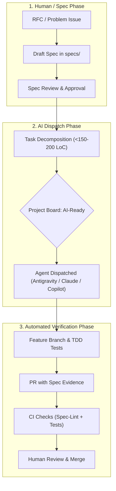

# GitHub Projects (v2) Setup Guide for AI-Driven Development

> **The Mission Control for Autonomous Agents and Human Engineers**

In AI-driven development, the biggest point of failure is uncoordinated agent execution: agents grabbing ill-defined tickets, duplicating work, hallucinating requirements, or stalling without visibility.

By leveraging **GitHub Projects (v2)** with customized metadata fields, lifecycle stages, and automated views, you transform GitHub into an automated orchestration control plane.

---

## 1. Project Architecture Overview



---

## 2. Custom Fields Configuration

Create a new GitHub Project (v2) in your repository or organization (`Projects -> New Project -> Team Backlog / Feature Board`).

Add the following **Custom Fields**:

| Field Name | Type | Options / Format | Purpose |
| :--- | :--- | :--- | :--- |
| **`Phase`** | Single Select | `0. Idea / Triage`<br>`1. Spec RFC`<br>`2. Spec Review`<br>`3. Spec Approved`<br>`4. Task Breakdown`<br>`5. Implementation`<br>`6. Review & QA`<br>`7. Done` | High-level stage in the SDD lifecycle |
| **`AI Readiness`** | Single Select | 🟡 `Drafting`<br>🟠 `Spec Needed`<br>🟢 `AI-Ready`<br>🔵 `AI Executing`<br>🟣 `Human Review`<br>⚪ `Blocked` | Explicit permission flag for agents to begin work |
| **`Agent Assigned`** | Single Select | `Unassigned`<br>`Antigravity`<br>`Claude Code`<br>`GitHub Copilot`<br>`Human Engineer` | Designates the active worker or AI agent |
| **`Spec ID`** | Text | e.g. `SPEC-0001` | Traces task directly back to its parent spec |
| **`Complexity`** | Single Select | `XS (<50 lines)`<br>`S (50-150 lines)`<br>`M (150-200 lines ceiling)`<br>`L (>200 lines, Split Required)` | Guardrail ensuring tasks are atomic for LLM context windows |

---

## 3. Recommended Views (The Executive Mission Control)

Configure the following 4 dedicated views in your GitHub Project:

### View 1: 👑 Multi-Agent Kanban (Board View)
> **Your primary operational dashboard:** Watch the Orchestrator plan and the Worker execute in real time.

- **Layout:** Board
- **Columns (Status):**
  1. 📥 **`Backlog`**: Unrefined ideas and raw feature requests curated exclusively by You. AI agents NEVER pull from Backlog autonomously.
  2. 📐 **`Spec Drafting`**: User commands a feature ➔ Orchestrator checks Backlog for duplicates/reusable tickets, adopts or creates tracking ticket, and drafts `specs/XXXX-feature.md`. Awaits Human approval (`review:human-signoff`) before advancing to Challenger.
  3. ⚔️ **`Challenger Review`**: Spec approved by Human! Challenger AI stress-tests the spec (edge cases, scale, YAGNI).
  4. 🟢 **`Ready for Worker`**: Spec hardened! Micro-tasks generated (<150-200 LoC) with `ai:ready`.
  5. ⚡ **`Worker Active`**: Worker AI has branched (`feat/...`) and is executing TDD.
  6. 🔍 **`Orchestrator Review`**: Worker opened PR. Orchestrator AI conducts 5-Point Anti-Slop Audit.
  7. 👑 **`Challenger Merge Gate`**: Orchestrator passed PR; Challenger runs pre-merge audit & executes squash merge.
  8. ✅ **`Done`**: Merged into `main`.
- **Visible Fields:** `Title`, `Spec ID`, `Agent Assigned`, `Complexity`, `PR Link`

### View 2: 📐 Spec Pipeline (Board View)
- **Purpose:** Track specifications from initial problem proposal to frozen contract.
- **Layout:** Board
- **Group By:** `Phase` (Filtered to: `0. Idea`, `1. Spec RFC`, `2. Spec Review`, `3. Spec Approved`)
- **Filter:** `label:type:spec`
- **Visible Fields:** `Title`, `Assignees`, `AI Readiness`, `Target Version`

### View 3: 👥 Agent & Human Workload (Table View)
- **Purpose:** Workload distribution across agents and engineers.
- **Layout:** Table
- **Group By:** `Agent Assigned`
- **Sort By:** `Complexity` ascending
- **Visible Fields:** `Title`, `Spec ID`, `Status`, `AI Readiness`, `PR`

### View 4: 🗺️ Release Roadmap (Table View)
- **Purpose:** High-level milestone tracking.
- **Layout:** Table
- **Group By:** `Milestone` or `Target Version`
- **Filter:** All issues

---

## 4. Built-in GitHub Project Automations (How Decoupled Agents Move Cards)

Because your AI agents (Orchestrator, Worker, Challenger) are separate entities that run independently, **they do not manually drag cards across columns**. Instead, GitHub's webhook engine automatically moves cards based on labels and PR events:

Under Project Settings -> **Workflows** (or via automated label mapping):

1. **Auto-Add to Project:**
   - Any new issue or PR created in the repo ➔ Auto-add to the Project Board in `Backlog`.
2. **Label ➔ Column Automations:**
   - Label `spec:in-review` added ➔ Move to `⚔️ Challenger Review`.
   - Label `ai:ready` added ➔ Move to `🟢 Ready for Worker`.
   - Label `ai:in-progress` added ➔ Move to `⚡ Worker Active`.
   - PR opened or labeled `phase:review` ➔ Move to `🔍 Orchestrator Review`.
   - Label `review:orchestrator-approved` added ➔ Move to `👑 Challenger Merge Gate`.
3. **Pull Request Merged:**
   - When a PR linked to an issue is merged ➔ Automatically set `Status` to `Done` and close linked issues.

---

## 5. Automated Setup via CLI (`scripts/setup-github-project.sh`)

You can create and configure the entire GitHub Project (v2) with all custom fields in one command:

```bash
# 1. Grant project permissions to GitHub CLI (one-time)
gh auth refresh -s project

# 2. Run the automated setup script
./scripts/setup-github-project.sh <owner/repo> "AI Mission Control"
```

### Manual Inspection & Management via `gh`:
```bash
# List projects
gh project list --owner Velocta

# View project fields
gh project field-list <project-number> --owner Velocta

# Add an issue to the project
gh project item-add <project-number> --owner Velocta --url https://github.com/Velocta/my-coding-style/issues/1
```
