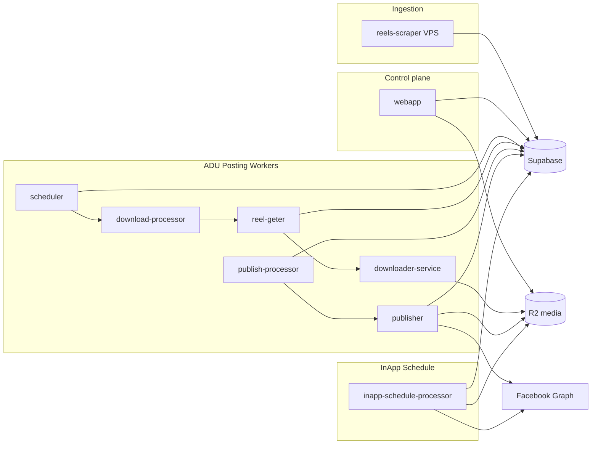

# System Overview

## Repository layout

| Path | Role |
|------|------|
| `webapp/` | Next.js App Router: auth, agency/super-admin dashboards, versioned API (`/api/v1`) |
| `backend_v3/` | Cloudflare Workers (posting, scheduling, analytics) + VPS scraper |
| `database/` | Supabase PostgreSQL: `production_schema.sql` (canonical), `migrations/` (forward changes) |
| `documentation/` | Architecture, runbooks, ADRs, webapp docs |

## Backend services (`backend_v3/`)

Backend layout follows the convention: `services/{platform}/{feature}/{type}/{worker}/`

### Facebook — Auto Download/Upload (posting pipeline)

Six Cloudflare Workers plus a container-backed downloader. Job state lives in `posting_jobs_v2`.

| Worker | Wrangler name | Trigger |
|--------|---------------|---------|
| `services/facebook/auto-download-upload/posting/scheduler-worker` | `fbuploadpro-fb-adu-scheduler` | Cron (every minute) |
| `services/facebook/auto-download-upload/posting/download-processor-worker` | `fbuploadpro-fb-adu-download-processor` | Cron |
| `services/facebook/auto-download-upload/posting/reel-geter-worker` | `fbuploadpro-fb-adu-reel-geter` | HTTP (internal) |
| `services/facebook/auto-download-upload/posting/downloader-service` | `fbuploadpro-fb-adu-downloader` | HTTP + Container |
| `services/facebook/auto-download-upload/posting/publish-processor-worker` | `fbuploadpro-fb-adu-publish-processor` | Cron |
| `services/facebook/auto-download-upload/posting/publisher-worker` | `fbuploadpro-fb-adu-publisher` | HTTP (internal) |

**Flow:**

1. **Scheduler** — RPC `claim_due_reels_and_create_jobs_v2` creates jobs (`download_pending`) for due pages with pending reels.
2. **Download processor** — Claims jobs, dispatches to reel-geter via service binding + `INTERNAL_JOB_DISPATCH_TOKEN`.
3. **Reel-geter + downloader** — Downloads source video (yt-dlp), stores in R2 `fbuploadprov2-v2-posting-media`, sets `pending_publish`.
4. **Publish processor** — Claims publish-ready jobs, dispatches to publisher.
5. **Publisher** — Uploads to Facebook Reels (Graph API v19), RPC `finalize_posting_job_v2` (tokens + reel `posted`).

Deploy: `backend_v3/services/facebook/auto-download-upload/posting/deploy.sh`

### Facebook — InApp Schedule

| Worker | Wrangler name | Trigger |
|--------|---------------|---------|
| `services/facebook/inapp-schedule/posting/processor-worker` | `fbuploadpro-fb-inapp-schedule-processor` | Cron (every minute) |

**Flow:**

1. Cron fires → RPC `claim_due_facebook_inapp_schedule_posts` claims up to 10 pending posts (atomic `FOR UPDATE SKIP LOCKED`).
2. For each post: generate signed R2 download URL → publish to Facebook Graph via `file_url` → post first comment if specified.
3. On success: deduct tokens, delete R2 object, mark `published`.
4. On failure: retry (up to 3 attempts with 5-minute backoff), then mark `failed`.

### Facebook — Analytics

- `services/facebook/auto-download-upload/analytics/followers-metrics-cron-worker` — Cron every 2 minutes; Graph API fan counts; RPC `bulk_update_page_metrics`.

### Facebook — Scraper (VPS)

- `services/facebook/auto-download-upload/scraping/reels-scraper` — Puppeteer daemon; RPC `get_next_pending_page`; upserts `reels` with `status = pending`.

## Webapp

- Auth and multi-tenant subdomains via `webapp/src/proxy.ts` and Supabase SSR.
- Sidebar navigation organized by platform (Facebook, YouTube, Instagram) + Settings.
- Business logic: `webapp/src/server/services`, persistence: `webapp/src/server/repositories`.
- Facebook features: Direct Post, Direct Schedule (native FB), InApp Schedule (our queue), Bulk Delete, Auto Download/Upload.
- R2 media uploads via presigned URLs (`webapp/src/lib/r2/user-media.ts`).
- Token cost lookup via `token_cost_rules` table; deduction after successful publish.

## Data flow (end-to-end)

## Service boundary rules

- No direct code imports between `webapp` and `backend_v3`.
- Each backend service owns its own `src/db/` (or `db.js`) Supabase client.
- Schema changes: add one file under `database/migrations/`, then update `database/production_schema.sql`.
- Legacy v1 posting (`posting_jobs`, Cloudflare queue `fbuploadprov2-prod-posting-download-jobs`) is removed from the repo and database snapshot.
