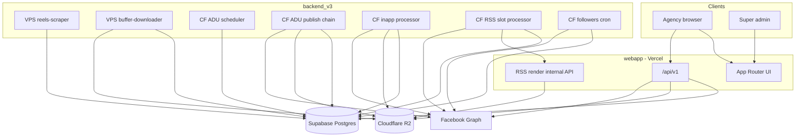

# FB Upload Pro v3 — Project Overview (for agents)

**FBUploadPro** is a multi-tenant SaaS for agencies that manage Facebook (and planned YouTube/Instagram) publishing at scale. Agencies connect Facebook accounts, spend **tokens** per action, and use several posting modes—from instant publish to scraped auto-repost pipelines.

The repo is a **monorepo** with three cooperating areas and shared Postgres (Supabase). Services do **not** import each other's code; they coordinate only through the database, R2, and HTTP between workers.

---

## Repository layout

| Path | Role |
|------|------|
| `webapp/` | Next.js 16 (App Router, React 19) — marketing, auth, agency + super-admin dashboards, `/api/v1` |
| `backend_v3/` | Cloudflare Workers (cron/HTTP) + VPS processes (scraper, buffer downloader) |
| `database/` | `production_schema.sql` (canonical) + `migrations/` (forward-only changes) |
| `documentation/` | Architecture, runbooks, API reference, UI/UX (Green Mist) |

Canonical architecture: [`architecture/system-overview.md`](architecture/system-overview.md).

---

## Product model

### Tenancy and roles

- **Agencies** (`users.role = 'agency'`) — primary customers; own subdomain, token balance, BYOC Facebook app credentials.
- **Super admins** — platform ops: agencies list, token pricing, usage visibility.
- Auth: **Supabase** (cookie sessions). Role is synced into `auth.users` app metadata.
- **Subdomain routing** (`webapp/src/proxy.ts`): `{subdomain}.maindomain` rewrites paths to `/agency/*` except auth/public pages.

### Tokens (billing)

- Balance on `users.tokens_balance`.
- Costs come from **`token_cost_rules`** (feature + platform + media_type + optional `source_platform`) — not hardcoded in app logic except migration seeds.
- Charges happen **after successful publish**; recorded in `token_transactions`.
- Features with default costs (from schema seeds): ADU (tiered by source), in-app schedule, RSS autoposter; direct post/schedule are 0 for Facebook in seeds.

### BYOC Facebook

Agencies can bring their own Meta app (`fb_app_id`, `fb_app_secret` on `users`) for OAuth instead of a platform default app.

---

## Facebook features (what ships today)

```text
Agency sidebar (Facebook) — see webapp/src/components/dashboard/nav-config.ts
├── Accounts + OAuth (magic link supported)
├── Auto Download/Upload (ADU) — full backend pipeline
├── Bulk Delete Posts — page-tools (Graph API list + batch delete)
├── Direct Post — immediate publish via webapp
├── Direct Schedule — native FB scheduled_publish_time
├── InApp Schedule — DB queue + CF worker publishes at due time
├── RSS Auto Poster — feed → template render → publish (flag-gated)
├── AI Text/Image Posts — Coming Soon shell
└── Payout Transfer — Coming Soon shell
```

**YouTube / Instagram** nav entries exist mostly as **Coming Soon** placeholders; backend folders under `backend_v3/services/youtube` and `instagram` are stubs for future work.

### Feature comparison (mental model)

| Feature | Where work runs | Media storage | Schedule |
|---------|-----------------|---------------|----------|
| **Direct Post** | Webapp → Graph API | R2 presign → user-media bucket | Now |
| **Direct Schedule** | Webapp → Graph API (native schedule) | R2 | Facebook-native |
| **InApp Schedule** | Webapp queues row; **CF processor** publishes | R2; deleted after publish | App DB + cron |
| **ADU** | VPS scrape/download + **CF** publish pipeline | R2 `adu-buffer` | Page `posting_times` / `posts_per_day` |
| **RSS Autoposter** | **CF slot processor** + webapp render API | R2 rendered images | Per-page RSS schedule |

---

## Backend (`backend_v3`)

Layout convention: `services/{platform}/{feature}/{type}/{worker}/`.

See also: [`../backend_v3/README.md`](../backend_v3/README.md).

### Auto Download/Upload (ADU)

End-to-end flow:

1. **reels-scraper** (VPS, Puppeteer) — discovers reel IDs → `reels.status = pending`.
2. **buffer-downloader** (VPS, yt-dlp) — downloads to R2 `fbuploadpro-adu-buffer` → `reels.status = downloaded`.
3. **scheduler-worker** (CF cron) — RPC `create_due_adu_posting_jobs` → `adu_posting_jobs`.
4. **publish-processor-worker** — claims jobs, calls publisher.
5. **publisher-worker** (HTTP) — reads R2, posts Facebook Reel, finalizes via RPC.

**Analytics:** `followers-metrics-cron-worker` updates page fan counts via Graph + `bulk_update_page_metrics`.

| Component | Path under `backend_v3/services/facebook/auto-download-upload/` |
|-----------|-------------------------------------------------------------------|
| Scraper | `scraping/reels-scraper/` |
| Buffer downloader | `downloader/` |
| Scheduler | `posting/scheduler-worker/` |
| Publish processor | `posting/publish-processor-worker/` |
| Publisher | `posting/publisher-worker/` |
| Analytics | `analytics/followers-metrics-cron-worker/` |

Wrangler names (examples): `fbuploadpro-fb-adu-scheduler`, `fbuploadpro-fb-adu-publish-processor`, `fbuploadpro-fb-adu-publisher`, `fbuploadpro-fb-adu-analytics`.

### InApp Schedule

- **processor-worker** — `services/facebook/inapp-schedule/posting/processor-worker/`
- Cron every minute; RPC `claim_due_facebook_inapp_schedule_posts` (`FOR UPDATE SKIP LOCKED`)
- Signed R2 URL → Graph `file_url`; token deduct; retries/backoff; deletes R2 on success
- Wrangler name: `fbuploadpro-fb-inapp-schedule-processor`

### RSS Auto Poster

- **slot-processor-worker** — `services/facebook/rss-autoposter/posting/slot-processor-worker/`
- Fetches RSS, picks items, calls webapp internal render endpoint, publishes photo posts, dedupes by GUID window
- Rendering: Konva/canvas on webapp — `POST /api/v1/internal/facebook/rss-autoposter/render` (worker secret header)

Deploy scripts live next to each worker (`deploy.sh`, `wrangler.toml`). All workers use **service role** Supabase clients in their own `src/db/`.

---

## Webapp architecture

Layering (from [`webapp/architecture.md`](webapp/architecture.md)):

| Layer | Location | Responsibility |
|-------|----------|----------------|
| Routes/UI | `webapp/src/app`, `src/features`, `src/components` | Pages, composition, Green Mist UI |
| API | `webapp/src/app/api/v1` | Auth guards, validation, HTTP shapes |
| Services | `webapp/src/server/services` | Workflows (OAuth, schedules, ADU reels, RSS, tokens) |
| Repositories | `webapp/src/server/repositories` | Supabase table access |
| Integrations | `webapp/src/server/integrations/facebook` | Graph client, publish helpers |
| Contracts | `webapp/src/contracts` | Shared API schemas |
| R2 | `webapp/src/lib/r2` | Presigned uploads, keys, deletes |

**Proxy** (`webapp/src/proxy.ts`) + **Supabase middleware** (`webapp/src/lib/supabase/middleware.ts`) handle session refresh and tenant host rules.

**Token gating** is UI-driven (sidebar lock when balance = 0), not a hard middleware redirect.

Tech: Next 16, React 19, shadcn/Radix, Tailwind, Vitest, Vercel, AWS SDK for R2-compatible S3.

### Agency routes (Facebook)

| Route | Purpose |
|-------|---------|
| `/agency/facebook/accounts` | FB account management, OAuth |
| `/agency/facebook/auto-download-upload` | ADU pages list |
| `/agency/facebook/auto-download-upload/[id]` | ADU page detail |
| `/agency/facebook/bulk-delete` | Bulk post deletion (page-tools) |
| `/agency/facebook/direct-post` | Publish immediately |
| `/agency/facebook/direct-schedule` | Native FB scheduling |
| `/agency/facebook/inapp-schedule` | Queue-based scheduling |
| `/agency/facebook/rss-autoposter` | RSS Auto Poster (requires `users.rss_autoposter_enabled`) |
| `/agency/settings/facebook-byoc` | BYOC app config |

Super-admin: `/super-admin`, `/super-admin/agencies`.

---

## Database (Supabase PostgreSQL)

**Source of truth:** `database/production_schema.sql`. New changes = one file in `database/migrations/` + update production schema + RLS.

Never modify existing migration files. See [`database/migration-workflow.md`](database/migration-workflow.md).

### Core tables

| Table | Purpose |
|-------|---------|
| `users` | Agency profile, subdomain, tokens, BYOC FB app, `rss_autoposter_enabled` |
| `facebook_accounts` | Connected FB users + long-lived tokens |
| `pages` | ADU destinations: source username/platform, schedule, follower stats (**legacy name** — ADU feature) |
| `reels` | Scraped reel inventory per page (**legacy name** — ADU feature) |
| `adu_posting_jobs` | ADU publish job queue |
| `facebook_direct_posts` | Direct post audit log |
| `facebook_direct_schedule_pages` / `facebook_direct_schedule_posts` | Native FB schedule |
| `facebook_inapp_schedule_pages` / `facebook_inapp_schedule_posts` | In-app queue |
| `facebook_rss_autoposter_pages` / `facebook_rss_autoposter_items` | RSS autoposter |
| `token_cost_rules` / `token_transactions` | Pricing + ledger |
| `system_settings` | e.g. token price (PKR) |
| `posting_jobs_v2` | Older pipeline table; ADU publish jobs use `adu_posting_jobs` |

### Naming conventions for new work

- Feature-specific tables: prefix with feature name (`facebook_direct_posts`, `facebook_inapp_schedule_posts`, `token_cost_rules`).
- Legacy ADU tables stay as `pages` and `reels` — do not rename without an explicit migration project.

### RPCs and concurrency

Heavy logic lives in Postgres RPCs so workers stay thin:

- ADU: `create_due_adu_posting_jobs`, `claim_publish_jobs_adu`, `finalize_posting_job_adu`, `claim_adu_buffer_downloads`, `skip_adu_reel`, etc.
- InApp: `claim_due_facebook_inapp_schedule_posts`
- RSS: `is_rss_item_posted_in_window`, etc.

**RLS:** Agencies see own rows (`agency_id = auth.uid()`); super-admin read where defined; `service_role` full access for workers.

### Token cost lookup keys

| Feature | `feature` value | Notes |
|---------|-----------------|-------|
| Auto Download/Upload | `auto_download_upload` | Use `source_platform` (instagram, youtube, tiktok) |
| Direct Post | `direct_post` | `media_type`: text, image, video |
| Direct Schedule | `direct_schedule` | Same media types |
| InApp Schedule | `inapp_schedule` | Same media types |
| RSS Autoposter | `rss_autoposter` | e.g. `media_type = image` |

Use `media_type = '*'` as wildcard. Resolve costs in app via `token_cost_rules` only (see `webapp/src/server/services/tokens/token-cost-service.ts`).

---

## External systems

| System | Use |
|--------|-----|
| **Supabase** | Auth + Postgres + RLS |
| **Cloudflare R2** | User media, ADU buffer (`fbuploadpro-adu-buffer`) |
| **Facebook Graph API** | Publish, schedule, tokens, page-tools bulk delete |
| **Vercel** | Webapp hosting |
| **Cloudflare Workers** | Schedulers, processors, publishers |
| **VPS (PM2)** | Scraper + buffer downloader |

---

## API surface

Base path: **`/api/v1`**. Full reference: [`webapp/api-reference.md`](webapp/api-reference.md).

Patterns:

- Agency routes: `agency` role, cookie session → `401` / `403` on failure.
- `POST /api/v1/agency/uploads/presign` — R2 presign for `direct-post`, `direct-schedule`, `inapp-schedule`.
- Public magic-link OAuth: `/api/v1/public/facebook/oauth/start` (signed token).
- Internal RSS render: `/api/v1/internal/facebook/rss-autoposter/render` + `x-rss-worker-secret`.
- Super-admin token price: `PATCH /api/v1/admin/settings/token-price`.

---

## Service boundary rules (must follow)

1. No direct code imports between `webapp` and `backend_v3`.
2. Each backend worker owns its Supabase client under `src/db/` (or `db.js`).
3. Schema changes only via `database/migrations/` + `database/production_schema.sql`.
4. Do not place service-specific docs at repo root; use `documentation/`.
5. New workers path: `backend_v3/services/{platform}/{feature}/{type}/{worker-name}/` — not flat `services/posting/`.

---

## Git and delivery workflow

1. Sync `main`, branch from it (`feature/*`, `fix/*`, `chore/*`).
2. Never commit directly to `main`.
3. Run lint/typecheck/tests/build as applicable locally.
4. Push branch; wait for CI; human QA (Vercel preview when relevant).
5. Merge to `main` only after **explicit human confirmation**.

---

## Operations and conventions

- **Deploy runbooks:** [`runbooks/deployment.md`](runbooks/deployment.md), [`runbooks/posting-deploy.md`](runbooks/posting-deploy.md), [`runbooks/rss-autoposter-deploy.md`](runbooks/rss-autoposter-deploy.md).
- **Env:** [`runbooks/environment.md`](runbooks/environment.md).
- **UI:** [`webapp/ui-ux-reference.md`](webapp/ui-ux-reference.md) (Green Mist) for any `webapp/src` UI work.
- **Production webapp:** `https://fbuploadprov2.vercel.app/` (see deployed testing playbook in `.cursor/rules/`).

---

## Architecture diagram (control + data)



---

## What to read next (by goal)

| Goal | Start here |
|------|------------|
| End-to-end posting pipelines | [`architecture/system-overview.md`](architecture/system-overview.md) |
| Add a webapp feature | [`webapp/feature-onboarding.md`](webapp/feature-onboarding.md), [`webapp/architecture.md`](webapp/architecture.md) |
| Change schema | [`database/migration-workflow.md`](database/migration-workflow.md), `database/production_schema.sql` |
| Deploy workers | [`runbooks/posting-deploy.md`](runbooks/posting-deploy.md), [`../backend_v3/README.md`](../backend_v3/README.md) |
| API contract | [`webapp/api-reference.md`](webapp/api-reference.md) |
| UI work | [`webapp/ui-ux-reference.md`](webapp/ui-ux-reference.md) |
| RLS | [`database/rls-overview.md`](database/rls-overview.md) |

---

## Summary

FB Upload Pro v3 is a **token-metered agency platform** centered on **Facebook automation**: scrape/download/repost reels (ADU), queue scheduled posts (in-app), native FB scheduling, direct publish, RSS-to-image posts, and operational tools (bulk delete). The **webapp** is the control plane and immediate publisher; **backend_v3** runs durable/async pipelines on Cloudflare and VPS; **Postgres RPCs** coordinate concurrency. YouTube/Instagram and some nav items are scaffolding for expansion.

Legacy v1 posting (`posting_jobs`, Cloudflare queue `fbuploadprov2-prod-posting-download-jobs`) is removed from the repo and database snapshot.
