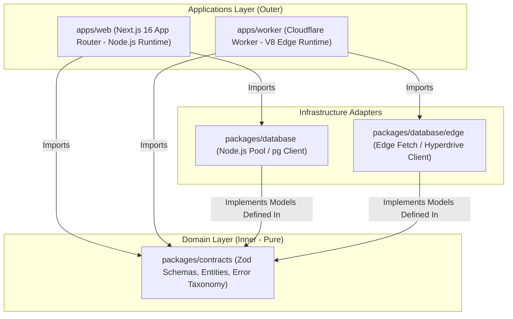

# SPEC-0002: Monorepo Foundation & Clean Data Substrate

## 1. Executive Summary & Problem Statement

The legacy FBUploadPro codebase suffered from severe architectural entropy:
1. **Disconnected Codebases:** 6+ independent Cloudflare Workers, 2 VPS daemons, and a Next.js web application each maintained isolated, copy-pasted database connection code and configuration logic with zero shared types.
2. **Database Schema Sprawl:** The database grew through 50+ ad-hoc patches into a monolithic 3,100+ line SQL snapshot laden with deprecated legacy tables (`posting_jobs_v2`), untestable stored procedures, and schema drift.
3. **Frontend Quality Failures:** The web application accumulated dozens of ESLint violations—primarily `react-hooks/set-state-in-effect` and rampant `any` typing—violating modern React 19 / Next.js standards.

To recreate the project properly, we must first construct an immutable, type-safe foundation. This specification establishes the Turborepo/pnpm monorepo structure, shared pure-domain contracts (`packages/contracts`), a clean PostgreSQL schema v1 (`packages/database`), an application shell with health verification (`apps/web`), and an isolated Cloudflare Worker shell (`apps/worker`).

### 1.1 Context
- **Current State:** The repository contains the legacy project archived in `old/`, with root-level Spec-Driven Development (SDD) governance files (`AGENTS.md`, `ORCHESTRATOR.md`, `specs/`). No production code exists in the root workspace.
- **Desired State:** A clean, building monorepo where all workspace packages (`@fbuploadpro/contracts`, `@fbuploadpro/database`, `@fbuploadpro/web`, `@fbuploadpro/worker`) compile, typecheck, lint, and test with zero errors and zero warnings.
- **Impact:** Serves as the bedrock for all subsequent specifications (Facebook OAuth, Media Pipeline, In-App Scheduler, ADU Scraper).

---

## 2. Scope & Non-Goals

### 2.1 In Scope
- [ ] Monorepo workspace configuration using `pnpm` workspaces and `turbo.json`.
- [ ] Shared TypeScript base configuration (`tsconfig.base.json`) with strict type-checking enabled (`noImplicitAny`, `strictNullChecks`, `exactOptionalPropertyTypes`).
- [ ] Shared ESLint 9 configuration enforcing zero warnings and React 19 compatibility.
- [ ] `packages/contracts`: Pure TypeScript domain models, Zod validation schemas with timestamp coercion, and domain error taxonomy for multi-tenancy (`Agency`, `User`), social integration (`FacebookAccount`, `FacebookPage`), and billing (`TokenBalance`, `TokenTransaction`).
- [ ] `packages/database`: Clean PostgreSQL v1 schema (DDL) with multi-tenant compound constraints, migration runner harness, Node.js connection pool client (`@fbuploadpro/database`), and edge-compatible client interface (`@fbuploadpro/database/edge`).
- [ ] `apps/web`: Minimal Next.js 16 (App Router) shell adhering to Clean Architecture folder conventions, with a sanitized `/api/health` probe handling degraded database states.
- [ ] `apps/worker`: Minimal Cloudflare Worker shell configured via `wrangler.toml` and TypeScript, importing edge-safe client contracts.
- [ ] Continuous Integration (`.github/workflows/ci.yml`) executing workspace lint, typecheck, and unit test suites on pull requests.

### 2.2 Explicit Non-Goals (Out of Scope)
- ❌ **No Meta Graph API integration or OAuth flows:** Deferred to `SPEC-0003: Facebook Integration & Media Pipeline`.
- ❌ **No Cloudflare R2 bucket integration or presigned URL generation:** Deferred to `SPEC-0003`.
- ❌ **No job scheduling, cron triggers, or queue dispatchers:** Deferred to `SPEC-0004: In-App Scheduling Engine`.
- ❌ **No scraper daemons (Puppeteer) or media downloaders (yt-dlp):** Deferred to modular services.
- ❌ **No authentication UI (login/signup screens) or dashboard views:** Only basic shell layout and health probe route.

---

## 3. User Stories & Acceptance Criteria

### US-1: Monorepo Orchestration & Type Sharing
**As a** system engineer  
**I want to** run a unified build, lint, and test cycle across all apps and packages  
**So that** any type mismatch or lint violation across service boundaries fails immediately in CI.

#### Acceptance Criteria
```gherkin
Scenario: Unified monorepo build and typecheck
  Given a clean checkout of the repository
  When "pnpm install" followed by "pnpm turbo run build lint typecheck test" is executed
  Then all workspaces (contracts, database, web, worker) compile with exit code 0
  And zero ESLint errors or warnings are emitted
  And all unit tests pass with 100% success

Scenario: Type boundary enforcement
  Given the packages/contracts package
  When inspecting package.json and tsconfig.json
  Then it has 0 dependencies on Next.js, React, or database drivers
  And exports pure Zod schemas and TypeScript types
```

### US-2: Clean PostgreSQL v1 Substrate & Tenant Isolation
**As a** backend service  
**I want to** interact with a normalized, legacy-free database schema  
**So that** all multi-tenant and account records have guaranteed referential integrity, non-negative token invariant enforcement, and zero cross-tenant entity hijacking.

#### Acceptance Criteria
```gherkin
Scenario: PostgreSQL v1 schema initialization
  Given a fresh PostgreSQL test instance
  When the packages/database migration harness runs
  Then tables "agencies", "users", "facebook_accounts", "facebook_pages", "token_balances", and "token_transactions" are created
  And composite foreign key "(agency_id, facebook_account_id)" in "facebook_pages" references "facebook_accounts(agency_id, id)"
  And compound unique constraints "(agency_id, fb_user_id)" and "(agency_id, fb_page_id)" prevent cross-tenant duplication
  And check constraints "balance >= 0" and "reserved >= 0" in "token_balances" are active
  And all tables contain "created_at" and "updated_at" timestamp fields
  And no legacy tables ("posting_jobs_v2", "reels_v1") exist

Scenario: Token debit concurrency and atomic decrement
  Given an agency with a balance of 5 tokens
  When two concurrent debit requests of 4 tokens each are executed
  Then exactly one debit succeeds and decrements the balance to 1
  And the other debit fails with zero rows updated and triggers an INSUFFICIENT_FUNDS domain error
  And the balance in "token_balances" never drops below 0

Scenario: Strongly typed database client
  Given the packages/database package
  When importing the database client into an application service
  Then all queries return strictly typed models matching packages/contracts without using "any"
```

### US-3: Application Shell & Health Probe
**As an** automated monitoring agent or health probe  
**I want to** issue an HTTP GET to "/api/health" on the web application  
**So that** I can verify service readiness and database connectivity without leaking internal topology or stack traces.

#### Acceptance Criteria
```gherkin
Scenario: Health probe check (Healthy)
  Given the apps/web service is running and database is reachable
  When a GET request is dispatched to "/api/health"
  Then the response status code is 200 OK
  And the JSON body matches { status: "ok", timestamp: string, database: "connected" }

Scenario: Degraded health probe on database failure (Sanitized 503)
  Given the database is unreachable or query exceeds 2000ms timeout budget
  When a GET request is dispatched to "/api/health"
  Then the response status code is 503 Service Unavailable
  And the JSON body matches { status: "unhealthy", timestamp: string, database: "disconnected" }
  And zero internal connection strings, credentials, or error stack traces are leaked in the response
```

---

## 4. Technical Architecture & System Design

### 4.1 Architecture Diagram & Layer Boundaries (Clean Architecture)



### 4.2 Workspace Layout & Runtime Separation

```text
fbuploadpro/
├── apps/
│   ├── web/
│   │   ├── src/
│   │   │   ├── app/
│   │   │   │   ├── api/health/route.ts
│   │   │   │   ├── layout.tsx
│   │   │   │   └── page.tsx
│   │   │   ├── application/ports/
│   │   │   └── infrastructure/
│   │   ├── package.json
│   │   ├── tsconfig.json
│   │   └── next.config.ts
│   └── worker/
│       ├── src/
│       │   └── index.ts
│       ├── package.json
│       ├── tsconfig.json
│       └── wrangler.toml
├── packages/
│   ├── contracts/
│   │   ├── src/
│   │   │   ├── domain/
│   │   │   │   ├── agency.ts
│   │   │   │   ├── user.ts
│   │   │   │   ├── facebook.ts
│   │   │   │   └── billing.ts
│   │   │   ├── errors/
│   │   │   │   └── domain-error.ts
│   │   │   └── index.ts
│   │   ├── package.json
│   │   └── tsconfig.json
│   └── database/
│       ├── migrations/
│       │   └── 0001_initial_schema.sql
│       ├── src/
│       │   ├── client.ts         # Node.js pool client (pg / pool)
│       │   ├── edge.ts           # V8 isolate edge client (fetch/Hyperdrive)
│       │   ├── migrate.ts
│       │   └── index.ts
│       ├── package.json
│       └── tsconfig.json
├── .github/
│   └── workflows/
│       └── ci.yml
├── pnpm-workspace.yaml
├── package.json
├── turbo.json
├── tsconfig.base.json
└── eslint.config.mjs
```

### 4.3 Data Models & Schemas (`packages/contracts`)

#### Multi-Tenancy & Subdomain Namespace Defense
```typescript
import { z } from 'zod';

export const RESERVED_SUBDOMAINS = [
  'api', 'app', 'admin', 'www', 'billing', 'support', 'status',
  'auth', 'mail', 'dashboard', 'preview', 'staging', 'test',
] as const;

export const SubdomainSchema = z
  .string()
  .min(2)
  .max(50)
  .regex(
    /^[a-z0-9]([a-z0-9-]{0,48}[a-z0-9])?$/,
    'Subdomain must be lowercase alphanumeric and may contain hyphens, but cannot start or end with a hyphen.'
  )
  .refine(
    (val) => !RESERVED_SUBDOMAINS.includes(val as typeof RESERVED_SUBDOMAINS[number]),
    { message: 'Subdomain is reserved by the platform.' }
  );

export const UserRoleSchema = z.enum(['super_admin', 'agency_admin', 'agency_member']);
export type UserRole = z.infer<typeof UserRoleSchema>;

export const AgencyStatusSchema = z.enum(['active', 'suspended', 'trial']);
export type AgencyStatus = z.infer<typeof AgencyStatusSchema>;

export const AgencySchema = z.object({
  id: z.string().uuid(),
  name: z.string().min(2).max(100),
  subdomain: SubdomainSchema,
  status: AgencyStatusSchema,
  createdAt: z.coerce.date(),
  updatedAt: z.coerce.date(),
});
export type Agency = z.infer<typeof AgencySchema>;

export const UserSchema = z.object({
  id: z.string().uuid(),
  agencyId: z.string().uuid(),
  email: z.string().email(),
  role: UserRoleSchema,
  status: z.enum(['active', 'invited', 'deactivated']),
  createdAt: z.coerce.date(),
  updatedAt: z.coerce.date(),
});
export type User = z.infer<typeof UserSchema>;
```

#### Social Entities with Tenant Cross-Reference Protection
```typescript
export const FacebookAccountStatusSchema = z.enum(['active', 'invalid_token', 'checkpoint', 'disconnected']);
export type FacebookAccountStatus = z.infer<typeof FacebookAccountStatusSchema>;

export const FacebookAccountSchema = z.object({
  id: z.string().uuid(),
  agencyId: z.string().uuid(),
  fbUserId: z.string().min(1),
  name: z.string().min(1),
  status: FacebookAccountStatusSchema,
  tokenExpiresAt: z.coerce.date().nullable(),
  createdAt: z.coerce.date(),
  updatedAt: z.coerce.date(),
});
export type FacebookAccount = z.infer<typeof FacebookAccountSchema>;

export const FacebookPageStatusSchema = z.enum(['active', 'fb_rate_limited', 'invalid_token', 'disconnected']);
export type FacebookPageStatus = z.infer<typeof FacebookPageStatusSchema>;

export const FacebookPageSchema = z.object({
  id: z.string().uuid(),
  agencyId: z.string().uuid(),
  facebookAccountId: z.string().uuid(),
  fbPageId: z.string().min(1),
  name: z.string().min(1),
  status: FacebookPageStatusSchema,
  followersCount: z.number().int().nonnegative().default(0),
  createdAt: z.coerce.date(),
  updatedAt: z.coerce.date(),
});
export type FacebookPage = z.infer<typeof FacebookPageSchema>;
```

#### Billing & Token Economy (Strict Positive Magnitude & Non-Negative Balance)
```typescript
export const TokenTransactionTypeSchema = z.enum(['credit', 'debit', 'refund', 'adjustment']);
export type TokenTransactionType = z.infer<typeof TokenTransactionTypeSchema>;

export const TokenBalanceSchema = z.object({
  id: z.string().uuid(),
  agencyId: z.string().uuid(),
  balance: z.number().int().nonnegative().default(0),
  reserved: z.number().int().nonnegative().default(0),
  updatedAt: z.coerce.date(),
});
export type TokenBalance = z.infer<typeof TokenBalanceSchema>;

export const TokenTransactionSchema = z.object({
  id: z.string().uuid(),
  agencyId: z.string().uuid(),
  amount: z.number().int().positive(), // Unsigned strictly positive magnitude
  transactionType: TokenTransactionTypeSchema,
  referenceId: z.string().nullable(),
  description: z.string().min(1).max(255),
  createdAt: z.coerce.date(),
});
export type TokenTransaction = z.infer<typeof TokenTransactionSchema>;
```

### 4.4 PostgreSQL Schema DDL Invariants (`0001_initial_schema.sql`)

```sql
-- 1. Agencies
CREATE TABLE agencies (
  id UUID PRIMARY KEY DEFAULT gen_random_uuid(),
  name VARCHAR(100) NOT NULL,
  subdomain VARCHAR(50) NOT NULL UNIQUE,
  status VARCHAR(20) NOT NULL DEFAULT 'active',
  created_at TIMESTAMPTZ NOT NULL DEFAULT now(),
  updated_at TIMESTAMPTZ NOT NULL DEFAULT now(),
  CONSTRAINT chk_agencies_status CHECK (status IN ('active', 'suspended', 'trial'))
);

-- 2. Users
CREATE TABLE users (
  id UUID PRIMARY KEY DEFAULT gen_random_uuid(),
  agency_id UUID NOT NULL REFERENCES agencies(id) ON DELETE CASCADE,
  email VARCHAR(255) NOT NULL UNIQUE,
  role VARCHAR(20) NOT NULL DEFAULT 'agency_member',
  status VARCHAR(20) NOT NULL DEFAULT 'active',
  created_at TIMESTAMPTZ NOT NULL DEFAULT now(),
  updated_at TIMESTAMPTZ NOT NULL DEFAULT now(),
  CONSTRAINT chk_users_role CHECK (role IN ('super_admin', 'agency_admin', 'agency_member')),
  CONSTRAINT chk_users_status CHECK (status IN ('active', 'invited', 'deactivated'))
);
CREATE INDEX idx_users_agency ON users(agency_id);

-- 3. Facebook Accounts
CREATE TABLE facebook_accounts (
  id UUID PRIMARY KEY DEFAULT gen_random_uuid(),
  agency_id UUID NOT NULL REFERENCES agencies(id) ON DELETE CASCADE,
  fb_user_id VARCHAR(100) NOT NULL,
  name VARCHAR(255) NOT NULL,
  status VARCHAR(30) NOT NULL DEFAULT 'active',
  token_expires_at TIMESTAMPTZ,
  created_at TIMESTAMPTZ NOT NULL DEFAULT now(),
  updated_at TIMESTAMPTZ NOT NULL DEFAULT now(),
  CONSTRAINT chk_fb_accounts_status CHECK (status IN ('active', 'invalid_token', 'checkpoint', 'disconnected')),
  CONSTRAINT uq_fb_accounts_agency_user UNIQUE (agency_id, fb_user_id),
  CONSTRAINT uq_fb_accounts_agency_id UNIQUE (agency_id, id)
);
CREATE INDEX idx_fb_accounts_agency ON facebook_accounts(agency_id);

-- 4. Facebook Pages (Composite Foreign Key enforces strict tenant isolation)
CREATE TABLE facebook_pages (
  id UUID PRIMARY KEY DEFAULT gen_random_uuid(),
  agency_id UUID NOT NULL REFERENCES agencies(id) ON DELETE CASCADE,
  facebook_account_id UUID NOT NULL,
  fb_page_id VARCHAR(100) NOT NULL,
  name VARCHAR(255) NOT NULL,
  status VARCHAR(30) NOT NULL DEFAULT 'active',
  followers_count INT NOT NULL DEFAULT 0 CHECK (followers_count >= 0),
  created_at TIMESTAMPTZ NOT NULL DEFAULT now(),
  updated_at TIMESTAMPTZ NOT NULL DEFAULT now(),
  CONSTRAINT chk_fb_pages_status CHECK (status IN ('active', 'fb_rate_limited', 'invalid_token', 'disconnected')),
  CONSTRAINT fk_fb_pages_agency_account FOREIGN KEY (agency_id, facebook_account_id)
    REFERENCES facebook_accounts(agency_id, id) ON DELETE CASCADE,
  CONSTRAINT uq_fb_pages_agency_page UNIQUE (agency_id, fb_page_id)
);
CREATE INDEX idx_fb_pages_agency ON facebook_pages(agency_id);
CREATE INDEX idx_fb_pages_account ON facebook_pages(facebook_account_id);

-- 5. Token Balances (Non-negative balance invariant)
CREATE TABLE token_balances (
  id UUID PRIMARY KEY DEFAULT gen_random_uuid(),
  agency_id UUID NOT NULL REFERENCES agencies(id) ON DELETE CASCADE,
  balance INT NOT NULL DEFAULT 0 CHECK (balance >= 0),
  reserved INT NOT NULL DEFAULT 0 CHECK (reserved >= 0),
  updated_at TIMESTAMPTZ NOT NULL DEFAULT now(),
  CONSTRAINT uq_token_balances_agency UNIQUE (agency_id)
);

-- 6. Token Transactions (Positive magnitude, direction determined by type)
CREATE TABLE token_transactions (
  id UUID PRIMARY KEY DEFAULT gen_random_uuid(),
  agency_id UUID NOT NULL REFERENCES agencies(id) ON DELETE CASCADE,
  amount INT NOT NULL CHECK (amount > 0),
  transaction_type VARCHAR(20) NOT NULL,
  reference_id VARCHAR(100),
  description VARCHAR(255) NOT NULL,
  created_at TIMESTAMPTZ NOT NULL DEFAULT now(),
  CONSTRAINT chk_token_txn_type CHECK (transaction_type IN ('credit', 'debit', 'refund', 'adjustment'))
);
CREATE INDEX idx_token_txns_agency ON token_transactions(agency_id);
```

#### Atomic Token Debit Semantics
```sql
-- Atomic debit: decrements balance only if balance >= amount. Throws INSUFFICIENT_FUNDS if 0 rows returned.
UPDATE token_balances
SET balance = balance - :amount, updated_at = now()
WHERE agency_id = :agencyId AND balance >= :amount
RETURNING balance;
```

### 4.5 Domain Error Taxonomy (`packages/contracts/src/errors/domain-error.ts`)

| Domain Error Code | HTTP Status | Description | User Message |
| :--- | :--- | :--- | :--- |
| `VALIDATION_FAILED` | 400 Bad Request | Payload failed Zod schema boundary validation | "The provided input parameters are invalid." |
| `UNAUTHORIZED` | 401 Unauthorized | Missing or expired credentials | "Authentication required to access this resource." |
| `FORBIDDEN` | 403 Forbidden | Authenticated user lacks permission | "You do not have permission to perform this action." |
| `NOT_FOUND` | 404 Not Found | Requested entity ID does not exist | "The requested resource could not be found." |
| `CONFLICT_STATE` | 409 Conflict | Unique constraint violation (e.g. subdomain taken) | "A resource with these attributes already exists." |
| `INSUFFICIENT_FUNDS`| 402 Payment Required| Token balance insufficient for operation | "Insufficient token balance to perform this operation." |
| `INTERNAL_ERROR` | 500 Internal Server | Unhandled infrastructure or database failure | "An unexpected error occurred. Please try again later." |

---

## 5. Security, Performance & Observability

### 5.1 OWASP Top 10 Invariants & Defensive Controls
- **Zero-Trust Boundary Validation:** 100% of payloads entering `/api/*` or worker endpoints must be parsed via Zod schemas in `packages/contracts`.
- **SQL Injection Defense:** All database interactions in `packages/database` must use parameterized statements. Zero raw string concatenation.
- **Sensitive Data Isolation:** Access tokens and secrets must never be logged in plain text. Model serialization methods must strip sensitive fields (`access_token`).
- **Health Check Sanitization & Timeout Budget:**
  - Health check ping wrapped in a strict **2000ms `AbortController` timeout**.
  - In degraded or timeout scenarios, `/api/health` must emit HTTP 503 with body `{ status: "unhealthy", timestamp: string, database: "disconnected" }`.
  - All internal connection strings, credentials, and raw stack traces are completely suppressed from HTTP responses and emitted solely to structured server logs.
- **Secrets Management:** Environment variables validated on process startup via Zod (`DATABASE_URL`, `NEXT_PUBLIC_APP_URL`).

### 5.2 Performance & Quality Invariants
- **React 19 & ESLint Standard:** Absolute prohibition of `react-hooks/set-state-in-effect`. All state transitions must be event-driven or derived.
- **Bundle Optimization:** `packages/contracts` contains zero native binary dependencies (no canvas, no sharp).
- **TypeScript Strictness:** `"strict": true`, `"noImplicitAny": true`, `"exactOptionalPropertyTypes": true` across all workspaces.

---

## 6. AI Agent Implementation Directives

### 6.1 Targeted Files & Directory Layout
```text
packages/contracts/
├── package.json
├── tsconfig.json
└── src/
    ├── domain/
    │   ├── agency.ts
    │   ├── user.ts
    │   ├── facebook.ts
    │   └── billing.ts
    ├── errors/
    │   └── domain-error.ts
    └── index.ts

packages/database/
├── package.json
├── tsconfig.json
├── migrations/
│   └── 0001_initial_schema.sql
└── src/
    ├── client.ts
    ├── edge.ts
    ├── migrate.ts
    └── index.ts

apps/web/
├── package.json
├── tsconfig.json
├── next.config.ts
└── src/
    └── app/
        ├── api/health/route.ts
        ├── layout.tsx
        └── page.tsx

apps/worker/
├── package.json
├── tsconfig.json
├── wrangler.toml
└── src/
    └── index.ts
```

### 6.2 Agent Execution Rules
1. **Spec Strictness:** Implement only the interfaces and schemas defined in Section 4. Do not invent unapproved routes or tables.
2. **TDD Required:** Write failing tests first for domain validation schemas and database queries before creating implementation files.
3. **No Slop:** Zero `TODO` comments, zero placeholder mocks, zero `console.log` statements in committed files.
4. **File Boundaries:** Workers must strictly adhere to the `Allowed Files` defined in each atomic task issue.

---

## 7. Verification & Test Plan

| Test Level | Scope | Execution Command | Pass Criteria |
| :--- | :--- | :--- | :--- |
| **Unit** | Domain schemas & error taxonomy | `pnpm --filter @fbuploadpro/contracts test` | 100% pass, 0 failures |
| **Database** | Schema migrations & client query tests | `pnpm --filter @fbuploadpro/database test` | Migrations apply cleanly, check constraints enforce balance >= 0, composite FKs block cross-tenant pages |
| **Typecheck**| Monorepo TypeScript compilation | `pnpm turbo run typecheck` | 0 errors across all workspaces |
| **Lint** | Monorepo ESLint audit | `pnpm turbo run lint` | 0 warnings, 0 errors |
| **Integration**| Next.js health probe route | `pnpm --filter @fbuploadpro/web test` | GET /api/health returns 200 OK when DB is healthy; returns 503 sanitized JSON on DB failure |

---

## 8. Atomic Task Breakdown

- [ ] **TASK-0001: Monorepo Setup & Workspace Tooling** (Issue: #TBD)
  - Configure root `package.json`, `pnpm-workspace.yaml`, `turbo.json`, `tsconfig.base.json`, and root ESLint.
- [ ] **TASK-0002: Domain Contracts & Error Taxonomy** (Issue: #TBD)
  - Implement `packages/contracts` with pure domain schemas (with timestamp coercion, subdomain blocklist, and positive amounts), models, and domain errors with Vitest unit tests.
- [ ] **TASK-0003: Clean PostgreSQL Schema v1 & Dual Clients** (Issue: #TBD)
  - Implement `packages/database` with initial DDL migration (composite FKs, balance check constraints), Node connection client, edge client interface, and integration tests.
- [ ] **TASK-0004: Webapp Shell & Health Route** (Issue: #TBD)
  - Scaffold `apps/web` with Next.js 16 App Router, sanitized `/api/health` endpoint (200 OK and 503 degraded states), and route tests.
- [ ] **TASK-0005: Worker Shell & CI Pipeline** (Issue: #TBD)
  - Scaffold `apps/worker` with Wrangler configured for edge database access and create `.github/workflows/ci.yml`.
