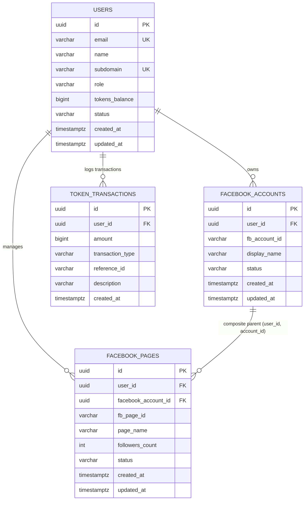

# Data Model: Core Monorepo Foundation & Data Substrate

This document defines the schema, invariants, validation rules, and relational relationships for the PostgreSQL data substrate with a unified User model.

---

## 1. Entity Relationship Diagram

---

## 2. Table Specifications & Invariants

### 2.1 `users`
Represents the primary tenant workspace and user operator.

| Column | Type | Constraints | Description |
| :--- | :--- | :--- | :--- |
| `id` | `UUID` | `PRIMARY KEY DEFAULT gen_random_uuid()` | Unique user/workspace identifier |
| `email` | `VARCHAR(255)` | `NOT NULL UNIQUE` | User email address |
| `name` | `VARCHAR(100)` | `NULL` | User display name |
| `subdomain` | `VARCHAR(50)` | `NOT NULL UNIQUE` | Normalized tenant subdomain slug |
| `role` | `VARCHAR(20)` | `NOT NULL DEFAULT 'user' CHECK (role IN ('user', 'seller', 'admin'))` | User role tier |
| `tokens_balance` | `BIGINT` | `NOT NULL DEFAULT 0 CHECK (tokens_balance >= 0)` | Current prepaid token balance |
| `status` | `VARCHAR(20)` | `NOT NULL DEFAULT 'active' CHECK (status IN ('active', 'suspended'))` | Account status |
| `created_at` | `TIMESTAMPTZ` | `NOT NULL DEFAULT now()` | Creation timestamp |
| `updated_at` | `TIMESTAMPTZ` | `NOT NULL DEFAULT now()` | Last update timestamp |

**Invariants & Subdomain Validation**:
- Subdomain must match regex: `/^[a-z0-9]([a-z0-9-]{0,48}[a-z0-9])?$/`
- Reserved subdomains are rejected: `admin`, `api`, `app`, `auth`, `billing`, `dashboard`, `internal`, `mail`, `status`, `system`, `test`, `webhook`, `www`.
- `tokens_balance` can never drop below 0.

---

### 2.2 `facebook_accounts`
Represents connected Facebook OAuth user identities.

| Column | Type | Constraints | Description |
| :--- | :--- | :--- | :--- |
| `id` | `UUID` | `PRIMARY KEY DEFAULT gen_random_uuid()` | Unique account record ID |
| `user_id` | `UUID` | `NOT NULL REFERENCES users(id) ON DELETE CASCADE` | Owning user |
| `fb_account_id`| `VARCHAR(100)` | `NOT NULL` | Facebook Graph user ID |
| `display_name` | `VARCHAR(255)` | `NOT NULL` | Social account name |
| `status` | `VARCHAR(20)` | `NOT NULL DEFAULT 'active' CHECK (status IN ('active', 'disconnected', 'expired'))` | Connection state |
| `created_at` | `TIMESTAMPTZ` | `NOT NULL DEFAULT now()` | Creation timestamp |
| `updated_at` | `TIMESTAMPTZ` | `NOT NULL DEFAULT now()` | Last update timestamp |

**Multi-Tenant Composite Keys**:
- `CONSTRAINT uq_fb_accounts_user_account UNIQUE (user_id, fb_account_id)`
- `CONSTRAINT uq_fb_accounts_user_id UNIQUE (user_id, id)` — Target for composite foreign key from `facebook_pages`.

---

### 2.3 `facebook_pages`
Represents managed Facebook publishing destinations.

| Column | Type | Constraints | Description |
| :--- | :--- | :--- | :--- |
| `id` | `UUID` | `PRIMARY KEY DEFAULT gen_random_uuid()` | Unique page record ID |
| `user_id` | `UUID` | `NOT NULL REFERENCES users(id) ON DELETE CASCADE` | Owning user |
| `facebook_account_id` | `UUID` | `NOT NULL` | Owning Facebook account ID |
| `fb_page_id` | `VARCHAR(100)` | `NOT NULL` | Facebook Graph Page ID |
| `page_name` | `VARCHAR(255)` | `NOT NULL` | Facebook Page display title |
| `followers_count` | `INT` | `NOT NULL DEFAULT 0 CHECK (followers_count >= 0)` | Page audience metric |
| `status` | `VARCHAR(30)` | `NOT NULL DEFAULT 'active' CHECK (status IN ('active', 'fb_rate_limited', 'invalid_token', 'disconnected'))` | Publishing readiness |
| `created_at` | `TIMESTAMPTZ` | `NOT NULL DEFAULT now()` | Creation timestamp |
| `updated_at` | `TIMESTAMPTZ` | `NOT NULL DEFAULT now()` | Last update timestamp |

**Defense-in-Depth Relational Keys**:
- `CONSTRAINT fk_fb_pages_user_account FOREIGN KEY (user_id, facebook_account_id) REFERENCES facebook_accounts(user_id, id) ON DELETE CASCADE`
- `CONSTRAINT uq_fb_pages_user_page UNIQUE (user_id, fb_page_id)`

---

### 2.4 `token_transactions`
Immutable financial audit trail of all token credits and debits.

| Column | Type | Constraints | Description |
| :--- | :--- | :--- | :--- |
| `id` | `UUID` | `PRIMARY KEY DEFAULT gen_random_uuid()` | Unique transaction ID |
| `user_id` | `UUID` | `NOT NULL REFERENCES users(id) ON DELETE CASCADE` | Owning user |
| `amount` | `BIGINT` | `NOT NULL CHECK (amount > 0)` | Transaction magnitude |
| `transaction_type` | `VARCHAR(20)` | `NOT NULL CHECK (transaction_type IN ('credit', 'debit', 'refund', 'adjustment'))` | Transaction category |
| `reference_id` | `VARCHAR(100)` | `NULL` | External job or invoice ID |
| `description` | `VARCHAR(255)` | `NOT NULL` | Audit explanation |
| `created_at` | `TIMESTAMPTZ` | `NOT NULL DEFAULT now()` | Timestamp of transaction |

---

## 3. State Transition Life Cycles

### 3.1 User Status
- `active` ➔ `suspended` (e.g. non-payment or administrative lock)
- `suspended` ➔ `active` (reactivation)

### 3.2 Facebook Page Status
- `active` ➔ `fb_rate_limited` (Graph API rate limit exceeded; pause publishing)
- `active` ➔ `invalid_token` (user changed password or token revoked)
- `active` ➔ `disconnected` (user manually removed page)
- `fb_rate_limited` ➔ `active` (cool-off timer elapsed)
- `invalid_token` ➔ `active` (re-authenticated via OAuth)
