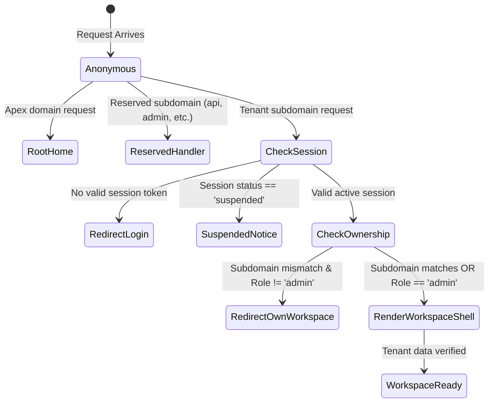

# Data Model: Authentication & Multi-Tenant Subdomain Routing Isolation

This document defines the runtime data structures, session claims, RBAC permissions, and tenant context models for Spec 002.

---

## 1. Domain Entities & Runtime Models

### 1.1 Session Context (`SessionPayload`)

The cryptographically signed session token issued to authenticated users and validated at edge/server boundaries:

```typescript
export interface SessionPayload {
  userId: string;       // User UUID (maps to users.id)
  email: string;        // User email
  name?: string | null; // Optional display name
  subdomain: string;    // Authorized tenant subdomain slug
  role: 'user' | 'seller' | 'admin'; // User RBAC role
  status: 'active' | 'suspended';     // User account status
  iat: number;          // Issued at Unix timestamp (seconds)
  exp: number;          // Expiration Unix timestamp (seconds)
}
```

**Invariants & Constraints**:
- `userId` must be a valid RFC 4122 UUID.
- `subdomain` must be a valid non-reserved subdomain slug matching `SubdomainSchema`.
- `role` must be one of `'user' | 'seller' | 'admin'`.
- `status` must be `'active'` to access protected workspace routes. If `'suspended'`, access is denied.
- `exp` must be strictly in the future (`exp > Math.floor(Date.now() / 1000)`).
- Session tokens are signed using HMAC-SHA256 (`HS256`) via Web Crypto `crypto.subtle`.

---

### 1.2 Tenant Routing Context (`TenantRouteContext`)

The routing metadata parsed from incoming host headers by Next.js Edge Middleware:

```typescript
export interface TenantRouteContext {
  hostname: string;           // Normalized hostname without port
  subdomain: string | null;   // Extracted subdomain slug, or null for apex/root
  isApex: boolean;            // True if host is apex/root domain (or localhost / 127.0.0.1)
  isReserved: boolean;        // True if subdomain matches RESERVED_SUBDOMAINS
  targetRewritePath: string;  // Internal path to rewrite into (e.g. /tenant/[subdomain]/...)
}
```

**Subdomain Extraction Rules**:
- Port numbers are stripped before evaluation (`test.localhost:3000` -> `test.localhost`).
- If host is `fbuploadpro.com`, `www.fbuploadpro.com`, `localhost`, or `127.0.0.1`: `isApex = true`, `subdomain = null`.
- If host is `{subdomain}.fbuploadpro.com` or `{subdomain}.localhost`:
  - If `subdomain` is in `RESERVED_SUBDOMAINS` (`api`, `app`, `admin`, `www`, `billing`, etc.): `isReserved = true`.
  - Otherwise, `isReserved = false`, valid tenant subdomain.

---

### 1.3 Role-Based Access Control Matrix (`RolePermission`)

The permission mapping governing route and action access:

| Permission | `user` | `seller` | `admin` | Description |
| :--- | :---: | :---: | :---: | :--- |
| `VIEW_WORKSPACE_DASHBOARD` | ✅ | ✅ | ✅ | View tenant workspace shell |
| `MANAGE_SOCIAL_ACCOUNTS` | ✅ | ✅ | ✅ | Connect and manage Facebook accounts and pages |
| `EXECUTE_PUBLISHING` | ✅ | ✅ | ✅ | Trigger automated Reel uploads and schedules |
| `ACCESS_SELLER_PORTAL` | ❌ | ✅ | ✅ | Access seller-tier templates and referral packages |
| `CROSS_TENANT_INSPECT` | ❌ | ❌ | ✅ | Inspect other tenants' workspace views |
| `ADMIN_SYSTEM_SETTINGS` | ❌ | ❌ | ✅ | Access platform `/admin` system tools and manage users |

**Hierarchical Role Order**:
`admin` (Level 3) > `seller` (Level 2) > `user` (Level 1).

---

### 1.4 Workspace Shell State (`WorkspaceShellState`)

The server-rendered state loaded for the multi-tenant workspace shell:

```typescript
export interface WorkspaceShellState {
  user: {
    id: string;
    email: string;
    name: string | null;
    subdomain: string;
    role: 'user' | 'seller' | 'admin';
    status: 'active' | 'suspended';
    createdAt: string;
  };
}
```

---

## 2. Authentication & Authorization State Transitions


