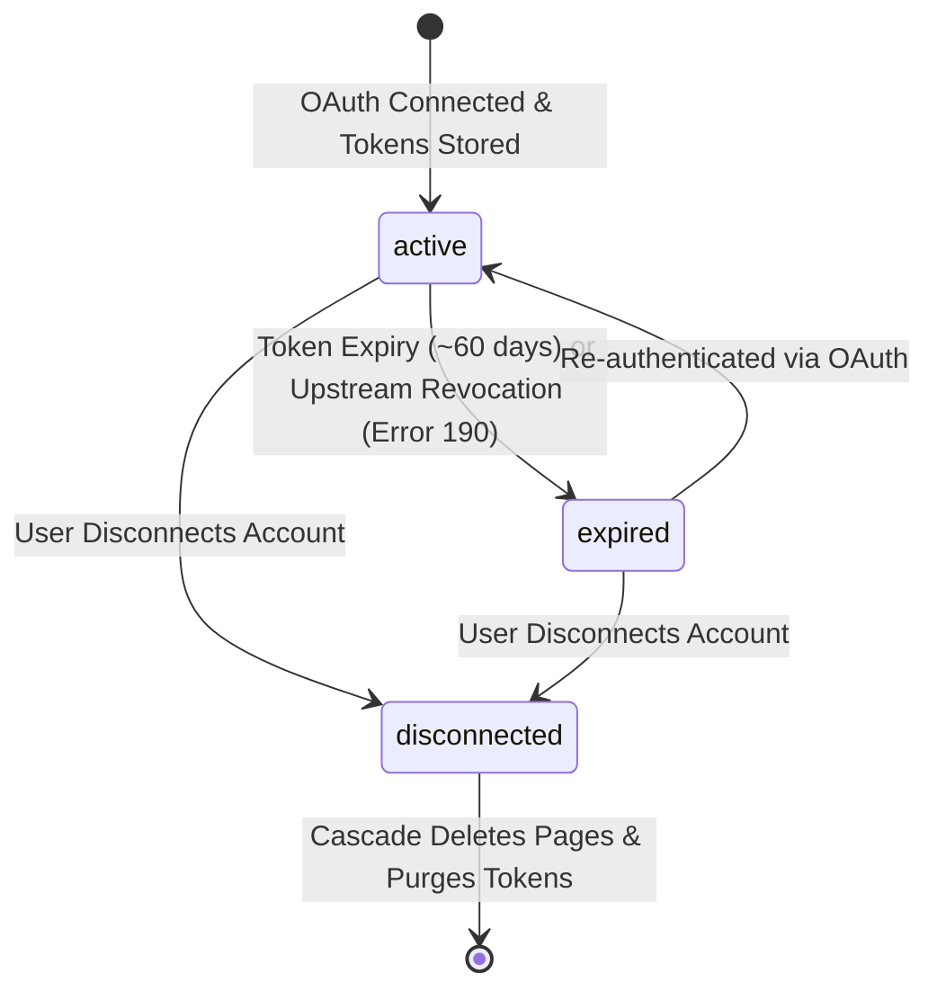
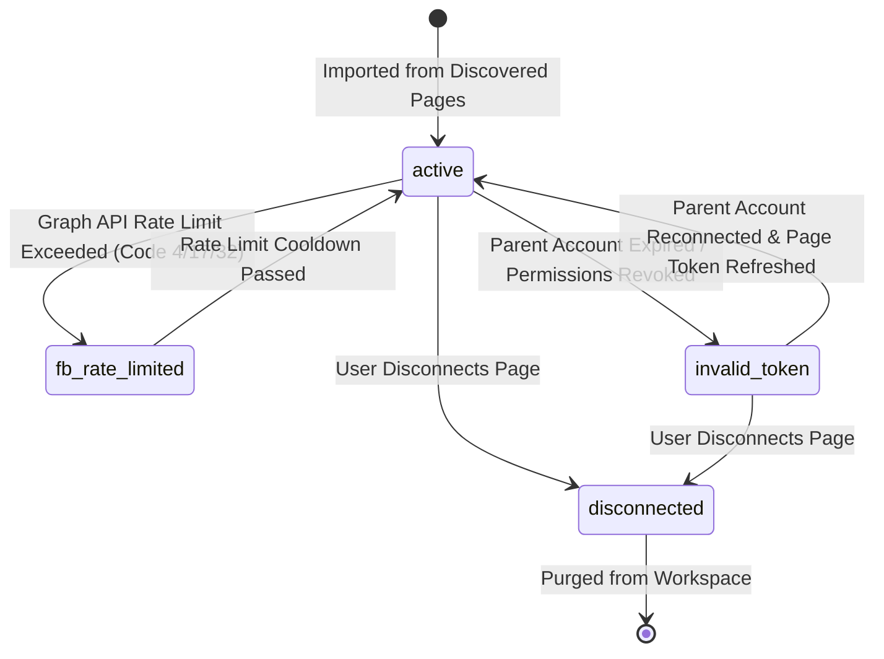

# Data Model: Facebook Graph API OAuth & Multi-Account Social Connection

This document defines the data models, entity relationships, database schema updates, and state transition matrices for Spec 003.

---

## 1. Domain Entities & Database Schema

### 1.1 `facebook_accounts` (Multi-Account 1:N per Tenant)
Represents a connected Facebook user profile authorized to manage pages under the tenant workspace.

| Field | Type | Nullable | Constraints / Defaults | Description |
|---|---|---|---|---|
| `id` | `UUID` | No | `PRIMARY KEY DEFAULT gen_random_uuid()` | Unique account identifier in FBUploadPro |
| `user_id` | `UUID` | No | `REFERENCES users(id) ON DELETE CASCADE` | Tenant owner identifier (composite root) |
| `fb_account_id` | `VARCHAR(100)` | No | | External Facebook user ID from Graph API `/me` |
| `display_name` | `VARCHAR(255)` | No | | Facebook profile full name |
| `encrypted_access_token` | `TEXT` | No | | AES-256-GCM encrypted long-lived user access token |
| `token_expires_at` | `TIMESTAMPTZ` | Yes | | Expiration timestamp of the long-lived token (~60 days) |
| `status` | `VARCHAR(20)` | No | `DEFAULT 'active'` `CHECK (status IN ('active', 'disconnected', 'expired'))` | Operational lifecycle status |
| `created_at` | `TIMESTAMPTZ` | No | `DEFAULT now()` | Record creation timestamp |
| `updated_at` | `TIMESTAMPTZ` | No | `DEFAULT now()` | Record update timestamp |

**Indexes & Constraints**:
- `CONSTRAINT uq_fb_accounts_user_account UNIQUE (user_id, fb_account_id)`: Multi-account enabled — a user can have multiple distinct Facebook accounts, but cannot duplicate the same account.
- `CONSTRAINT uq_fb_accounts_user_id UNIQUE (user_id, id)`: Enables composite foreign key target for `facebook_pages`.
- `CREATE INDEX idx_fb_accounts_user_id ON facebook_accounts(user_id);`
- `CREATE INDEX idx_fb_accounts_status ON facebook_accounts(status);`

---

### 1.2 `facebook_pages` (Managed Page Publishing Targets)
Represents a specific Facebook Page imported from a connected account for video publishing. Exclusively Facebook Pages; zero Facebook Groups.

| Field | Type | Nullable | Constraints / Defaults | Description |
|---|---|---|---|---|
| `id` | `UUID` | No | `PRIMARY KEY DEFAULT gen_random_uuid()` | Unique page record identifier in FBUploadPro |
| `user_id` | `UUID` | No | | Tenant owner identifier (composite root) |
| `facebook_account_id` | `UUID` | No | | Parent Facebook account reference |
| `fb_page_id` | `VARCHAR(100)` | No | | External Facebook Page ID from Graph API `/me/accounts` |
| `page_name` | `VARCHAR(255)` | No | | Facebook Page display name |
| `category` | `VARCHAR(100)` | Yes | | Facebook Page category (e.g. Media/News, Creator) |
| `tasks` | `JSONB` | No | `DEFAULT '[]'::jsonb` | Assigned page tasks (e.g. `["CREATE_CONTENT", "MANAGE"]`) |
| `followers_count` | `INT` | No | `DEFAULT 0 CHECK (followers_count >= 0)` | Discovered page followers count |
| `encrypted_access_token` | `TEXT` | No | | AES-256-GCM encrypted Page Access Token |
| `status` | `VARCHAR(30)` | No | `DEFAULT 'active'` `CHECK (status IN ('active', 'fb_rate_limited', 'invalid_token', 'disconnected'))` | Publishing operational status |
| `created_at` | `TIMESTAMPTZ` | No | `DEFAULT now()` | Record creation timestamp |
| `updated_at` | `TIMESTAMPTZ` | No | `DEFAULT now()` | Record update timestamp |

**Indexes & Constraints**:
- `CONSTRAINT fk_fb_pages_user_account FOREIGN KEY (user_id, facebook_account_id) REFERENCES facebook_accounts(user_id, id) ON DELETE CASCADE`: Strict composite tenant isolation.
- `CONSTRAINT uq_fb_pages_user_page UNIQUE (user_id, fb_page_id)`: Prevents duplicate page imports within the same tenant workspace.
- `CREATE INDEX idx_fb_pages_user_id ON facebook_pages(user_id);`
- `CREATE INDEX idx_fb_pages_account_id ON facebook_pages(facebook_account_id);`
- `CREATE INDEX idx_fb_pages_status ON facebook_pages(status);`

---

## 2. Ephemeral & Transient Entities

### 2.1 `OAuthStatePayload` (Ephemeral Signed CSRF Token)
Generated before redirecting to Facebook and verified upon return:
```typescript
export interface OAuthStatePayload {
  tenantSubdomain: string;
  userId: string;
  nonce: string;
  iat: number; // Issued at (seconds)
  exp: number; // Expires at (seconds, max 10 minutes)
}
```

### 2.2 `DiscoveredFacebookPage` (In-Memory Discovery Object)
Returned to the client for the page selection modal:
```typescript
export interface DiscoveredFacebookPage {
  fbPageId: string;
  pageName: string;
  category?: string | null;
  followersCount: number;
  tasks: string[];
  isImported: boolean; // Computed by checking if fbPageId exists in tenant's facebook_pages
}
```
*Note*: `access_token` is handled strictly server-side and is never included in `DiscoveredFacebookPage` returned to the browser.

---

## 3. State Machines & Lifecycle Transitions

### 3.1 Facebook Account Status Transition


### 3.2 Facebook Page Status Transition


---

## 4. DDL Migration Specification (`0002_facebook_tokens.sql`)

```sql
-- Migration: 0002_facebook_tokens.sql
-- Description: Add encrypted access tokens, expiration timestamps, and page metadata

ALTER TABLE facebook_accounts
    ADD COLUMN IF NOT EXISTS encrypted_access_token TEXT NOT NULL DEFAULT '',
    ADD COLUMN IF NOT EXISTS token_expires_at TIMESTAMPTZ;

ALTER TABLE facebook_pages
    ADD COLUMN IF NOT EXISTS encrypted_access_token TEXT NOT NULL DEFAULT '',
    ADD COLUMN IF NOT EXISTS category VARCHAR(100),
    ADD COLUMN IF NOT EXISTS tasks JSONB NOT NULL DEFAULT '[]'::jsonb;

-- Remove default '' constraint after column creation so future inserts require valid encrypted tokens
ALTER TABLE facebook_accounts ALTER COLUMN encrypted_access_token DROP DEFAULT;
ALTER TABLE facebook_pages ALTER COLUMN encrypted_access_token DROP DEFAULT;

CREATE INDEX IF NOT EXISTS idx_fb_accounts_status ON facebook_accounts(status);
CREATE INDEX IF NOT EXISTS idx_fb_pages_status ON facebook_pages(status);
```
