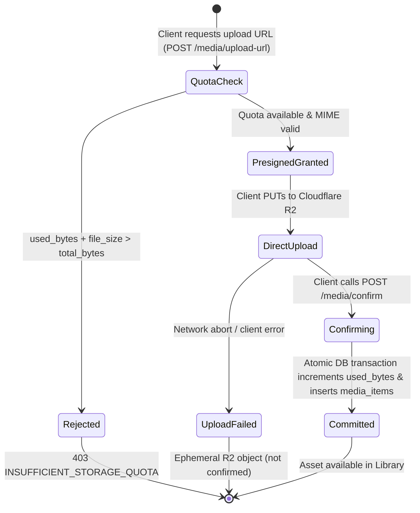
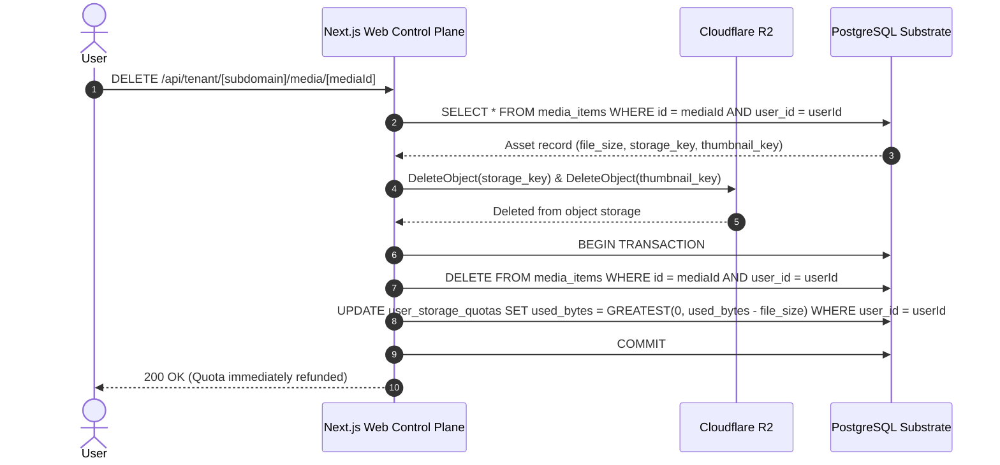

# Data Model: Dedicated User Media Library & Cloudflare R2 Uploads

This document defines the domain entities, database schema updates, relational constraints, state transition lifecycles, and SQL DDL migrations for Spec 004: Dedicated User Media Library & Cloudflare R2 Uploads.

---

## 1. Domain Entities & Database Schema

### 1.1 `user_storage_quotas` (User Storage Quota & Accounting)
Maintains current storage limits and active byte consumption per user workspace.

| Field | Type | Nullable | Constraints / Defaults | Description |
|---|---|---|---|---|
| `user_id` | `UUID` | No | `PRIMARY KEY REFERENCES users(id) ON DELETE CASCADE` | Isolated user identifier |
| `total_bytes` | `BIGINT` | No | `DEFAULT 5368709120 CHECK (total_bytes >= 0)` | Total quota limit in bytes (5 GB default) |
| `used_bytes` | `BIGINT` | No | `DEFAULT 0 CHECK (used_bytes >= 0)` | Currently consumed storage footprint in bytes |
| `updated_at` | `TIMESTAMPTZ` | No | `DEFAULT now()` | Last update timestamp |

**Indexes & Constraints**:
- `PRIMARY KEY (user_id)`
- `CHECK (used_bytes >= 0)`: Enforces non-negative consumption.

---

### 1.2 `media_folders` (Organizational Groupings)
Represents custom folders for grouping short-form videos and images within a user workspace.

| Field | Type | Nullable | Constraints / Defaults | Description |
|---|---|---|---|---|
| `id` | `UUID` | No | `PRIMARY KEY DEFAULT gen_random_uuid()` | Unique folder identifier |
| `user_id` | `UUID` | No | `REFERENCES users(id) ON DELETE CASCADE` | Workspace owner reference |
| `name` | `VARCHAR(100)` | No | | Folder display name |
| `color` | `VARCHAR(20)` | No | `DEFAULT 'slate'` | Folder badge color token (`blue`, `green`, `purple`, etc.) |
| `created_at` | `TIMESTAMPTZ` | No | `DEFAULT now()` | Record creation timestamp |
| `updated_at` | `TIMESTAMPTZ` | No | `DEFAULT now()` | Record update timestamp |

**Indexes & Constraints**:
- `CONSTRAINT uq_media_folders_user_name UNIQUE (user_id, name)`: Prevents duplicate folder names per user.
- `CONSTRAINT uq_media_folders_user_id UNIQUE (user_id, id)`: Enables composite foreign key targeting from `media_items`.
- `CREATE INDEX idx_media_folders_user_id ON media_folders(user_id);`

---

### 1.3 `caption_templates` (Reusable Copywriting Vault)
Represents reusable caption snippets, call-to-actions, hashtags, and links.

| Field | Type | Nullable | Constraints / Defaults | Description |
|---|---|---|---|---|
| `id` | `UUID` | No | `PRIMARY KEY DEFAULT gen_random_uuid()` | Unique caption template identifier |
| `user_id` | `UUID` | No | `REFERENCES users(id) ON DELETE CASCADE` | Workspace owner reference |
| `title` | `VARCHAR(150)` | No | | Template title or label |
| `content` | `TEXT` | No | | Reusable copywriting content with hashtags/links |
| `tags` | `JSONB` | No | `DEFAULT '[]'::jsonb` | Categorization tags for the template |
| `created_at` | `TIMESTAMPTZ` | No | `DEFAULT now()` | Record creation timestamp |
| `updated_at` | `TIMESTAMPTZ` | No | `DEFAULT now()` | Record update timestamp |

**Indexes & Constraints**:
- `CONSTRAINT uq_caption_templates_user_title UNIQUE (user_id, title)`: Prevents duplicate titles per user.
- `CONSTRAINT uq_caption_templates_user_id UNIQUE (user_id, id)`: Enables composite foreign key targeting.
- `CREATE INDEX idx_caption_templates_user_id ON caption_templates(user_id);`

---

### 1.4 `media_items` (Media Assets & Cloud Storage References)
Represents individual uploaded video or image assets stored in Cloudflare R2.

| Field | Type | Nullable | Constraints / Defaults | Description |
|---|---|---|---|---|
| `id` | `UUID` | No | `PRIMARY KEY DEFAULT gen_random_uuid()` | Unique asset identifier |
| `user_id` | `UUID` | No | `REFERENCES users(id) ON DELETE CASCADE` | Workspace owner reference |
| `folder_id` | `UUID` | Yes | | Parent folder reference (nullable for unorganized) |
| `name` | `VARCHAR(255)` | No | | Original or user-assigned asset name |
| `file_size` | `BIGINT` | No | `CHECK (file_size > 0)` | File size in bytes |
| `mime_type` | `VARCHAR(100)` | No | | Verified MIME type (`video/mp4`, `image/jpeg`, etc.) |
| `media_type` | `VARCHAR(20)` | No | `CHECK (media_type IN ('video', 'image'))` | Media category |
| `storage_key` | `VARCHAR(500)` | No | `UNIQUE` | Cloudflare R2 object key (`users/${userId}/media/...`) |
| `url` | `TEXT` | No | | Public / accessible URL for preview & publishing |
| `thumbnail_key` | `VARCHAR(500)` | Yes | | Cloudflare R2 thumbnail object key |
| `thumbnail_url` | `TEXT` | Yes | | Accessible URL for asset thumbnail |
| `duration_seconds` | `NUMERIC(10, 2)` | Yes | | Video duration in seconds (null for images) |
| `aspect_ratio` | `VARCHAR(20)` | No | `DEFAULT 'unknown'` | Detected aspect ratio (`9:16`, `16:9`, `1:1`, `4:5`, etc.) |
| `tags` | `JSONB` | No | `DEFAULT '[]'::jsonb` | Array of search tags (e.g. `["#viral", "#ad"]`) |
| `caption_template_id` | `UUID` | Yes | | Reference to originating caption template |
| `caption_text` | `TEXT` | Yes | | Snapshotted copy assigned to this media asset |
| `created_at` | `TIMESTAMPTZ` | No | `DEFAULT now()` | Record creation timestamp |
| `updated_at` | `TIMESTAMPTZ` | No | `DEFAULT now()` | Record update timestamp |

**Composite Foreign Keys & Multi-Tenant Defense**:
- `CONSTRAINT fk_media_items_user_folder FOREIGN KEY (user_id, folder_id) REFERENCES media_folders(user_id, id) ON DELETE SET NULL`
  - Guarantees `folder_id` belongs to the exact same user.
  - When a folder is deleted, `ON DELETE SET NULL` moves all items to unorganized without data loss.
- `CONSTRAINT fk_media_items_user_caption FOREIGN KEY (user_id, caption_template_id) REFERENCES caption_templates(user_id, id) ON DELETE SET NULL`
  - Guarantees `caption_template_id` belongs to the same user.
  - Deleting a caption template preserves the snapshotted `caption_text` on the asset.

**Indexes**:
- `CREATE INDEX idx_media_items_user_id ON media_items(user_id);`
- `CREATE INDEX idx_media_items_user_folder ON media_items(user_id, folder_id);`
- `CREATE INDEX idx_media_items_user_created ON media_items(user_id, created_at DESC);`
- `CREATE INDEX idx_media_items_user_type ON media_items(user_id, media_type);`
- `CREATE INDEX idx_media_items_tags ON media_items USING GIN (tags);`

---

## 2. Forward DDL Migration: `0003_media_library.sql`

```sql
-- Migration: 0003_media_library.sql
-- Description: Dedicated user media library, custom folders, caption templates, and storage quotas

CREATE TABLE IF NOT EXISTS user_storage_quotas (
    user_id UUID PRIMARY KEY REFERENCES users(id) ON DELETE CASCADE,
    total_bytes BIGINT NOT NULL DEFAULT 5368709120 CHECK (total_bytes >= 0),
    used_bytes BIGINT NOT NULL DEFAULT 0 CHECK (used_bytes >= 0),
    updated_at TIMESTAMPTZ NOT NULL DEFAULT now()
);

CREATE TABLE IF NOT EXISTS media_folders (
    id UUID PRIMARY KEY DEFAULT gen_random_uuid(),
    user_id UUID NOT NULL REFERENCES users(id) ON DELETE CASCADE,
    name VARCHAR(100) NOT NULL,
    color VARCHAR(20) NOT NULL DEFAULT 'slate',
    created_at TIMESTAMPTZ NOT NULL DEFAULT now(),
    updated_at TIMESTAMPTZ NOT NULL DEFAULT now(),
    CONSTRAINT uq_media_folders_user_name UNIQUE (user_id, name),
    CONSTRAINT uq_media_folders_user_id UNIQUE (user_id, id)
);

CREATE INDEX IF NOT EXISTS idx_media_folders_user_id ON media_folders(user_id);

CREATE TABLE IF NOT EXISTS caption_templates (
    id UUID PRIMARY KEY DEFAULT gen_random_uuid(),
    user_id UUID NOT NULL REFERENCES users(id) ON DELETE CASCADE,
    title VARCHAR(150) NOT NULL,
    content TEXT NOT NULL,
    tags JSONB NOT NULL DEFAULT '[]'::jsonb,
    created_at TIMESTAMPTZ NOT NULL DEFAULT now(),
    updated_at TIMESTAMPTZ NOT NULL DEFAULT now(),
    CONSTRAINT uq_caption_templates_user_title UNIQUE (user_id, title),
    CONSTRAINT uq_caption_templates_user_id UNIQUE (user_id, id)
);

CREATE INDEX IF NOT EXISTS idx_caption_templates_user_id ON caption_templates(user_id);

CREATE TABLE IF NOT EXISTS media_items (
    id UUID PRIMARY KEY DEFAULT gen_random_uuid(),
    user_id UUID NOT NULL REFERENCES users(id) ON DELETE CASCADE,
    folder_id UUID NULL,
    name VARCHAR(255) NOT NULL,
    file_size BIGINT NOT NULL CHECK (file_size > 0),
    mime_type VARCHAR(100) NOT NULL,
    media_type VARCHAR(20) NOT NULL CHECK (media_type IN ('video', 'image')),
    storage_key VARCHAR(500) NOT NULL UNIQUE,
    url TEXT NOT NULL,
    thumbnail_key VARCHAR(500) NULL,
    thumbnail_url TEXT NULL,
    duration_seconds NUMERIC(10, 2) NULL,
    aspect_ratio VARCHAR(20) NOT NULL DEFAULT 'unknown',
    tags JSONB NOT NULL DEFAULT '[]'::jsonb,
    caption_template_id UUID NULL,
    caption_text TEXT NULL,
    created_at TIMESTAMPTZ NOT NULL DEFAULT now(),
    updated_at TIMESTAMPTZ NOT NULL DEFAULT now(),
    CONSTRAINT fk_media_items_user_folder FOREIGN KEY (user_id, folder_id)
        REFERENCES media_folders(user_id, id) ON DELETE SET NULL,
    CONSTRAINT fk_media_items_user_caption FOREIGN KEY (user_id, caption_template_id)
        REFERENCES caption_templates(user_id, id) ON DELETE SET NULL
);

CREATE INDEX IF NOT EXISTS idx_media_items_user_id ON media_items(user_id);
CREATE INDEX IF NOT EXISTS idx_media_items_user_folder ON media_items(user_id, folder_id);
CREATE INDEX IF NOT EXISTS idx_media_items_user_created ON media_items(user_id, created_at DESC);
CREATE INDEX IF NOT EXISTS idx_media_items_user_type ON media_items(user_id, media_type);
CREATE INDEX IF NOT EXISTS idx_media_items_tags ON media_items USING GIN (tags);

-- Initialize storage quotas for existing users
INSERT INTO user_storage_quotas (user_id, total_bytes, used_bytes)
SELECT id, 5368709120, 0
FROM users
ON CONFLICT (user_id) DO NOTHING;
```

---

## 3. State Machines & Lifecycle Transitions

### 3.1 Media Asset Upload & Quota Allocation Lifecycle



---

### 3.2 Folder Deletion Non-Destructive Preservation

```mermaid
sequenceDiagram
    autonumber
    actor Creator as User
    participant Web as Next.js Web Control Plane
    participant DB as PostgreSQL Substrate

    Creator->>Web: DELETE /api/tenant/[subdomain]/media/folders/[folderId]
    Web->>DB: DELETE FROM media_folders WHERE id = folderId AND user_id = userId
    Note over DB: fk_media_items_user_folder ON DELETE SET NULL triggers
    DB-->>DB: Sets media_items.folder_id = NULL for all contained items
    DB-->>Web: Folder deleted successfully
    Web-->>Creator: 200 OK (0 items lost; items visible in Unorganized)
```

---

### 3.3 Media Purge & Quota Reclamation Lifecycle


