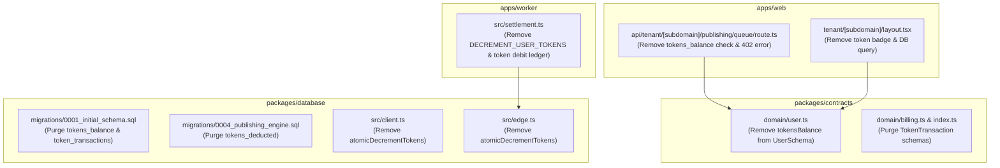

# Implementation Plan: 007-remove-token-system

**Feature**: Purge Token System & Enforce Unrestricted Publishing
**Branch**: `refactor/remove-token-system`
**Ratified**: 2026-10-08
**Constitution Version**: 2.0.0

---

## 1. Architecture Blueprint & Package Boundary Breakdown

This architectural refactor purges all prepaid credit ledger mechanisms across the monorepo, restoring unrestricted publishing for active users.

### Affected Packages & Changes:
1. **`packages/contracts`**:
   - `domain/user.ts`: Remove `tokensBalance` field and default from `UserSchema` and `User` type.
   - `domain/billing.ts`: Remove `TokenTransactionType`, `TokenTransactionTypeSchema`, `TokenTransaction`, `TokenTransactionSchema`.
   - `index.ts`: Remove or adjust billing export.
   - Tests: Update `tests/user.test.ts` to remove `tokensBalance` assertions.
2. **`packages/database`**:
   - `migrations/0001_initial_schema.sql`: Remove `tokens_balance BIGINT NOT NULL DEFAULT 0 CHECK (tokens_balance >= 0)` from `users` table; delete `token_transactions` table and its indexes.
   - `migrations/0004_publishing_engine.sql`: Remove `tokens_deducted INT NOT NULL DEFAULT 0 CHECK (tokens_deducted >= 0)` from `publish_logs`.
   - `src/client.ts` & `src/edge.ts`: Remove `atomicDecrementTokens` method.
   - Tests: Update `tests/database.test.ts` and `tests/schema.test.ts` to remove `atomicDecrementTokens` and `token_transactions` tests.
3. **`apps/worker`**:
   - `src/settlement.ts`:
     - Remove `DECREMENT_USER_TOKENS_SQL` and `INSERT_TOKEN_TRANSACTION_SQL`.
     - In `settlement.ts`, on outcome `'published'`, only execute `UPDATE_QUEUE_ITEM_PUBLISHED_SQL` and `INSERT_PUBLISH_LOG_SQL` (passing null or removing tokens_deducted column).
   - Tests: Update `tests/token-settlement.test.ts` to assert that published settlement marks status without deducting tokens.
4. **`apps/web`**:
   - `src/app/api/tenant/[subdomain]/publishing/queue/route.ts`: Remove Step 4 (`SELECT tokens_balance` and 402 response); enqueue directly if user exists.
   - `src/app/tenant/[subdomain]/layout.tsx`: Remove `tokensBalance` state, database query, and the `⚡ tokens` badge.
   - Tests: Update `tests/api/publishing-queue.test.ts` and `tests/security/publishing-isolation.test.ts` to remove 402 token expectations.

---

## 2. Risk Mitigation & Verification Strategy

- **Zero Breakage of Auth Credentials**: Ensure `encrypted_access_token` on Facebook models and JWT session verification remain untouched.
- **Verification Gates**:
  1. `pnpm turbo run test` passes across all packages.
  2. `pnpm turbo run typecheck` passes with zero type errors.
  3. `pnpm turbo run lint` passes with zero warnings.
  4. `pnpm turbo run build` creates valid production builds.
