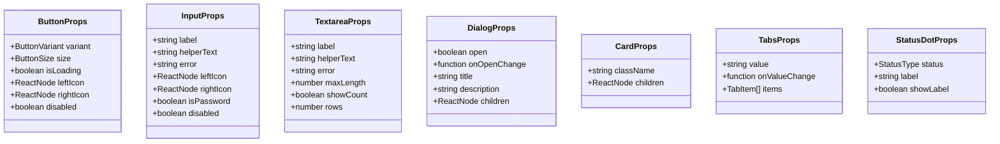

# Data Model & Component Interface Catalog: Essential Reusable UI Components

**Feature**: Essential Reusable UI Components  
**Directory**: `specs/008-reusable-ui-components`  
**Date**: 2026-10-08  

---

## 1. Component State & Prop Models



---

## 2. Type Definitions

### A. Form & Action Controls

```typescript
export type ButtonVariant = 'primary' | 'secondary' | 'ghost' | 'danger' | 'link';
export type ButtonSize = 'sm' | 'md' | 'lg';

export interface ButtonProps extends React.ButtonHTMLAttributes<HTMLButtonElement> {
  variant?: ButtonVariant;
  size?: ButtonSize;
  isLoading?: boolean;
  leftIcon?: React.ReactNode;
  rightIcon?: React.ReactNode;
  asChild?: boolean;
}

export interface InputProps extends React.InputHTMLAttributes<HTMLInputElement> {
  label?: string;
  helperText?: string;
  error?: string;
  leftIcon?: React.ReactNode;
  rightIcon?: React.ReactNode;
  isPassword?: boolean;
}

export interface TextareaProps extends React.TextareaHTMLAttributes<HTMLTextAreaElement> {
  label?: string;
  helperText?: string;
  error?: string;
  maxLength?: number;
  showCount?: boolean;
}

export interface CheckboxProps extends Omit<React.InputHTMLAttributes<HTMLInputElement>, 'onChange'> {
  label?: string;
  description?: string;
  checked: boolean;
  onCheckedChange: (checked: boolean) => void;
}

export interface SwitchProps {
  label?: string;
  description?: string;
  checked: boolean;
  onCheckedChange: (checked: boolean) => void;
  disabled?: boolean;
  name?: string;
  id?: string;
}

export interface SelectOption {
  value: string;
  label: string;
  disabled?: boolean;
}

export interface SelectProps extends Omit<React.SelectHTMLAttributes<HTMLSelectElement>, 'onChange'> {
  label?: string;
  helperText?: string;
  error?: string;
  options: SelectOption[];
  placeholder?: string;
  value?: string;
  onValueChange?: (value: string) => void;
}
```

---

### B. Structural Containers & Overlays

```typescript
export interface CardProps extends React.HTMLAttributes<HTMLDivElement> {
  children: React.ReactNode;
}

export interface CardHeaderProps extends React.HTMLAttributes<HTMLDivElement> {}
export interface CardTitleProps extends React.HTMLAttributes<HTMLHeadingElement> {}
export interface CardDescriptionProps extends React.HTMLAttributes<HTMLParagraphElement> {}
export interface CardContentProps extends React.HTMLAttributes<HTMLDivElement> {}
export interface CardFooterProps extends React.HTMLAttributes<HTMLDivElement> {}

export interface DialogProps {
  open: boolean;
  onOpenChange: (open: boolean) => void;
  title?: string;
  description?: string;
  children: React.ReactNode;
}
```

---

### C. Navigation & Tabulation

```typescript
export interface TabItem {
  id: string;
  label: string;
  disabled?: boolean;
  content?: React.ReactNode;
}

export interface TabsProps {
  value: string;
  onValueChange: (value: string) => void;
  items: TabItem[];
  children?: React.ReactNode;
}

export interface TableProps extends React.TableHTMLAttributes<HTMLTableElement> {}
export interface TableHeaderProps extends React.HTMLAttributes<HTMLTableSectionElement> {}
export interface TableBodyProps extends React.HTMLAttributes<HTMLTableSectionElement> {}
export interface TableRowProps extends React.HTMLAttributes<HTMLTableRowElement> {}
export interface TableHeadProps extends React.ThHTMLAttributes<HTMLTableCellElement> {}
export interface TableCellProps extends React.TdHTMLAttributes<HTMLTableCellElement> {}
```

---

### D. Status Signaling, Feedback & Loading

```typescript
export type StatusType = 'operational' | 'queued' | 'critical' | 'idle';

export interface StatusDotProps {
  status: StatusType;
  label?: string;
  showLabel?: boolean;
  className?: string;
}

export type TagVariant = 'default' | 'accent' | 'warning' | 'danger' | 'success';

export interface TagProps extends React.HTMLAttributes<HTMLSpanElement> {
  variant?: TagVariant;
  children: React.ReactNode;
}

export type SkeletonVariant = 'text' | 'rect' | 'circle';

export interface SkeletonProps extends React.HTMLAttributes<HTMLDivElement> {
  width?: string | number;
  height?: string | number;
  variant?: SkeletonVariant;
}

export type AlertSeverity = 'info' | 'success' | 'warning' | 'error';

export interface AlertProps extends React.HTMLAttributes<HTMLDivElement> {
  severity?: AlertSeverity;
  title?: string;
  message: string;
  onClose?: () => void;
}

export interface TooltipProps {
  content: string;
  children: React.ReactElement;
  side?: 'top' | 'right' | 'bottom' | 'left';
}
```
