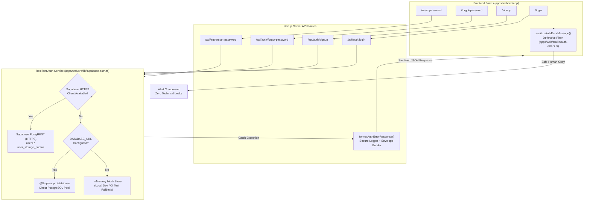

# Technical Architecture & Implementation Plan: Spec 012

**Feature**: Auth Security Leak Prevention & Fault-Tolerant Resilience  
**Feature Branch**: `feat/012-auth-security-leak-prevention-and-resilience`  
**Prerequisites**: `spec.md`, `checklists/requirements.md`

---

## 1. Architecture Overview

---

## 2. Component Design & Module Boundaries

### 2.1 Centralized Error Sanitization Module (`apps/web/src/lib/auth-errors.ts`)
- **`formatAuthErrorResponse(error: unknown, defaultMessage?: string)`**:
  - Emits full diagnostic error to `console.error('[Auth Error]', error)`.
  - Maps credential mismatches to 401 with standard message: `"Invalid email or password. Please try again."`.
  - Maps suspended account to 403 with standard message: `"Your account is suspended. Please contact support."`.
  - Maps duplicate account registration to 409 with standard message: `"This email address is already registered. Please sign in instead."`.
  - For all database, network, socket, or unexpected exceptions: returns HTTP 500 with sanitized message: `"Unable to sign in at this moment. Please try again shortly."` (or appropriate action fallback).
- **`sanitizeAuthErrorMessage(message: string | null | undefined, fallback?: string): string`**:
  - Regex inspection testing for technical terms:
    `/ECONNREFUSED|127\.0\.0\.1|localhost|5432|postgres|pg_pool|select\s|insert\s|database|socket|timed?\s*out|stack|syntaxerror|uncaught/i`
  - Replaces matches with a clean, reassuring fallback message.

### 2.2 Resilient Multi-Runtime Auth Adapter (`apps/web/src/lib/supabase-auth.ts`)
- When `getSupabaseClient()` returns an active client:
  - Query user records via `supabase.from('users').select('*').ilike('email', emailLower).maybeSingle()`.
  - Persist new user records via `supabase.from('users').insert(...)`.
  - Persist storage quotas via `supabase.from('user_storage_quotas').upsert(...)`.
  - Verify subdomain uniqueness via `supabase.from('users').select('id').eq('subdomain', candidate).maybeSingle()`.
- When Supabase client is not available:
  - Fall back to `getDbClient()` only if `process.env.DATABASE_URL` is defined.
  - If `DATABASE_URL` is not defined or database connection throws: fall back to local test store or cleanly rethrow an error that gets sanitized by `formatAuthErrorResponse`.

### 2.3 API Routes Error Guarding
- Refactor `apps/web/src/app/api/auth/login/route.ts` to utilize `formatAuthErrorResponse`.
- Refactor `apps/web/src/app/api/auth/signup/route.ts` to utilize `formatAuthErrorResponse`.
- Refactor `apps/web/src/app/api/auth/forgot-password/route.ts` to utilize `formatAuthErrorResponse`.
- Refactor `apps/web/src/app/api/auth/reset-password/route.ts` to utilize `formatAuthErrorResponse`.

### 2.4 Frontend Pages Defensive Filtering
- Wrap error display states in `apps/web/src/app/login/page.tsx` with `sanitizeAuthErrorMessage`.
- Wrap error display states in `apps/web/src/app/signup/page.tsx` with `sanitizeAuthErrorMessage`.
- Wrap error display states in `apps/web/src/app/forgot-password/page.tsx` with `sanitizeAuthErrorMessage`.
- Wrap error display states in `apps/web/src/app/reset-password/page.tsx` with `sanitizeAuthErrorMessage`.

---

## 3. Test & Verification Plan

1. **Unit Tests (`apps/web/tests/auth/auth-error-sanitization.test.ts`)**:
   - Verify `sanitizeAuthErrorMessage` scrubs `ECONNREFUSED 127.0.0.1:5432`, `SELECT * FROM users`, and raw error traces.
   - Verify `formatAuthErrorResponse` generates correct HTTP status codes (401, 403, 409, 500) and sanitized payloads.
2. **Integration Tests (`apps/web/tests/auth/auth-resilience.test.tsx`)**:
   - Simulate database connection refusal (`new Error('connect ECONNREFUSED 127.0.0.1:5432')`) on sign-in API and assert response body contains 0 technical tokens.
   - Simulate sign-in component rendering during network failure and assert rendered HTML contains zero technical terms.
3. **Full Quality Gate**:
   - `pnpm turbo run build lint typecheck test` passing with 100% success and 0 errors.
