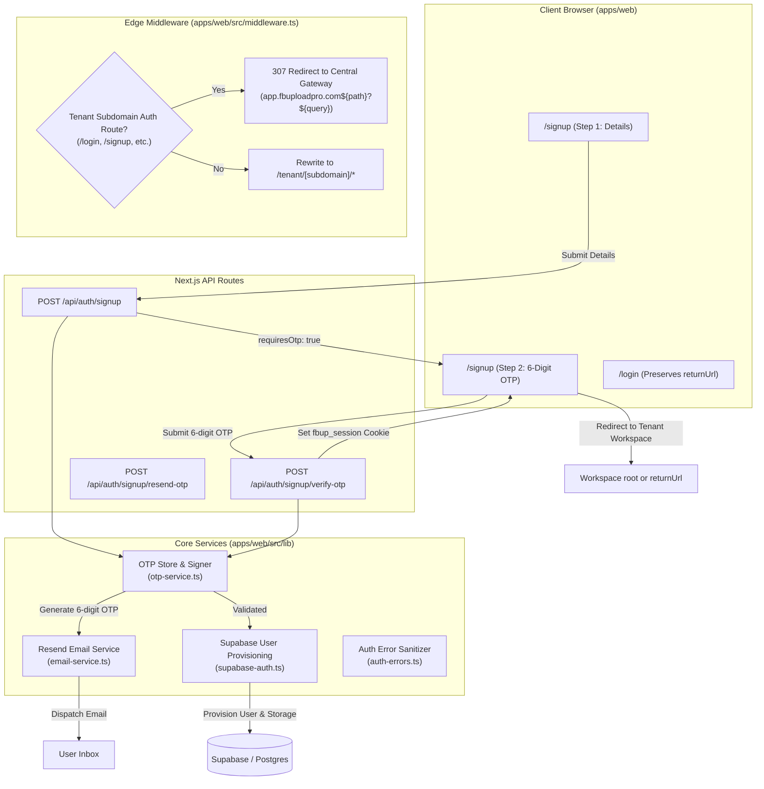

# Technical Architecture & Implementation Plan: Spec 013

**Feature**: Auth OTP Confirmation & Subdomain Hardening  
**Feature Branch**: `feat/013-auth-otp-confirmation-and-subdomain-hardening`  
**Prerequisites**: `spec.md`, `checklists/requirements.md`

---

## 1. System Architecture

---

## 2. Component & File Design

### A. Resend Email Dispatcher (`apps/web/src/lib/email-service.ts`)
- Configured via `RESEND_API_KEY`.
- If key is present: Dispatches via official `@resend` SDK.
- If key is absent (local dev / CI tests / mock runtime): Gracefully logs the generated OTP to console without crashing, allowing tests and local offline development to run smoothly.
- Beautiful, high-craft transactional HTML & text templates with FBUploadPro styling.

### B. OTP Service (`apps/web/src/lib/otp-service.ts`)
- Cryptographic 6-digit generation: `100000 - 999999`.
- Hashed pending registration records with 10-minute TTL.
- Methods:
  - `createPendingSignup(data: SignupRequest)`: Generates OTP, stores pending record, returns OTP.
  - `verifyPendingSignup(email: string, otp: string)`: Validates OTP against stored hash; checks expiry; returns registration payload if valid.
  - `resendSignupOtp(email: string)`: Enforces 60-second cooldown, generates fresh OTP.

### C. Edge Middleware Routing Hardening (`apps/web/src/middleware.ts`)
- Remove the buggy `isPublicTenantPath` that rewrote `/login` and `/signup` to `/tenant/[subdomain]/...`.
- Define centralized `AUTH_ROUTES = ['/login', '/signup', '/forgot-password', '/reset-password']`.
- On any customer tenant subdomain (`!(isApex || isReserved || !subdomain)`):
  - If `AUTH_ROUTES.includes(pathname)`:
    - Return `NextResponse.redirect(new URL(pathname + request.nextUrl.search, 'https://app.' + rootDomain), 307)`.
  - Else: If unauthenticated, redirect to `app.${rootDomain}/login?returnUrl=${encodeURIComponent(request.url)}`.

### D. Password Strength Meter (`apps/web/src/components/auth/password-strength-meter.tsx`)
- Props: `password: string`.
- Computes score (0 to 4):
  - Rule 1: Length >= 8
  - Rule 2: Contains both uppercase and lowercase letters
  - Rule 3: Contains at least one digit
  - Rule 4: Contains at least one special character
- Renders 4-tier visual progress indicator using strict theme tokens:
  - Weak (score <= 1): `PALETTE.accent3` (error red/pink)
  - Fair (score 2-3): `PALETTE.primary` (warm amber)
  - Strong (score 4): `PALETTE.accent2` (mint/emerald)
- Interactive checklist reflecting criteria fulfillment in real-time.

### E. Enhanced PasswordInput with Caps Lock Detection (`apps/web/src/components/auth/password-input.tsx`)
- Tracks Caps Lock state via `e.getModifierState('CapsLock')` on `onKeyDown`, `onKeyUp`, and `onFocus`.
- Renders an unobtrusive inline indicator `Caps Lock is on` in the input container with theme typography and micro-signal styling.

### F. Refactored Signup Form (`apps/web/src/app/signup/page.tsx`)
- Step 1: User fills in Name, Phone, Email, Password, Confirm Password.
  - Includes Password Strength Meter.
  - Includes Caps Lock detection.
  - Displays legal consent: *"By creating an account, you agree to our [Terms of Service](#) and [Privacy Policy](#)."*
  - Preserves `returnUrl` in state and when linking to `/login`.
- Step 2: 6-Digit OTP Verification.
  - Submits to `/api/auth/signup/verify-otp`.
  - Auto-formatting 6-digit numeric input.
  - 60-second countdown for "Resend code".
  - On success: redirects to `redirectUrl` or `returnUrl`.

---

## 3. Testing Strategy

1. **Unit Tests**:
   - `apps/web/tests/auth/otp-service.test.ts`: OTP generation, expiry handling, incorrect code rejection, cooldown enforcement.
   - `apps/web/tests/auth/password-strength.test.ts`: Password score computation and criteria checks.
2. **Integration Tests**:
   - `apps/web/tests/api/signup-otp.test.ts`: Full API flow for `/api/auth/signup`, `/api/auth/signup/verify-otp`, and `/api/auth/signup/resend-otp`.
   - `apps/web/tests/middleware-subdomain-auth.test.ts`: Subdomain 307 redirects for `/login`, `/signup`, `/forgot-password`, `/reset-password` preserving query parameters.
3. **Quality Gates**:
   - `pnpm turbo run build lint typecheck test` across all 5 workspace packages.
