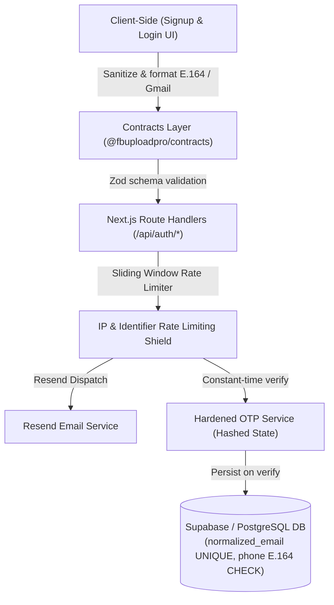

# Technical Plan: Auth Gmail Canonicalization, Phone E.164 & Hardened OTP Security (Spec 015)

**Feature Branch**: `feat/014-auth-gmail-canonicalization-phone-e164-and-otp-hardening`  
**Prerequisites**: `specs/015-auth-gmail-canonicalization-phone-e164-and-otp-hardening/spec.md`

---

## 1. Architectural Strategy

This feature enforces defense-in-depth across the entire stack:

---

## 2. Component Architecture & Data Contracts

### 2.1 Contracts Layer (`packages/contracts`)
- **Dependency**: Add `libphonenumber-js` to `packages/contracts/package.json`.
- **Email Canonicalization (`contracts/src/domain/auth.ts`)**:
  - `canonicalizeGmailAddress(rawEmail: string): string`:
    1. Trim whitespace, convert to lowercase.
    2. Validate domain is either `gmail.com` or `googlemail.com`.
    3. Extract username portion.
    4. Remove any plus tag: `username.split('+')[0]`.
    5. Strip all dots: `usernameWithoutTag.replace(/\./g, '')`.
    6. Recombine as `<clean_username>@gmail.com`.
- **Phone Validation (`contracts/src/domain/auth.ts`)**:
  - `validateAndFormatE164Phone(rawPhone: string): string`:
    1. Parse using `parsePhoneNumberFromString(rawPhone)`.
    2. Assert `phoneNumber && phoneNumber.isValid()`.
    3. Return `phoneNumber.format('E.164')` (e.g. `+923001234567`).
- **Updated Schemas**:
  - `SignupRequestSchema`:
    - `email`: Validates and transforms via `canonicalizeGmailAddress`.
    - `phone`: Validates and transforms via `validateAndFormatE164Phone`.
  - `LoginRequestSchema`:
    - `email`: Validates and transforms via `canonicalizeGmailAddress`.

### 2.2 Database Substrate Layer (`supabase/migrations` & `packages/database/migrations`)
- Migration: `20261009120000_auth_hardening_canonical_email_e164.sql`:
  - `ALTER TABLE users ADD COLUMN IF NOT EXISTS normalized_email VARCHAR(255);`
  - Populate existing rows:
    `UPDATE users SET normalized_email = LOWER(REGEXP_REPLACE(SPLIT_PART(email, '@', 1), '\+.*', '')) || '@gmail.com' WHERE normalized_email IS NULL;`
  - `CREATE UNIQUE INDEX IF NOT EXISTS idx_users_normalized_email ON users(normalized_email);`
  - `ALTER TABLE users ADD CONSTRAINT check_users_phone_e164 CHECK (phone IS NULL OR phone ~ '^\+[1-9][0-9]{6,14}$');`
  - `ALTER TABLE users ADD CONSTRAINT check_users_gmail_only CHECK (normalized_email ~* '^[a-z0-9._%+-]+@gmail\.com$');`

### 2.3 Rate Limiting & Abuse Prevention (`apps/web/src/lib/rate-limiter.ts`)
- Sliding-window in-memory rate limiter with cleanup:
  - `checkRateLimit(key: string, maxRequests: number, windowMs: number): { allowed: boolean; retryAfterSeconds: number }`
  - Limits:
    - Signup OTP dispatch: 3 requests per 60 seconds per IP and per email.
    - OTP verification: 5 attempts per active registration; 15-minute temporary lockout if exceeded.

### 2.4 OTP Service Hardening (`apps/web/src/lib/otp-service.ts`)
- **Constant-Time Verification**:
  - Compare provided code against stored OTP using `crypto.timingSafeEqual(Buffer.from(provided), Buffer.from(actual))` to eliminate timing attacks.
- **Hash Sensitive Fields**:
  - Store pending passwords hashed using `hashPassword` before saving in pending state.

### 2.5 Route Handlers & UI Integration
- `/api/auth/signup`:
  - Enforce IP and identifier rate limiting.
  - Check Resend dispatch result; return 500 if delivery fails instead of false success.
  - Return uniform response for existing users to eliminate user enumeration.
- `/signup/page.tsx` & `/login/page.tsx`:
  - Update placeholders and helper text to reflect `@gmail.com` requirement and international `+` phone prefix.
