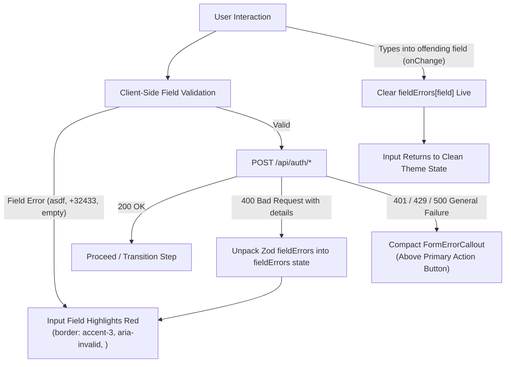

# Technical Plan: Auth UX Refinement, Inline Error Highlighting & Edge-Case Hygiene (Spec 016)

**Feature Branch**: `feat/016-auth-ux-refinement-inline-errors-and-edge-cases`  
**Prerequisites**: `specs/016-auth-ux-refinement-inline-errors-and-edge-cases/spec.md`

---

## 1. Architectural Strategy



---

## 2. Component Architecture & Changes

### 2.1 Contracts Layer (`packages/contracts`)
- **Phone Validation & Edge-Case Sanitization (`contracts/src/domain/auth.ts`)**:
  - Export `validateClientPhoneNumber(rawPhone: string): { isValid: boolean; error?: string; formatted?: string }`:
    1. If empty or whitespace: returns error `"Phone number is required"`.
    2. If does not start with `+`: returns error `"Please include your country calling code starting with + (e.g. +1 555 123 4567 or +92 300 1234567)"`.
    3. If contains letters or illegal symbols: returns error `"Phone number can only contain numbers and standard international formatting"`.
    4. If incomplete or invalid via `libphonenumber-js` (e.g., `+32433`): returns error `"Please enter a complete, valid international phone number (e.g. +1 555 123 4567)"`.
    5. If valid: returns `{ isValid: true, formatted: formattedE164 }`.

### 2.2 Compact Form Error Callout (`apps/web/src/components/auth/form-error-callout.tsx`)
- Lightweight, un-intrusive component designed specifically to sit directly above the submit button.
- Replaces bulky `<Alert severity="error">` banners.
- Properties:
  - `message: string | null`
  - Subtle styling adhering strictly to `apps/web/src/lib/theme.ts`:
    - `backgroundColor: 'rgba(246, 70, 93, 0.08)'`
    - `border: '1px solid rgba(246, 70, 93, 0.3)'`
    - `color: PALETTE.accent3`
    - `borderRadius: RADII.sm` (6px)
    - `padding: '8px 12px'`
    - `fontSize: '0.8125rem'`
    - Smooth opacity transition, zero layout jumps.

### 2.3 Removal of Password Strength Checker
- Remove `<PasswordStrengthMeter>` from `apps/web/src/app/signup/page.tsx`.
- Keep helper text on the password field: `"Minimum 8 characters"`.

### 2.4 Auth Pages Refactoring (`/login`, `/signup`, `/forgot-password`, `/reset-password`)
- **Field Error State**:
  - `fieldErrors: Record<string, string | undefined>`
  - Pass `error={fieldErrors[fieldName]}` to each `Input` and `PasswordInput`.
- **Hybrid Real-Time Validation**:
  - In each field's `onChange`, delete or clear `fieldErrors[fieldName]` so the red border and error text vanish as the user types.
- **Server Error Mapping**:
  - Parse `data.details` from 400 responses:
    ```ts
    if (data.details) {
      const newFieldErrors: Record<string, string> = {};
      for (const [key, msgs] of Object.entries(data.details)) {
        if (Array.isArray(msgs) && msgs.length > 0) {
          newFieldErrors[key] = msgs[0];
        }
      }
      setFieldErrors(newFieldErrors);
    }
    ```
  - For non-field errors (invalid credentials, 429 rate limit, 500 server error), set `generalError`.

---

## 3. Testing Strategy
- Unit tests in `packages/contracts` asserting `validateClientPhoneNumber` against `asdf`, `+32433`, `+`, `+1 555 123 4567`.
- Component tests in `apps/web/tests/auth/` verifying:
  - Inline error highlighting on invalid inputs.
  - Absence of top `<Alert severity="error">` banner.
  - Live error clearing upon typing in input fields.
  - Server 400 `details` mapping to input fields.
  - Absence of `PasswordStrengthMeter` on `/signup`.
