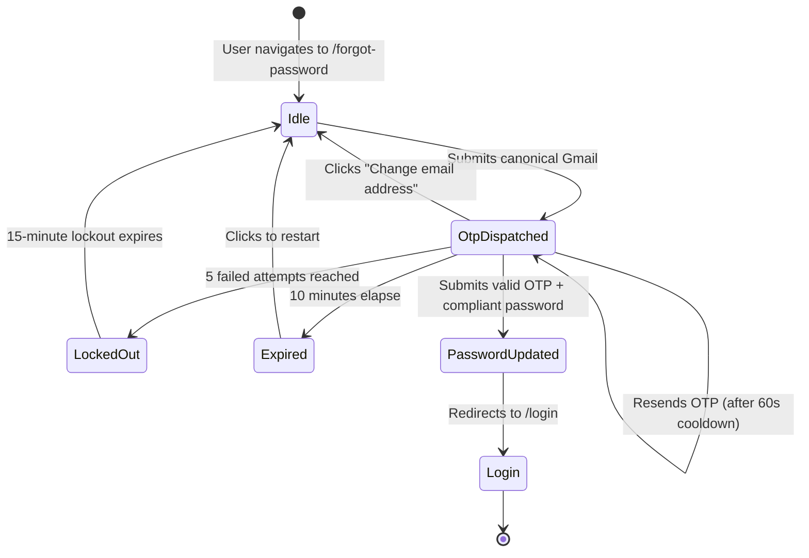

# Data Model: Spec 018 - 6-Digit OTP Password Reset Flow

**Feature**: `specs/018-password-reset-otp-flow`  
**Date**: 2026-10-09  

---

## 1. Entities & Types

### 1.1 Pending Password Reset Entry (`PendingPasswordResetEntry`)
Represents an active password recovery request pending OTP verification.

```typescript
export interface PendingPasswordResetEntry {
  email: string;        // Canonicalized Gmail address (e.g. 'user@gmail.com')
  otp: string;          // 6-digit numeric string ('100000'-'999999')
  createdAt: number;    // Epoch ms when created
  expiresAt: number;    // Epoch ms when expires (createdAt + 10 minutes)
  lastSentAt: number;   // Epoch ms when last dispatched (for 60s cooldown)
  attempts: number;     // Number of failed verification attempts (max 5)
}
```

### 1.2 User Entity Update (`AuthUser`)
Represents the authenticated user with session invalidation tracking.

```typescript
export interface AuthUser {
  id: string;
  email: string;
  name: string | null;
  phone: string | null;
  subdomain: string;
  role: UserRole;
  status: UserStatus;
  passwordUpdatedAt?: number | undefined; // Epoch seconds when password last changed
}
```

---

## 2. API Contracts & Validation Schemas (`@fbuploadpro/contracts`)

### 2.1 Password Reset Request (`POST /api/auth/forgot-password`)
Initiates the password recovery sequence and dispatches the OTP.

```typescript
export const ForgotPasswordRequestSchema = z.object({
  email: GmailSchema,
});

export type ForgotPasswordRequest = z.infer<typeof ForgotPasswordRequestSchema>;

export const ForgotPasswordResponseSchema = z.object({
  success: z.literal(true),
  message: z.string(),
  requiresOtp: z.literal(true),
  email: z.string(),
  expiresAt: z.string(),
});
```

### 2.2 Password Reset Mutation (`POST /api/auth/reset-password`)
Verifies the OTP and updates the account password.

```typescript
export const ResetPasswordOtpRequestSchema = z.object({
  email: GmailSchema,
  otp: z.string().trim().regex(/^\d{6}$/, 'Verification code must be exactly 6 digits'),
  password: z.string().min(8, 'Password must be at least 8 characters long').max(128, 'Password cannot exceed 128 characters'),
});

export type ResetPasswordOtpRequest = z.infer<typeof ResetPasswordOtpRequestSchema>;

export const ResetPasswordOtpResponseSchema = z.object({
  success: z.literal(true),
  message: z.string(),
});
```

### 2.3 Resend Password Reset OTP (`POST /api/auth/forgot-password/resend`)
Resends a fresh OTP subject to cooldown and lockout constraints.

```typescript
export const ResendResetOtpRequestSchema = z.object({
  email: GmailSchema,
});

export const ResendResetOtpResponseSchema = z.object({
  success: z.boolean(),
  message: z.string(),
  cooldownSecondsRemaining: z.number().optional(),
});
```

---

## 3. State Transitions & Lifecycle


