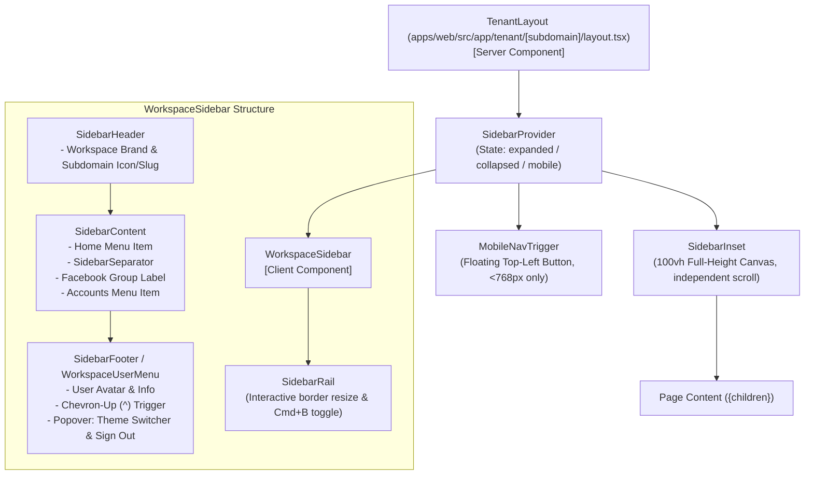

# Architecture & Technical Plan: 019 Workspace Pure Sidebar-Only App Shell

**Feature ID**: `019-workspace-app-shell`  
**Date**: 2026-10-09  
**Status**: Ready for Checklist & Tasks  

---

## 1. Architectural Blueprint & Component Tree



---

## 2. Directory Layout & Package File Structure

```
apps/web/src/
├── app/
│   └── tenant/
│       └── [subdomain]/
│           ├── layout.tsx                # Integrates SidebarProvider, WorkspaceSidebar, MobileNavTrigger, SidebarInset
│           └── page.tsx                  # Workspace Home page
├── components/
│   ├── ui/
│   │   ├── sidebar.tsx                   # Add SidebarSeparator primitive + export
│   │   └── index.ts                      # Re-export SidebarSeparator
│   └── workspace/
│       ├── workspace-sidebar.tsx         # Full workspace sidebar with Home, Separator, Facebook/Accounts
│       ├── workspace-user-menu.tsx       # Bottom profile card with caret trigger & popover
│       └── mobile-nav-trigger.tsx        # Floating corner trigger for mobile viewports (<768px)
└── tests/
    ├── ui/
    │   ├── sidebar.test.tsx              # Unit tests for sidebar primitives including SidebarSeparator
    │   ├── workspace-sidebar.test.tsx    # Tests for Home, Facebook Accounts navigation
    │   └── workspace-user-menu.test.tsx  # Tests for bottom user card, popover, signout
    └── dashboard.test.ts                 # Integration test for tenant layout
```

---

## 3. Component Details & Technical Contracts

### A. `SidebarSeparator` Primitive (`apps/web/src/components/ui/sidebar.tsx`)
```typescript
export interface SidebarSeparatorProps extends React.HTMLAttributes<HTMLDivElement> {}

export const SidebarSeparator = forwardRef<HTMLDivElement, SidebarSeparatorProps>(
  function SidebarSeparator({ className, style, ...props }, ref) {
    const { state, isMobile } = useSidebar();
    const isCollapsed = !isMobile && state === 'collapsed';

    return (
      <div
        ref={ref}
        data-sidebar="separator"
        className={className}
        style={{
          height: '1px',
          width: '100%',
          backgroundColor: THEME.default.borders.hairline,
          margin: isCollapsed ? `${SPACING.xs} 0` : `${SPACING.xs} 0`,
          ...style,
        }}
        {...props}
      />
    );
  }
);
```

### B. `WorkspaceSidebar` (`apps/web/src/components/workspace/workspace-sidebar.tsx`)
- Reads active pathname via `usePathname()` to compute `isActive` state for:
  - **Home**: `/tenant/${subdomain}`
  - **Facebook Accounts**: `/tenant/${subdomain}/accounts` (or sub-route)
- Renders:
  - `SidebarHeader`: Workspace brand icon with subdomain tag
  - `SidebarContent`:
    - `SidebarMenu`: "Home" button with home icon and tooltip
    - `SidebarSeparator`: 1px hairline divider
    - `SidebarGroup`:
      - `SidebarGroupLabel`: "Facebook"
      - `SidebarGroupContent`:
        - `SidebarMenu`: "Accounts" with users/pages icon and tooltip
  - `SidebarFooter`: `WorkspaceUserMenu`
  - `SidebarRail`: Rail toggle

### C. `WorkspaceUserMenu` (`apps/web/src/components/workspace/workspace-user-menu.tsx`)
- Displays:
  - User avatar with initials (28px circle with theme subtle background)
  - User full name and canonical email (hidden in collapsed icon mode)
  - Chevron-up icon button (`^` / SVG) with `aria-label="User menu"` and `aria-expanded`
- State:
  - `isOpen: boolean` toggling the floating popover card positioned directly above the footer
  - Outside click listener (`useRef` + `mousedown` event)
- Popover Contents:
  - User identity preview
  - Divider hairline
  - Theme toggle (Light / Dark mode switcher using theme context or CSS attribute)
  - Sign Out button calling `POST /api/auth/logout` and redirecting to `/login`

### D. `MobileNavTrigger` (`apps/web/src/components/workspace/mobile-nav-trigger.tsx`)
- Client component using `useSidebar()`
- Rendered conditionally on `<768px` viewports via CSS media query or `isMobile` context
- Floating placement:
  ```css
  position: fixed;
  top: 12px;
  left: 12px;
  z-index: 35;
  width: 36px;
  height: 36px;
  border-radius: 6px;
  background-color: var(--surface-panel);
  border: 1px solid var(--border-hairline);
  box-shadow: 0 2px 8px rgba(0, 0, 0, 0.15);
  ```

---

## 4. Verification Plan

1. **Unit Tests**:
   - `SidebarSeparator` renders with `data-sidebar="separator"` and hairline border.
   - `WorkspaceSidebar` renders Home, separator, Facebook heading, and Accounts item.
   - `WorkspaceUserMenu` renders user initials, toggles popover on `^` click, and invokes logout API.
   - `MobileNavTrigger` toggles sidebar open state on mobile.
2. **Layout Integration Test**:
   - `apps/web/tests/dashboard.test.ts`: Verify tenant layout renders sidebar, content canvas, and no top header.
3. **Full Pipeline Validation**:
   - `pnpm turbo run build lint typecheck test` passes with 100% success and 0 errors.
