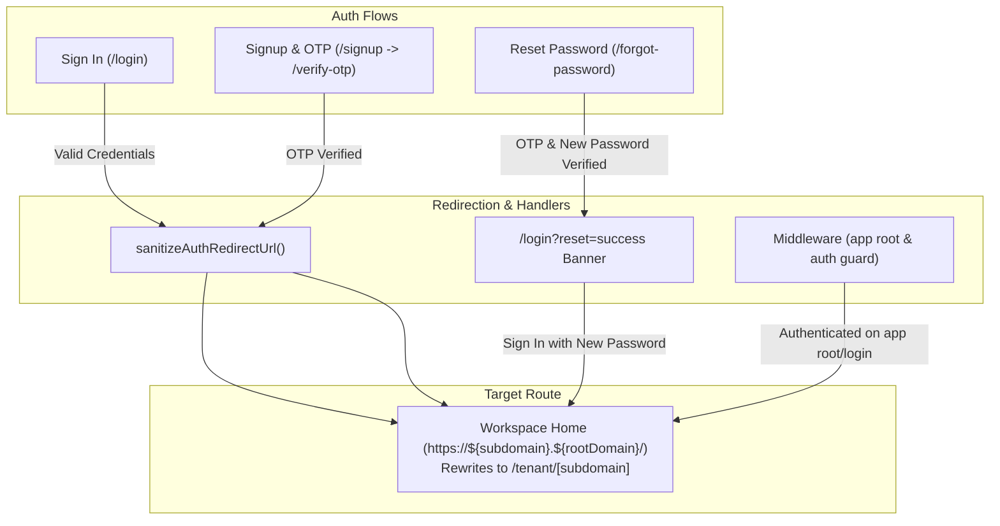

# Technical Architecture & Implementation Plan: 020 Post-Authentication Workspace Home Landing Route

**Feature ID**: `020-post-auth-home-landing`  
**Date**: 2026-10-09  
**Status**: Ready for Implementation  

---

## 1. Architecture Overview

This plan details the technical changes required to standardize all post-authentication redirects to the workspace **Home** page (`https://${subdomain}.${rootDomain}/` in production, `http://${subdomain}.${rootDomain}/` in dev, which internally rewrites to `/tenant/[subdomain]`), completely eradicating deprecated `/dashboard` routes.



---

## 2. File Modification & Contract Map

| File Path | Component / Function | Nature of Change |
| :--- | :--- | :--- |
| `apps/web/src/lib/auth-redirect.ts` | `sanitizeAuthRedirectUrl` | Update default URL fallback from `/dashboard` to `/` (subdomain root). |
| `apps/web/src/lib/supabase-auth.ts` | `registerTenantUser` & `loginTenantUser` | Update default fallback redirect URL from `/dashboard` to `/`. |
| `apps/web/src/middleware.ts` | `middleware()` | Update session forwarding on `app.${rootDomain}` from `/dashboard` to `/`. |
| `apps/web/src/app/forgot-password/page.tsx` | `handleResetSubmit` | Update success transition to navigate to `/login?reset=success`. |
| `apps/web/src/app/login/page.tsx` | `LoginPage` | Add banner notification when `reset=success` query parameter is detected. |
| `apps/web/tests/auth/auth-redirect.test.ts` | Unit Tests | Update tests to assert root subdomain redirection instead of `/dashboard`. |
| `apps/web/tests/api/auth-endpoints.test.ts` | Integration Tests | Update tests asserting `redirectUrl` on login and verify-otp. |
| `apps/web/tests/auth/forgot-password.test.tsx` | Integration Tests | Verify redirection to `/login?reset=success` after password reset. |
| `apps/web/tests/login.test.tsx` | Integration Tests | Verify `reset=success` banner rendering on login page. |

---

## 3. Detailed Component & Route Design

### A. `apps/web/src/lib/auth-redirect.ts`
```typescript
export function sanitizeAuthRedirectUrl(
  rawReturnUrl: string | null | undefined,
  userSubdomain?: string | undefined,
  rootDomain: string = process.env.NEXT_PUBLIC_ROOT_DOMAIN || 'localhost:3000'
): string {
  const cleanRoot = rootDomain.toLowerCase().split(':')[0] || 'localhost';
  const isLocal = cleanRoot.includes('localhost') || cleanRoot.includes('127.0.0.1');
  const protocol = isLocal ? 'http' : 'https';
  const defaultUrl = userSubdomain
    ? `${protocol}://${userSubdomain}.${rootDomain}/`
    : '/';
  // ... security validations remain unchanged ...
```

### B. `apps/web/src/app/login/page.tsx`
Detects `?reset=success` query parameter in `useEffect` and displays:
```tsx
{isResetSuccess && (
  <Alert
    severity="success"
    title="Password Updated"
    message="Your password has been successfully reset. Please sign in with your new credentials."
  />
)}
```

### C. `apps/web/src/app/forgot-password/page.tsx`
On successful `/api/auth/reset-password`:
```typescript
setIsSuccess(true);
setIsSubmitting(false);

const timer = setTimeout(() => {
  router.push('/login?reset=success');
}, 1500);
return () => clearTimeout(timer);
```

---

## 4. Verification & Testing Plan
1. Unit tests for `sanitizeAuthRedirectUrl` verifying root URL outputs.
2. API endpoint integration tests asserting `redirectUrl` on `/api/auth/login` and `/api/auth/signup/verify-otp`.
3. UI tests for `/forgot-password` asserting redirection to `/login?reset=success`.
4. UI tests for `/login` asserting detection and rendering of success alert banner when `reset=success`.
5. Full quality gate pass: `pnpm turbo run build lint typecheck test`.
