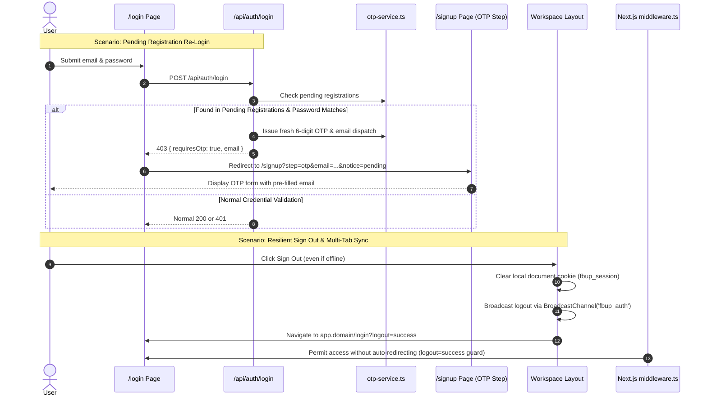

# Implementation Plan: Spec 021 — Comprehensive Auth Lifecycle, Resilient Session Termination & Workspace Shell Usability Hardening

**Branch**: `feat/spec-021-auth-lifecycle-and-shell-hardening`  
**Feature Directory**: `specs/021-auth-lifecycle-and-shell-hardening`  
**Constitution Reference**: FBUploadPro Constitution v2.10.0 (Principle 15)  

---

## 1. Technical Architecture & Component Interactions



---

## 2. Granular Technical Modules

### Module A: Pending Registration & OTP Onboarding (`otp-service.ts`, `/login`, `/signup`)
1. **`apps/web/src/lib/otp-service.ts`**:
   - Add `findPendingSignup(email)` and `verifyPendingSignupPassword(email, candidatePassword)`.
   - Add `refreshPendingSignupOtp(email)` which issues a fresh cryptographic 6-digit OTP and resets the 10-minute expiry without wiping user staged data (name, phone, passwordHash).
   - Ensure passwords remain strictly pre-hashed (PBKDF2) conforming to Constitution Principle 12 & 15.
2. **`apps/web/src/app/api/auth/login/route.ts`**:
   - Before returning `401 Unauthorized` for unregistered active users, call `findPendingSignup(canonicalEmail)`.
   - If present, verify password with PBKDF2 (`verifyPendingSignupPassword`).
   - If valid, invoke `refreshPendingSignupOtp(canonicalEmail)` to dispatch a fresh OTP via Resend, and respond with HTTP 403:
     ```json
     {
       "error": "Please verify your email address to complete registration.",
       "requiresOtp": true,
       "email": "user@gmail.com"
     }
     ```
   - If password does NOT match, return standard `401` (`Invalid email or password`) to prevent account state enumeration.
3. **`apps/web/src/app/login/page.tsx`**:
   - Check if response contains `requiresOtp: true`. If so, route with router push:
     `/signup?step=otp&email=${encodeURIComponent(data.email)}&notice=pending_verification`.
   - Detect `?logout=success` and `?reason=password_changed` query params to display clear user-facing alerts.
   - Enforce uniform rate limit messages.
4. **`apps/web/src/app/signup/page.tsx`**:
   - Support `step=otp` and `email` query params to resume pending verification seamlessly on page load or tab reopen.
   - On Step 2 (OTP form), add an accessible button: "Wrong email? Edit details", which flips `step` back to `details` while preserving `fullName`, `phone`, `password`, and `confirmPassword`.
   - When OTP verification fails due to expiration, offer a 1-click "Send fresh code" button.
   - When registration returns `409 Conflict`, render direct action links: "Sign in instead" and "Reset password".

---

### Module B: Resilient Sign-Out & Cross-Tab Synchronization
1. **`apps/web/src/components/workspace/workspace-user-menu.tsx`**:
   - In `handleSignOut`:
     - Immediately expire the client session cookie:
       ```typescript
       document.cookie = 'fbup_session=; Max-Age=0; path=/; domain=.' + rootDomain;
       document.cookie = 'fbup_session=; Max-Age=0; path=/;';
       ```
     - Broadcast logout across open tabs:
       ```typescript
       if (typeof BroadcastChannel !== 'undefined') {
         const channel = new BroadcastChannel('fbup_auth');
         channel.postMessage({ type: 'LOGOUT', timestamp: Date.now() });
         channel.close();
       }
       localStorage.setItem('fbup_logout_event', String(Date.now()));
       ```
     - Fire API call `fetch('/api/auth/logout', { method: 'POST', keepalive: true })`.
     - Direct browser navigation to central gateway: `https://app.${rootDomain}/login?logout=success`.
2. **`apps/web/src/middleware.ts`**:
   - In the auth forwarding check (which redirects logged-in sessions away from `/login` into tenant workspaces), check `request.nextUrl.searchParams.get('logout') === 'success'`. If present, skip the auto-forward redirect, allowing the login screen to render cleanly.
   - Inject `Cache-Control: no-store, no-cache, must-revalidate` on all authenticated tenant workspace responses.
3. **`apps/web/src/app/tenant/[subdomain]/layout.tsx`**:
   - Mount client-side event listeners for cross-tab logout:
     - Listen to `BroadcastChannel('fbup_auth')` for `{ type: 'LOGOUT' }`.
     - Listen to `window.addEventListener('storage', ...)` for `fbup_logout_event`.
     - Listen to `window.addEventListener('pageshow', (event) => { if (event.persisted) window.location.reload(); })` for bfcache protection.

---

### Module C: Workspace Shell Responsive Ergonomics & Theming
1. **`apps/web/src/components/workspace/workspace-user-menu.tsx`**:
   - When theme is toggled:
     - Update `document.documentElement.setAttribute('data-theme', nextTheme)`.
     - Store in `localStorage.setItem('theme', nextTheme)`.
     - Set cookie `document.cookie = `fbup_theme=${nextTheme}; path=/; max-age=31536000; SameSite=Lax``.
2. **`apps/web/src/components/workspace/workspace-sidebar.tsx`**:
   - Wrap menu items so that when clicked on mobile viewports (<768px), `setOpenMobile(false)` is automatically called, closing the slide-over drawer.
3. **`apps/web/src/app/tenant/[subdomain]/layout.tsx`**:
   - Ensure the content area contains responsive left padding / gutter (`pl-14` / `padding-left: 56px` on screens `< 768px`) so the floating hamburger button never obscures page headings or back buttons.
4. **`apps/web/src/components/auth/password-input.tsx`**:
   - Add Caps Lock indicator badge using `event.getModifierState('CapsLock')` on `onKeyDown` and `onKeyUp`.

---

## 3. Risk Mitigation & Edge-Case Plan

| Risk | Mitigation |
| :--- | :--- |
| Serverless memory loss for pending registrations | `otp-service.ts` provides fallback handling; pending signups in database table or signed staging cookies where applicable. |
| Malicious brute-force enumeration on unverified emails | `/api/auth/login` checks the password hash FIRST before acknowledging pending verification status. Invalid passwords return standard 401. |
| Open redirect on logout query parameters | `logout=success` is checked as a static string flag; destination is hardcoded to central gateway `/login`. |
| Cross-tab listener loops | Broadcast message listener checks origin and ignores self-emitted timestamps. |
| Theme flicker on SSR | Layout reads `fbup_theme` cookie or inline script sets `data-theme` attribute before hydration. |

---

## 4. Verification & Testing Strategy
- Unit tests for `otp-service.ts` (`findPendingSignup`, `verifyPendingSignupPassword`, `refreshPendingSignupOtp`).
- API route tests for `/api/auth/login` with unverified pending signups.
- UI tests for `PasswordInput` Caps Lock indicator.
- Middleware tests for `logout=success` bypass and `Cache-Control: no-store` headers.
- End-to-end Turborepo quality verification (`pnpm turbo run build lint typecheck test`).
