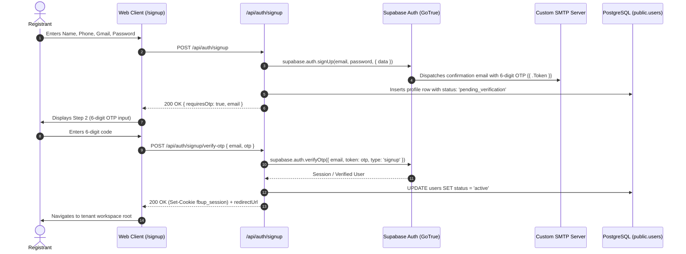

# Architectural Plan: Spec 023 — Supabase Auth Native SMTP OTP Delivery Architecture

**Status**: Ready  
**Branch**: `feat/spec-023-supabase-auth-smtp-migration`  
**Constitution Reference**: FBUploadPro Constitution v2.12.0 (Principle 17)  

---

## 1. Architecture Blueprint & Interaction Sequence

---

## 2. Component & API Refactoring Plan

### 1. `apps/web/package.json`
- Remove `"resend"` from `dependencies`.
- Run `pnpm install` to update lockfile cleanly.

### 2. `apps/web/src/lib/supabase-auth.ts`
- Enhance `registerTenantUser`:
  - When Supabase client is available:
    - Call `supabase.auth.signUp({ email, password, options: { data: { name, phone, subdomain } } })`.
    - Insert profile into `users` table with `status = 'pending_verification'`.
  - Provide helper `verifySignupOtpViaSupabase(email, token)`:
    - Calls `supabase.auth.verifyOtp({ email, token, type: 'signup' })`.
    - On success, updates `status = 'active'` in `users` table.
  - Provide helper `resendSignupOtpViaSupabase(email)`:
    - Calls `supabase.auth.resend({ type: 'signup', email })`.
  - Enhance `resetUserPasswordWithOtp`:
    - Calls `supabase.auth.verifyOtp({ email, token, type: 'recovery' })`.
    - Calls `supabase.auth.updateUser({ password })`.
- Maintain test/offline fallback stores so CI tests without remote Supabase credentials continue passing 100%.

### 3. API Routes Refactoring
- **`apps/web/src/app/api/auth/signup/route.ts`**:
  - Replace `createPendingSignup` + `sendOtpEmail` with Supabase Auth `signUp`.
  - Insert profile record as `pending_verification`.
- **`apps/web/src/app/api/auth/signup/verify-otp/route.ts`**:
  - Verify via Supabase Auth `verifyOtp` and activate user profile record.
- **`apps/web/src/app/api/auth/signup/resend-otp/route.ts`**:
  - Call Supabase Auth `resend({ type: 'signup', email })`.
- **`apps/web/src/app/api/auth/login/route.ts`**:
  - For unverified users (`status === 'pending_verification'`), call `supabase.auth.resend({ type: 'signup', email })` and return 403 `requiresOtp: true`.
- **`apps/web/src/app/api/auth/forgot-password/route.ts` & `resend/route.ts`**:
  - Call `supabase.auth.resetPasswordForEmail(email)` or `resend({ type: 'recovery', email })`.
- **`apps/web/src/lib/email-service.ts`**:
  - Remove file completely.
- **`apps/web/src/lib/otp-service.ts`**:
  - Streamline in-memory storage to act strictly as test/CI fallback when Supabase client is not available.

---

## 3. Supabase Custom SMTP Configuration Instructions for Operator

The operator will configure custom SMTP in Supabase Dashboard:
1. Navigate to **Project Settings > Authentication > SMTP Settings**.
2. Toggle **Enable Custom SMTP**.
3. Enter Sender Name (e.g. `FBUploadPro`), Sender Email, Host, Port, Username, and Password.
4. Navigate to **Authentication > Email Templates**:
   - In **Confirm signup**: Ensure `{{ .Token }}` is present in the email body (delivering the 6-digit verification code).
   - In **Reset password**: Ensure `{{ .Token }}` is present in the email body.
