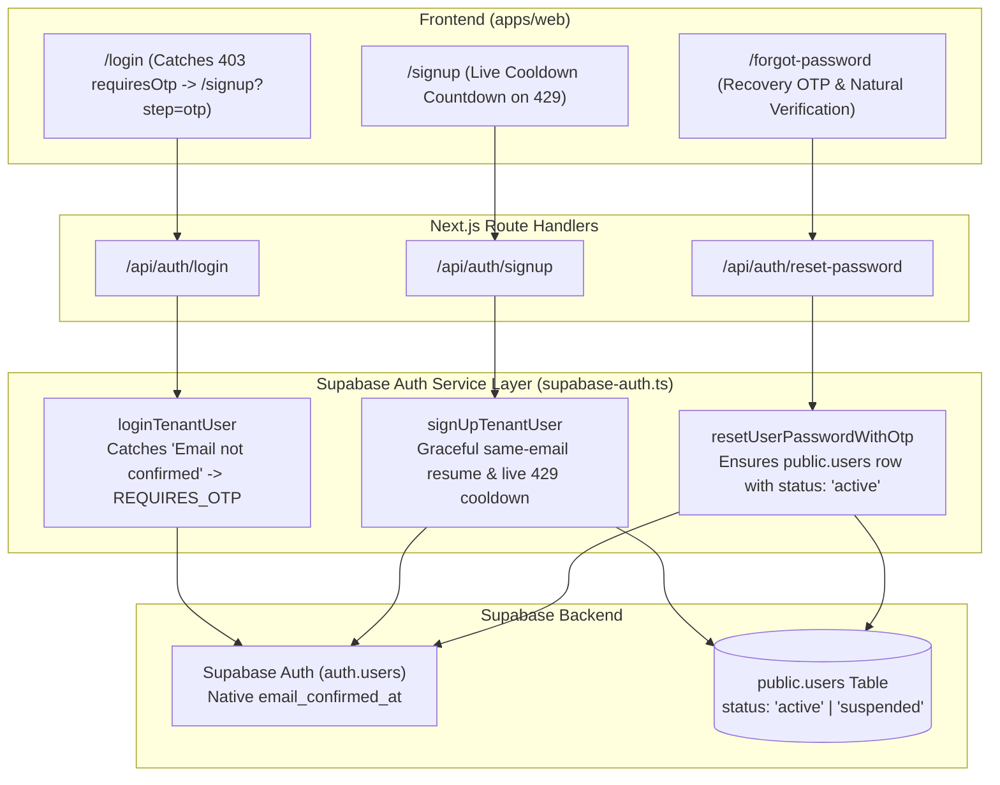

# Technical Architecture Plan: Spec 024 — Native Supabase Auth Lifecycle

**Feature ID**: `024-supabase-native-auth-lifecycle`  
**Spec Reference**: `specs/024-supabase-native-auth-lifecycle/spec.md`  
**Constitution Principle**: Principle 18 (Native Supabase Email Verification Lifecycle)

---

## 1. Architectural Overview & Component Responsibilities

---

## 2. Technical Decisions & Refactors

### A. Contracts & User Status (`packages/contracts`)
- Revert `UserStatusSchema` to `z.enum(['active', 'suspended'])`.
- Revert `UserStatus` type definition.
- Database constraint on `users.status` remains `CHECK (status IN ('active', 'suspended'))`.
- Clean up forward migration `20261009210000_add_pending_verification_status.sql` (revert constraint to clean `'active', 'suspended'`).

### B. Supabase Auth Helper Layer (`apps/web/src/lib/supabase-auth.ts`)
1. **`loginTenantUser`**:
   - When `supabase.auth.signInWithPassword` returns `authError`:
     - Inspect `authError.message` and `authError.code`.
     - If message contains `"email not confirmed"` or code is `"email_not_confirmed"`:
       - Throw typed error: `code: 'REQUIRES_OTP'`, `requiresOtp: true`, `email: canonicalEmail`.
     - Otherwise, throw `"Invalid email or password"`.
   - If `!user && authData?.user`:
     - Ensure row exists in `public.users` with `status: 'active'`.
     - Upsert storage quota in `user_storage_quotas`.
2. **`signUpTenantUser`**:
   - Check `findUserByEmail(canonicalEmail)`:
     - If user exists and is active, but unconfirmed in Supabase:
       - Attempt `resendSignupOtpViaSupabase(canonicalEmail)`.
       - If Supabase returns rate limit (`"after X seconds"`), catch it and return `{ user: existingUser, requiresOtp: true, cooldownSecondsRemaining: X }`.
       - If user modified name or phone, update in `public.users`.
       - Return `{ user: existingUser, requiresOtp: true }`.
     - If user does not exist in `public.users`:
       - Call `supabase.auth.signUp(...)`.
       - If `authError`:
         - Check for rate limit message (`/after (\d+) seconds/i`):
           - Extract seconds $X$.
           - Throw `RateLimitError`: `code: 'RATE_LIMITED'`, `retryAfterSeconds: X`.
         - If already registered: throw `Email is already registered`.
       - Insert profile in `public.users` with `status: 'active'`.
3. **`resetUserPasswordWithOtp`**:
   - After `verifyOtp({ type: 'recovery' })` and `updateUser({ password })`:
   - Check if user exists in `public.users`.
   - If not found or incomplete, insert/upsert user in `public.users` with `status: 'active'` and provision `user_storage_quotas`.

### C. Route Handlers & Error Formatting
1. **`apps/web/src/lib/auth-errors.ts`**:
   - Recognize `RATE_LIMITED` and Supabase cooldown phrases (`"for security purposes"`, `"after \d+ seconds"`).
   - Format response as HTTP `429 Too Many Requests` with `{ error, retryAfterSeconds, cooldownSecondsRemaining }`.
2. **`apps/web/src/app/api/auth/login/route.ts`**:
   - Catches `REQUIRES_OTP` from `loginTenantUser`.
   - Calls `resendSignupOtpViaSupabase(targetEmail)`.
   - Returns HTTP `403` with `{ error: 'Please verify your email address to complete registration.', requiresOtp: true, email: targetEmail }`.
3. **`apps/web/src/app/signup/page.tsx`**:
   - If response is `429`, extract `retryAfterSeconds` or parse from error text.
   - Set `resendCooldown(retryAfterSeconds)`.
   - Show countdown on "Create Account" button (`"Please wait Xs..."`) and disable until timer finishes.
