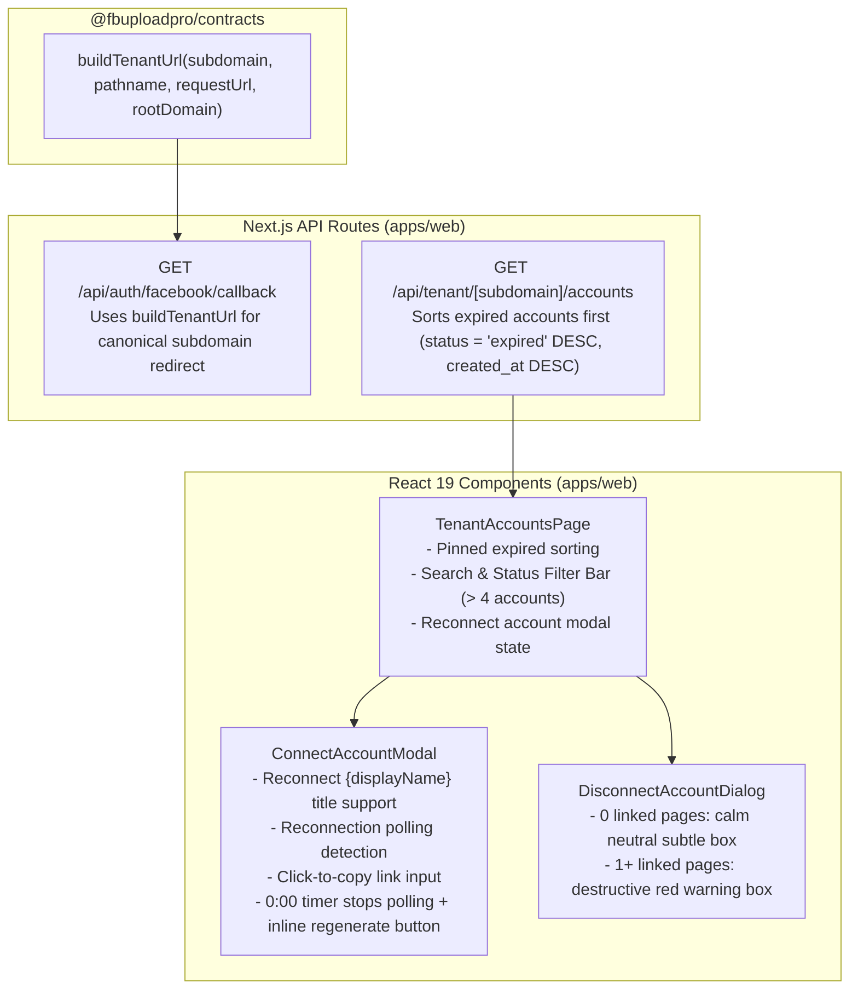

# Implementation Plan: Spec 029 — Facebook Accounts UX, OAuth Subdomain Redirect & Multi-Account Scale Hardening

**Feature ID**: `029-facebook-accounts-ux-hardening`  
**Specification**: [`spec.md`](./spec.md)  
**Created**: 2026-10-10

---

## 1. Architectural Overview

Spec 029 hardens the Facebook Accounts management workflow across `@fbuploadpro/contracts` and `@fbuploadpro/web`:

---

## 2. Component & Route Design

### 2.1 `@fbuploadpro/contracts` — `buildTenantUrl` (`packages/contracts/src/domain/routing.ts`)
- Export `buildTenantUrl(subdomain: string, pathname: string, requestUrl: string | URL, rootDomain?: string | null): URL`:
  - When `requestUrl` is a production domain and `rootDomain` is configured (e.g. `vinsmokemedia.online`), sets `url.host = "${subdomain}.${cleanRoot}"` and `url.pathname = normalizedPath`.
  - When on `localhost`, `127.0.0.1`, `.vercel.app`, or when `rootDomain` is absent/local, falls back to path-rewritten `/tenant/${subdomain}${normalizedPath}`.

### 2.2 `GET /api/auth/facebook/callback` (`apps/web/src/app/api/auth/facebook/callback/route.ts`)
- Read `rootDomain = process.env.NEXT_PUBLIC_ROOT_DOMAIN || ''`.
- Construct `destinationUrl = buildTenantUrl(tenantSubdomain, '/accounts', request.url, rootDomain)`.
- If upstream `error` parameter is present and `state` can be verified, redirect to `buildTenantUrl(statePayload.tenantSubdomain, '/accounts', request.url, rootDomain)` with `?error=...` so the user lands back on their workspace subdomain rather than a 404 `/accounts` on the gateway.

### 2.3 `GET /api/tenant/[subdomain]/accounts` (`apps/web/src/app/api/tenant/[subdomain]/accounts/route.ts`)
- After computing `status` via `evaluateAccountHealth()`, sort the returned `accounts` array so that `status === 'expired'` accounts always appear first, preserving `createdAt DESC` order within each group.

### 2.4 `DisconnectAccountDialog` (`apps/web/src/components/accounts/disconnect-account-dialog.tsx`)
- Branch on `pagesCount === 0`:
  - **When `pagesCount === 0`**:
    - Render a calm, neutral container (`backgroundColor: var(--bg-subtle, ${THEME.default.surfaces.subtle})`, `border: 1px solid var(--border-subtle, ${THEME.default.borders.hairline})`, `color: var(--text-sub, ${THEME.default.text.secondary})`).
    - Display exact copy: `"No Facebook pages are linked to this account yet. its safe to remove, You can reconnect it anytime."`
  - **When `pagesCount > 0`**:
    - Render the existing red destructive container (`rgba(246, 70, 93, 0.08)` background, `rgba(246, 70, 93, 0.25)` border) with header `"Before you disconnect"` and body `"{pagesCount} linked {pagesCount === 1 ? 'Facebook page' : 'Facebook pages'} will be Removed, and any scheduled content on them will be removed as well."`

### 2.5 `ConnectAccountModal` (`apps/web/src/components/accounts/connect-account-modal.tsx`)
- Add optional prop `reconnectingAccount?: { id: string; displayName: string } | null`.
- **Modal Title**: Render `reconnectingAccount ? "Reconnect " + reconnectingAccount.displayName : "Connect Facebook Account"`.
- **Click-to-Copy Input**: Add `onClick={handleCopyLink}` and `cursor: 'pointer'` on `data-testid="magic-url-input"` so clicking anywhere on the read-only input copies the URL and triggers `"Copied!"`.
- **Expiry Handling (`remainingSeconds === 0`)**:
  - In the 3-second polling `useEffect`, guard with `if (view !== 'magic' || !open || remainingSeconds <= 0) return;` so polling stops immediately when the timer hits `0:00`.
  - When `remainingSeconds <= 0`, replace the link input & copy button row with an inline recovery button (`data-testid="magic-regenerate-button"`) labeled `"Link expired — Generate a new link"` that invokes `handleStartMagicLink()`.
- **Reconnection Polling Detection**:
  - Track initial account states (`id -> { status, updatedAt }`).
  - Detect completion in `pollAccounts()` when either:
    1. A new account `id` is added (`!initialAccountMap.has(acc.id)`), OR
    2. `reconnectingAccount` is now `status === 'active'` (with a newer `updatedAt` or changed from `'expired'`), OR
    3. Any account that was `'expired'` when the modal opened is now `'active'`.

### 2.6 `TenantAccountsPage` (`apps/web/src/app/tenant/[subdomain]/accounts/page.tsx`)
- **Reconnect Modal Wiring**:
  - Add state `reconnectingAccount: FacebookAccountItem | null`.
  - `handleReconnect(account)` sets `reconnectingAccount(account)` and `setIsConnectOpen(true)`.
  - Reset `reconnectingAccount(null)` when opening via header/empty state Connect button or when modal closes.
- **Auto-Sort Expired Accounts**:
  - Sort `accounts` client-side as well (`a.status === 'expired'` before `'active'`) so expired accounts are always pinned to the top.
- **Search & Filter Bar (`accounts.length > 4`)**:
  - Render `data-testid="accounts-filter-bar"` when `accounts.length > 4` with:
    - Search input (`data-testid="accounts-search-input"`, placeholder `"Search accounts..."`).
    - Status filter buttons (`data-testid="accounts-filter-all"`, `data-testid="accounts-filter-active"`, `data-testid="accounts-filter-expired"`) for `All`, `Active`, and `Expired`.
  - If filtered results are empty while `accounts.length > 0`, show a clean empty filter message with a `"Clear filters"` button.

---

## 3. Compliance & Constraints
- **Theme Enforcement**: Strictly use `THEME`, `PALETTE`, `RADII`, `SPACING`, `TYPOGRAPHY`, and `COMPONENT_STYLES` from `apps/web/src/lib/theme.ts`.
- **Immutability of `DESIGN.md`**: Zero changes to `DESIGN.md`.
- **Zero Mock Theater**: Full unit and integration test coverage in `packages/contracts/tests/routing.test.ts`, `apps/web/tests/api/auth-facebook.test.ts`, and `apps/web/tests/ui/accounts.test.tsx`.
