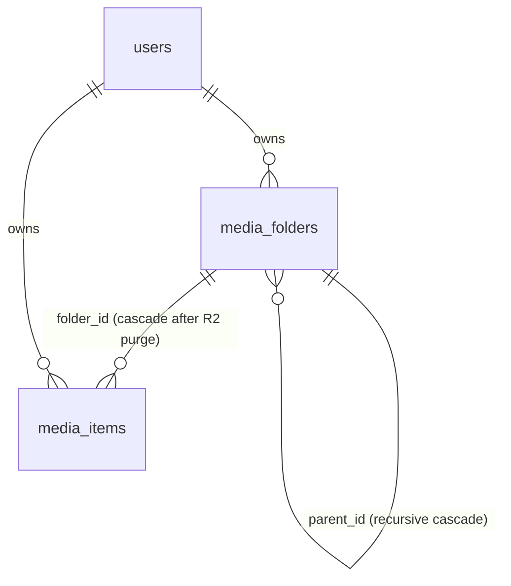

# Data Model: Spec 029 — Nested Media Library & Recursive Folder Explorer

## 1. `media_folders` Table (Updated via Forward Migration)

```sql
ALTER TABLE media_folders
    ADD COLUMN IF NOT EXISTS parent_id UUID NULL;

ALTER TABLE media_folders
    DROP CONSTRAINT IF EXISTS uq_media_folders_user_name;

ALTER TABLE media_folders
    ADD CONSTRAINT chk_media_folders_no_self_parent
        CHECK (id <> parent_id),
    ADD CONSTRAINT fk_media_folders_user_parent
        FOREIGN KEY (user_id, parent_id)
        REFERENCES media_folders(user_id, id)
        ON DELETE CASCADE;

CREATE UNIQUE INDEX IF NOT EXISTS idx_media_folders_root_name
    ON media_folders (user_id, LOWER(name))
    WHERE parent_id IS NULL;

CREATE UNIQUE INDEX IF NOT EXISTS idx_media_folders_child_name
    ON media_folders (user_id, parent_id, LOWER(name))
    WHERE parent_id IS NOT NULL;

CREATE INDEX IF NOT EXISTS idx_media_folders_user_parent
    ON media_folders (user_id, parent_id);
```

## 2. `media_items` Foreign Key Cascade

```sql
ALTER TABLE media_items
    DROP CONSTRAINT IF EXISTS fk_media_items_user_folder,
    ADD CONSTRAINT fk_media_items_user_folder
        FOREIGN KEY (user_id, folder_id)
        REFERENCES media_folders(user_id, id)
        ON DELETE CASCADE;
```

## 3. Entity Relationships


