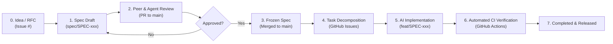

# Specifications (SpecDD) Registry

Welcome to the specification repository for Spec-Driven Development (SDD). In this repository, **all code begins as an approved specification**. Code written without a corresponding specification is considered unverified drift.

---

## 1. The Spec Lifecycle



### States Defined:
1. **`draft`**: Author (human or AI) is defining requirements, contracts, and acceptance criteria.
2. **`in-review`**: Specification is submitted via PR for technical review and consensus.
3. **`approved`**: Specification is frozen. Contracts and acceptance criteria are locked. Ready for task decomposition.
4. **`in-implementation`**: Tasks have been generated as GitHub Issues and assigned to AI agents or human engineers.
5. **`completed`**: All acceptance criteria are met, tested, and released to production.
6. **`deprecated`**: Superseded by a newer specification or retired.

---

## 2. Directory Layout

```text
specs/
├── README.md                              # This specification index & lifecycle guide
├── templates/
│   ├── SPEC_TEMPLATE.md                  # Standard specification template
│   └── TASK_TEMPLATE.md                  # Atomic task breakdown template
├── 0001-spec-driven-development-standard.md # SPEC-0001: The SDD Standard itself
└── ...
```

---

## 3. Specification Index

| ID | Title | Status | Type | Target Version | AI Readiness |
| :--- | :--- | :--- | :--- | :--- | :--- |
| [SPEC-0001](0001-spec-driven-development-standard.md) | Spec-Driven Development Standard & Protocol | `approved` | `standard` | `v1.0.0` | `ready` |
| [SPEC-0002](0002-monorepo-foundation-and-data-substrate.md) | Monorepo Foundation & Clean Data Substrate | `approved` | `architecture` | `v0.1.0` | `ready` |

---

## 4. How AI Agents Use Specifications

AI coding assistants (Antigravity, Claude Code, Cursor, Copilot Workspace) must follow this protocol:
1. **Never write code from conversational intuition.** If the user asks for a feature, first reference the relevant `SPEC-XXXX.md`.
2. **Verify against Section 3 (Acceptance Criteria):** Convert Gherkin scenarios directly into integration test suites.
3. **Strict adherence to Section 4 (Architecture & Contracts):** Treat data structures, endpoint signatures, and error types as immutable law.
4. **Respect Section 2.2 (Non-Goals):** Reject any temptation to add out-of-scope helpers or premature generalizations.
5. **Run Section 7 (Verification Plan):** Execute the listed commands and include output logs in the Pull Request description.
