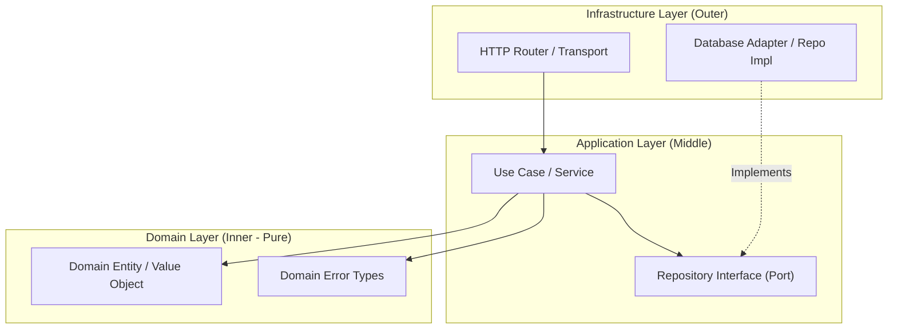

# SPEC-0000: Feature or Component Name

## 1. Executive Summary & Problem Statement
*Briefly describe the business and user problem this specification solves. Why is this necessary now? What is the core value proposition?*

### 1.1 Context
- **Current State:** How does the system behave today?
- **Desired State:** How should the system behave after this spec is implemented?
- **Impact:** What systems, users, or workflows will be touched?

---

## 2. Scope & Non-Goals
> [!IMPORTANT]
> Strict boundaries are mandatory for AI-driven development. If a capability is not explicitly inside scope, it is considered out-of-scope.

### 2.1 In Scope
- [ ] Explicit capability 1
- [ ] Explicit capability 2
- [ ] Explicit capability 3

### 2.2 Explicit Non-Goals (Out of Scope)
- What this feature will **NOT** do in this iteration.
- Premature optimizations or adjacent features deferred to future specs.

---

## 3. User Stories & Acceptance Criteria

### US-1: [User Story Title]
**As a** [user persona]  
**I want to** [perform an action]  
**So that** [achieve an outcome]  

#### Acceptance Criteria (Gherkin / Scenario-Based)
```gherkin
Scenario: Successful flow
  Given [precondition]
  When [action executed]
  Then [expected state/result]
  And [additional invariant]

Scenario: Error / Edge case flow
  Given [invalid input or failure condition]
  When [action executed]
  Then [system returns descriptive error code and logs warning]
```

---

## 4. Technical Architecture & System Design

### 4.1 Architecture Diagram & Layer Boundaries (Clean Architecture)


### 4.2 Data Models & Schemas
*Provide exact TypeScript, Python, SQL, or JSON Schemas.*

```json
{
  "$schema": "http://json-schema.org/draft-07/schema#",
  "title": "ExampleEntity",
  "type": "object",
  "properties": {
    "id": { "type": "string", "format": "uuid" },
    "name": { "type": "string", "minLength": 1, "maxLength": 100 },
    "createdAt": { "type": "string", "format": "date-time" }
  },
  "required": ["id", "name", "createdAt"],
  "additionalProperties": false
}
```

### 4.3 API Contracts & Interface Definitions
```typescript
export interface ExampleService {
  create(payload: CreatePayload): Promise<Result<Entity, DomainError>>;
  findById(id: string): Promise<Option<Entity>>;
}
```

### 4.4 Invariants & Edge Cases
- **Invariant 1:** [Condition that must ALWAYS hold true, e.g., zero data loss, idempotent mutations].
- **Edge Case 1:** [Concurrent requests handling].
- **Edge Case 2:** [Network partition or timeout handling].

### 4.5 Domain Error Taxonomy
| Domain Error Code | HTTP / Transport Code | Description & Trigger Condition | User Message |
| :--- | :--- | :--- | :--- |
| `ENTITY_NOT_FOUND` | 404 Not Found | Requested entity ID does not exist | "The requested resource was not found." |
| `VALIDATION_FAILED`| 400 Bad Request | Payload failed boundary schema validation | "Invalid input parameters provided." |
| `CONFLICT_STATE`   | 409 Conflict    | Unique constraint or race collision | "Resource already exists." |

---

## 5. Security, Performance & Observability

### 5.1 Security & OWASP Defenses
- **Boundary Validation:** Every request validated against strict schema before reaching domain.
- **SQL / Command Injection:** 100% parameterized queries; raw string concatenation forbidden.
- **Data Protection & PII:** Passwords/tokens hashed using standard algorithms; zero secrets in logs.
- **Authorization & Principle of Least Privilege:** Explicit access checks at use case layer.

### 5.2 Performance & Resource Budgets
- Maximum latency budget: (e.g. `< 150ms p95`)
- Memory / CPU footprint bounds:

### 5.3 Observability & Reliability
- **Structured JSON Logs:** Level, timestamp, message, and `correlationId`.
- **Metrics & Health:** Latency histograms, error counters, readiness/liveness probes.
- **Timeout & Retry Policy:** Explicit network timeouts with exponential backoff and jitter.

---

## 6. AI Agent Implementation Directives
> [!NOTE]
> This section contains explicit guidance for autonomous coding agents (Antigravity, Claude Code, Cursor, Copilot Workspace) executing tasks against this spec.

### 6.1 Targeted Files & Directory Layout
```text
src/
├── domain/
│   └── example.entity.ts
├── services/
│   └── example.service.ts
└── tests/
    └── example.service.test.ts
```

### 6.2 Agent Execution Rules
1. **Spec Strictness:** Never invent API parameters or side effects outside Section 4.
2. **Test-First (TDD):** Always write failing tests reproducing the acceptance criteria in Section 3 before writing implementation code.
3. **No Dead Code:** Do not add speculative utility functions, boilerplate unneeded by this spec, or placeholder comments.
4. **Error Handling:** All errors must be typed and mapped to domain error codes; never swallow exceptions.

---

## 7. Verification & Test Plan

| Test Level | Scope | Execution Command | Pass Criteria |
| :--- | :--- | :--- | :--- |
| **Unit** | Core domain logic & validators | `npm test -- tests/unit/` | 100% pass, >90% coverage |
| **Integration** | Service to database / API | `npm test -- tests/integration/` | 100% pass |
| **Lint / Format**| Code style & typecheck | `npm run lint && npm run typecheck` | 0 errors, 0 warnings |

---

## 8. Atomic Task Breakdown

- [ ] **Task 1 (Setup & Models):** Define domain entities, schema definitions, and migration files. (Issue: #...)
- [ ] **Task 2 (TDD Test Suite):** Implement unit and integration test fixtures for Acceptance Criteria. (Issue: #...)
- [ ] **Task 3 (Core Implementation):** Implement service logic to pass test suite. (Issue: #...)
- [ ] **Task 4 (E2E & Conformance):** Run full verification, doc updates, and submit PR. (Issue: #...)
